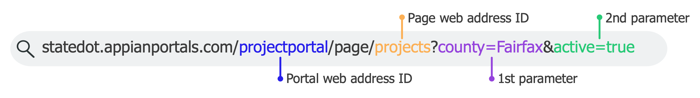

- Appian Portals is only supported for Appian Cloud customers and if environment is behind a VPN, you cannot connect a portal to it.
- Portal worked on isolated architecture that is independent from Appian.To upload files in Appian ```File upload or signature component --->Use a!submitUploadedfiles() function in submit button ---> specify target document folder ---> service account with Viewer permissions to target folder```. To download document ```Document download link or document image ---> Files to download ---> Document folder for our files ---> service account with viewer permissions to documents and folder ```.
- To use partially compatible capabilities and functions, connect to them using a web API and integration.The ```a!submitUploadedFiles() and a!verifyRecaptcha()``` functions only work in a published portal. You can't test them in the interface object itself.
- In your Appian environment, make sure you are in the ```Portals Publishers group``` to update, delete,publish portals.If Portal Publishing Manager site is not visible to us make sure we are in Portals Publishers Group.
- To setup with [ReCaptcha](https://docs.appian.com/suite/help/23.3/google_reCAPTCHA.html) with Portal - ```Create project in Google Admin console``` ---> ```Note Project ID``` ---> ```Create API and SITE keys using Google documentation```(API Key allow portal to communicate with reCaptcha server,site key allow to use reCaptcha on our portal since Appian only supports v3 reCaptcha so our site key ```must be score-based site key```) ---> In portal page,click "Use google reCaptcha to protect your page" ---> paste site and API key in that box in manager ---> Enter reCaptcha project ID when we created project in google.

### [Poral Capabilities](https://docs.appian.com/suite/help/23.3/portal-capabilities.html)

- Using record type to write or query data - compatible for portals, ```a!queryRecordType(),a!queryRecordByIdentifier()```,a!queryRecordByIdentifier() can't query unsynced service backed record type from portal.
- Record types to use in portal must have a service account enabled and added to the group that atleast have initiator permissions
-  Can't able to use ```record links,record actions, can't able to save filters```.Manage filters button will replace with clear filters button in published portal.

- Compatible
 <ul style="list-style-type: square; list-style-position: inside;">
<li>StartProcess</li>
<li>Read and Write from Public external db</li>
<li>Upload and download files</li> 
<li>HTTP and OpenAPI with basic and API Key Auth</li>
<li>Appian supported locales,time zones,calendars</li>
<li>Rule inputs</li>
</ul>

- <b>Partially Compatible- Use them with integration</b>
<ul style="list-style-type: square; list-style-position: inside;">
<li>Using CDT for write and read data</li>
<li>Connecting to db behind VPN </li>
<li>HTTP and OpenAPI with AWS Signature V4,Google Service Account, OAuth 2.0</li>
<li>Pre built connected systems</li>
<li>Function plugins</li>
<li>Decision objects</li>
</ul>

- <b>Incompatible</b>
<ul style="list-style-type: square; list-style-position: inside;">
<li>Constant of type Application,Group,Group Type,Report,Site,Task Report</li>
<li>Record actions,list and views</li>
<li>Component Plugins</li>
<li>Tasks</li>
<li>Access portal in Appian mobile app</li>
<li>Offline mobile</li>
<li>Using portal as an embedded interface</li>
<li>Restrict portal to use VPN</li>
</ul>


### [Portal Object](https://docs.appian.com/suite/help/23.3/portal-object.html)

- For Branding in portal, the favicon should 16x16,32x32 and <100kb
- While giving App Name when selected PWA option, can give upto 12 chars.
- For portal app icon work across all devices,size should be 512x512 or 1024x1024 pixels.
- App icons are maskable that fills up any shape the device uses maybe circle,square and teardrop shape.
- Use icon safe zone to cut app icons,standard safe zone is ```40%```
- If user installs multiple portals that published from the same environment, portals may share some of the same settings like cookie preferences , permissions such as access to the device microphone and location.For these types of settings, the user will be unable to choose different options for PWAs published from the same environment
- ```Visitor Activity Log``` section contains system-level logs for the microservice that runs the portal provides insights about end-user activity and errors they might be encountering when they interact with your portal.


### [Create a portal](https://docs.appian.com/suite/help/23.3/portals-create.html)

- Add upto `10` pages in portal
- If deselect header bar, if have >1 page then additional pages will be removed.

### [Manage a Portal](https://docs.appian.com/suite/help/23.3/portals-manage-portals.html)

- The ```a!submitUploadedFiles() and a!verifyRecaptcha()``` functions only work in a published portal.
- UUIDs are added by default to the web addresses of all portals in your development and testing environments.So that only users that you share the URL with will be able to easily find the portal during development.In production environments, this option is deselected by default to make the web addresses to easier for your users to access them.

-  After deployment, the value of the portal object's Published field in the target environment will be the same as the Published field value in the source environment.
- If portal is published in the target environment and deploy an updated precedent of the portal to that environment, the portal will automatically republish after import to include the latest updates.
- Service accounts required permission


### [Working with data](https://docs.appian.com/suite/help/23.3/portals-data.html#example-starting-a-process-to-write-data-using-a-record-type)

- In order to query data, the service account needs to have ```Viewer permissions``` to the web API and data store.
<span style="background-color:yellow;color:black">When deploying a portal object to a different environment, make sure that there is a service account of the same username in the target environment and make sure it is in the same groups</span>
- When connecting portal to open accessible external db, web Apis won't be used and calls to db won't pass through appian.It must satisfy below needs
<ul style="list-style-type: square; list-style-position: inside;">
<li>It must be a supported external database.</li>
<li>It must not be behind a VPN.</li>
<li>It must be accessible at a public IP address.</li>
</ul>

### [Service accounts](https://docs.appian.com/suite/help/23.3/portals-service-accounts.html)

- A service account is a special type of user account in Appian that is a member of the Service Account system group
- Normal security we need for each actions:


### [Best Practices](https://docs.appian.com/suite/help/23.3/portals-design.html)

- To set up portal to view, download, or upload documents, set up the service account permissions so the portal has the required access.
- To upload files correctly, publish the portal and test the file upload. Use ```a!submitUploadedFiles()``` to upload documents.The size limit for uploaded files is ```10 MB```.

### [Configuring reCaptcha](https://docs.appian.com/suite/help/23.3/recaptcha.html)

- Appian uses the first score returned by reCAPTCHA for all instances of the `a!verifyRecaptcha()` function's onSuccess parameter within an interface, regardless of the number of user interactions in the page.
- fv!score < 0.3 = bot,fv!score>=0.3 and fv!score <=0.6 = a bot or human , fv!score > 0.7 = human
- Google's reCAPTCHA unit testing allows you to create score-based site keys that will always return a set score, such as 1 or 0.
-  To get the most accurate results for each Portal, you must have a separate instance of reCAPTCHA for each portal using reCAPTCHA.


### [Portal website protections](https://docs.appian.com/suite/help/23.3/portals-security.html)

- User traffic to your portal is limited to 10 terabytes per month.

### [Troubleshooting](https://docs.appian.com/suite/help/23.3/portals-troubleshooting.html)

- issue = causing by connected system, check portal error log.
- issue = connecting back to Appian, integrations, databases, or APIs, check the server log.
- don't have admin access, check visitor acitivity log.
- Find issues and information for portal processes, actions, and key usage and performance metrics in the following places: environment server log,
Portals latency, traffic, and error rate metric log,Portals rule,performance details logs,external system or database server log.

### [Custom domain](https://docs.appian.com/suite/help/23.3/portals-custom-domain.html)

- Don't give `appian` as subdomain name.
- Make sure the DNS infrastructure for domain is publicly else certificate signing will fail, and end users will be unable to access the portal.
- If have a Certification Authority Authorization (CAA) record configured for the domain, make sure it lists Amazon certificate authorities as authorized else, certificate signing will fail.Appian does not support wildcard certificates, meaning the certificate must not use wildcard characters in the hostname.
- Able to configure one custom domain per environment.To configure raie Appian support ticket.
- Portals certificates are hosted AWS Certificate Manager (ACM) and automatically renews if below condiitons are met:
<ul style="list-style-type: square; list-style-position: inside;">
<li>DNS records used to validate the certificate remain in place.</li>
<li>The certificate is in use when it is nearing expiration and ready to be renewed.</li>
<li>If CAA record configured for your domain, it lists Amazon certificate authorities as authorized.</li>
If the certificate expires due to one of the criteria not being met, open a support case.
</ul>


### [URL Parameters](https://docs.appian.com/suite/help/23.3/url-parameters.html#) 

- Url parameters are in format ```?search=<text>&<parameter1>=<parameter1Value>```

- ```a!urlForPortal()``` function to get encrypted URL link of portal page with parameter values as input and open the link which by default set the parameter values as input to that page.
<ul style="list-style-type: square; list-style-position: inside;">
<li>Parameter <b>portalPage:</b> use <span style="color:orange">portal!</span> to see a list of portals. Use <span style="color:orange">.</span> to see a list of portal pages</li>
<li>Parameter <b>urlParameter:</b> use<span style="color:orange"> a!map()</span> to list your URL parameter names and values as key-value pairs</li>
<li>Function allows to keep link upto date even web identifiers or RI are modified</li>
<li>If portal has only one page, the <span style="color:orange">page</span> won't display in url like in image, else it will show like in image 
</img>
</ul>

- set default value to Rule Input so it will redirect when parameter has no value.The rule input uses the default value when: 1.A user accesses the page via the header bar in the portal. 2.A link doesn't use the URL parameter. 3.A user changes or deletes any character in the encrypted URL parameter string. 4.Someone constructs a plaintext link that would otherwise ignore a URL parameter due to error handling, such as if they misspell the URL parameter name.<p style="color:red">If the default value isn't configured and a URL parameter doesn't provide the value, the rule input value is null.</p> 
<span style="background-color:yellow;color:black">Appian automatically republish published portals after environment is restarted, when it is upgraded or hotfixed.Automatically republish portals that use <span style="color:orange">a!urlForPortal()</span> to link to other portals when the following occurs: In the linked portal, the web address identifier for the portal or a portal page is changed. In the linked portal, the Encrypt URL Parameter checkbox is selected or deselected in a portal page</span>

- <b>To enable URL Parameters</b>
<ul style="list-style-type: square; list-style-position: inside;">
<li>Create rule input (should not be array,must contain primitive data types,should not present in precedents of portal page)</li>
<li>Configure rule inputs in portal page ( Add portal page > configure rule input ( Encrypt URL Parameters - To encrypt parameters, RI - RI that used to set initial values only appear, Enable in URL - Only appears when Encrypt URL parameters is deselected, URL Parameter Name - Parameter name, Default Value -  set default values that support <span style="color:orange">100 values or less<span></li>) > Done)
<li>Add service account if encrypted parameters used, then publish portal (<a href="https://docs.appian.com/suite/help/23.3/portals-create.html#add-a-service-account">Add service account</a> > Goto configurations and turn on publish toggle > Save changes)</li>
<li>Add,rename,delete RI in portal's page interface then edit the portal page to update the rule input configurations and republish it.</li>
<span style="color:black;background-color:yellow">Above only affects RI that used to set initial values on portal pages. Other RI don't need to be updated if they change.</span>
</ul>

- Several places you can link portal are
<ul style="list-style-type: square; list-style-position: inside;">
<li>Interface,Expression rule,process model</li>
<li>Another portal (Using <span style="color:orange">a!urlForPortal()</span> we can link, must have <span style="color:orange">service account configured</span></li>
<li><a href="https://docs.appian.com/suite/help/23.3/url-parameters.html#linking-from-an-external-website"> External website </a></li>
</ul>

- Use plaintext URL parameters when:
<ul style="list-style-type: square; list-style-position: inside;">
<li><b>Linking to the portal from an external website </b></li>
<ul style="list-style-type: square; list-style-position: inside;">
<li>Create Encrypted URL parameters using <span style="color:orange">a!urlForPortal()</span>. This encryption is specific to environment, you can't construct a link in development environment and modify it to be used in a production environment. You need to use <span style="color:orange">a!urlForPortal()</span> in a production environment to get an encrypted link for a production portal.
<li>To use URL parameters to link to a portal page from an external website,use plaintext URL parameters</li>
<li>If you must use encrypted parameters, use a web API that uses <span style="color:orange">a!urlForPortal()</span> to construct the link and invoke the web API from your external website.</li>
</ul>
<li>Using a third-party web service that needs to pass an exact value</li>
</ul>


# Recommendations

### URL Parameters

- Don't create portals that allow users to update information in a form they already submitted. If users need to update information they submitted, they should have an Appian account and update the information through a site rather than a portal.
- Don't use this method to pre-populate user-specific information on a form in portals. Portals are intended for unauthenticated users to fill out generic forms.


