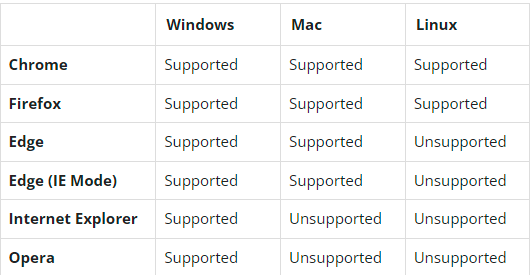
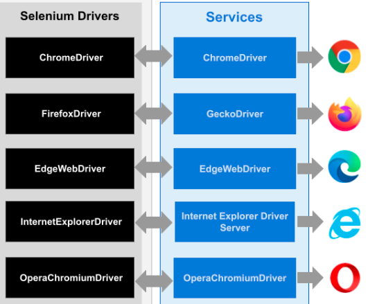

- Appian cloud offers HA configuration with Recovery Point Objective(RPO),Recovery Time Objective(RTO).Appian Cloud HA reduces risk of unplanned downtime in instance caused by service failure,software or hardware failure,availability zone failure
- Appian cloud HA has 3 nodes in different availability zones,datas replicated across active nodes, if one fails other nodes manage requests
- Appian loud HA has RPO of 1 min,RTO of 21 min for advanced users,4 min for enterprise users.If need VPN integration fill VPN worksheet for extra nodes to be created.Appian RPA is not offered as HA configuration , other HA features and services that independent of Appian RPA won't be affected.
- In the Appian Admin console, system administrators can create a service account at the same time they generate the API key.This service account will be used as the user context for the robotic process when it's run from a process model.Appian RPA components rely on shared permission tags for security.Users, robotic processes, and resources must share common tags in order to see and interact with one other.Only robotic processes that share permissions with a resource are allowed to run on that resource. Permissions control which robotic processes users are able to see.Be sure to set permission tags on the service account, so it has access to the robotic process; otherwise, it won't work at runtime. Download AppianRPAagent and run it so can communicate with the orchestration server.Can see active status in resource.The Support Files section of the Advanced Configuration tab. This is where you place files that the robotic process will need during execution, such as web browser drivers.For example, if your robotic process will need to use the Chrome web browser on Windows computers, the chromedriver for Windows must be added to the Support Files. Create the chromeWebDriver folder, then add the chromedriver file.The version of the chromedriver must match the version of Chrome on the resource. See the Appian documentation for details on adding support files, including browser drivers. Your organization can allow web drivers to be automatically updated. If it does, you do not need to perform this step. 
- Create Service Account API key ---> create Appian RPA ConnectedSystem using created API Key and test connection ---> Add API Key Service User to Admin group
- AppianRPA can be installed in ```on Prem env using Hybrid configuration```(connection between a customer's self-managed Appian site and a separate Appian Cloud site, where Appian RPA is available).

## Modules

- ```IJidokaServer``` for communication with Appian RPA server
- ```IClient``` for performing actions regardless of OS
- ```startUp()``` verify resource before executing actions in workflow.Use ```JidokaFactory.getServer()``` initialize jidokaserver.```IClient.getInstance(this)``` implements IRobot interface and ```return true``` for process to run or ```return false``` to stop the process.
- ```start()``` define initial action of workflow.```client.typingPause()```,```client.mousePause()``` are methods present 
- ```preProcess()``` helps to list steps that must complete before processing items.We can define list of steps here
- ```moreItems()``` evaluate another item or move to next step in workflow.
Implements workflow-guided loop and associated with conditional action
- ```processItem()``` evaluates processes each item,vary depending on what our item is
- ```postProcess()``` allows list steps that must be completed after all items are done.Eg: we can add steps to close an app and log out.
- ```end()``` define final actions of workflow and is associated with End action.By default it calls ```server.debug()```.
- ```cleanUp()``` leave resource in same state it was before robotic process started its execution.For eg:closing an app and logging out. It's recommended to add these in both postProcess(),cleanUp().Cleanup() also returns output files can download directly from Robotic Process execution page.
- ```Appian services module``` for querying Appian design objects.If AppianRPA started in the interface, the currently logged in username is sent to Appian.If started through an integration, the name of the service account is sent to Appian.If started by a schedule, the name of the person who last modified the schedule is sent to Appian.If started through another robotic process, the name of the person to initiate the first robotic process is sent to Appian.

## Browser

- To support each browser add it's respective driver.exe (driver name in Linux OS are case sensitive while in other OS are insensitive.)
- For internet explorer full support, set browser zoom level ```Tools>100%```,Browser security set at ```Tools>Internet options>Security>Enabled protected mode```.```Tools>Internet Options> Privacy>Turn on pop-up blocker``` should be turned off,if blocked Open Browser method won't open new window if one already open.




## Important points

- Action groups is series of actions and can alternate.
- Even if actions in main section terminates due to error clean up always runs.
- The built-in RPA Task Recorder can capture all the steps that performs manually. As shown below, the Task Recorder records interactions in a web browser and translates them into actions in a robotic process.
- Top three roles for RPA are Admin ,Developer,Operations Manager.

## Documents processing methods

- IDP supports claims,invoices,purchase orders,receipts

## Recommendations

- Work with most recent versions of browsers,bridge servers.Use recommended version for drivers [see here](https://docs.appian.com/suite/help/22.1/rpa-7.14/modules/browser-module.html)

## Others

- See more about Appian community edition [here](https://community.appian.com/p/community-edition-guide#restrictions)
