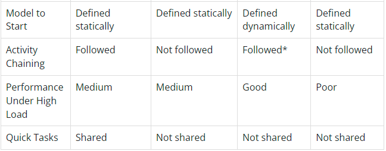
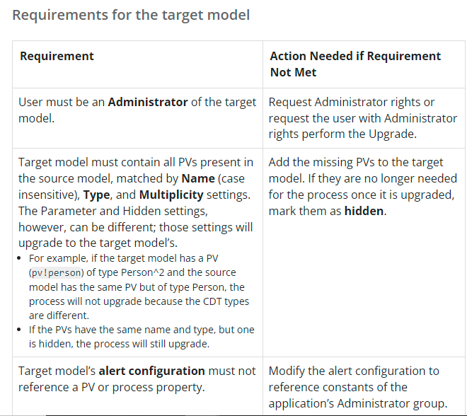
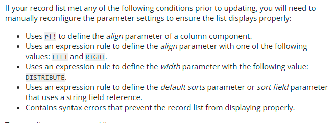
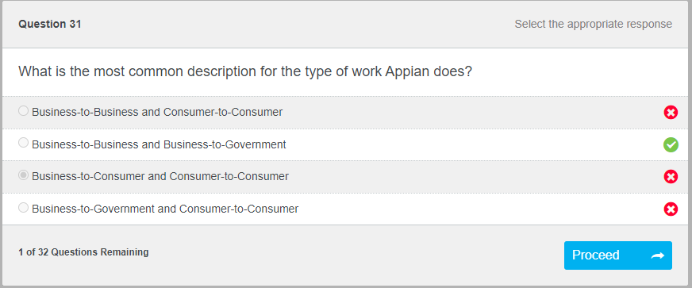
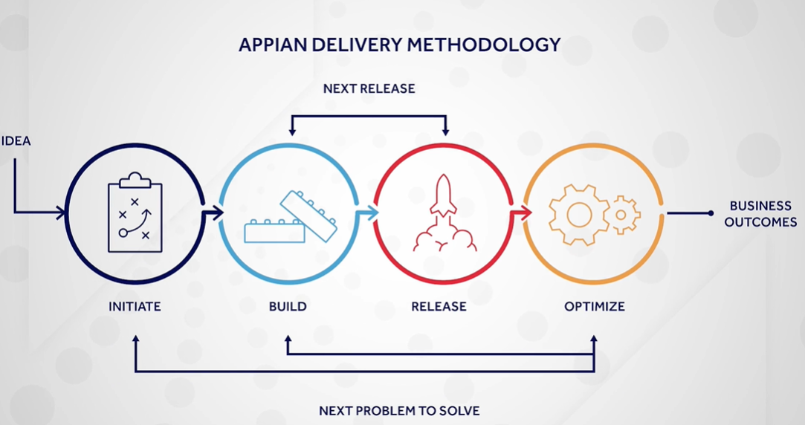
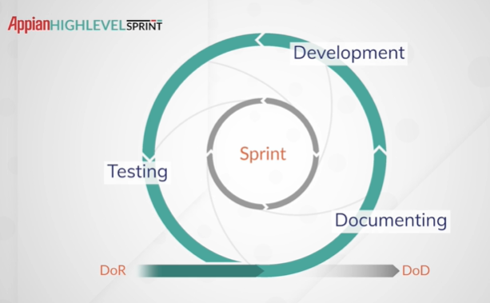

# Appian 23.4 Release Features

- Introduced Robot keys in Appian RPA to identify robot and fully managed by customers.
- Open and work with multiple workbooks simultaneously, Copy data between sheets and workbook, Add sorting and filtering, Search worksheet by cell value, Choose workbooks to close, Refresh data connections and pivot table can be done now in Appian RPA for excel. `Excel: License Required` with new actions introduced.
- New interface component `RecordChats` introduced with AI CoPilot features to chat based on Records and related records.
- `Data Fabric Analytics`, new workspace to create views quickly. It has data contaned in multiple apps. Every dataset is made of record type and its one-to-one, many-to-one related record types. Every users should be in `Data Fabric Report Creators` group.
- Delete records and its related records using `Delete records` smart service by allowing `allow modifying related records`. Configure record actions automatically and rv!reocrd now automatically queries fields referenced in start form.
- `Auto-commit` field in Execute stored procedure smart service introduced. Rename integrations from object properties menu. Now upload logo files to Custom JDBC Connected systems where logo displayed in record type relationship diagrams and everywhere.
- `Translation set` new object introduced to create language translations across an application. `Page groups` navigations are introduced in sites available for both web and mobile apps. `Portal monitoring` tab introduced in Monitoring section for indicating latency, traffic and error rate of portals. 
- In Sites choose `Sidebar` navigation bar option to show site in SideBar. Like in portals `URL Parameters` introduced in Sites and `a!urlForSite()` is introduced for this.
- choose dropdown labels and values from Record type fields. In a!recordData() function new field `fields` introduced to query specific fields. `Max selections` and `Show selection Count` fields are introduced in Read Only grid to select at maximum and show number of selections at bottom.
- Now when submit if there is validation in any fields it will automatically scroll to the validated field. Download any chart as `PNG` image. Now valid parameters with list or text types will be shown instead of typing . For eg: we don't need to type "10X" instead it will show when put "" itself.


# Appian 23.3 Release Features

- Generative AI ```Appian copilot``` , Generate interfaces based on uploaded pdf. Enable it on Admin console > AI Services > Microsoft Azure
- <a href="AISkill">AI Skills</a> includes email and document classification, document extraction.
- ```Operations console``` to manage robots easily.
- ```Robot pools``` assign robots to particular task, group robots by their roles
- <b>RPA</b><span style="color:orange"> Interact with browser alert</span> to manage browser alerts and <span style="color:orange">Get table values</span> to retrieve table values from html formatted table.Use <span style="color:orange">Open or create workbook</span> to customize spreadhsheet with macros and formatting. <span style="color:orange">Format cells</span> to merge cells,give colors and more.<span style="color:orange">Run Macro</span> to automate microsoft excel tasks using predefined macros stored in excel workbooks,run unsupported functions in excel.
- Now use single node to update record and related records in ```One to many``` and ```One to one``` relationships only.
- New functions `a!automationId() , a!automationType()` has been introduced for event history.
- `a!queryRecordByIdentifier()` function is introduced.

- `Postgresql14,Amazon aurora mysql3,Amazon aurora postgresql13` databases introduced.Use this also in Record type.
- Record type sync has been increase from `2 million` to `4 million`
- `URL Parameters` in portal is introduced.
- `Cell coloring` feature in read only grid is introduced.
- `Patterns` tab to use customized patters in interface.
- More `Image size` options are introduced
- `Billboard` now automatically adjust based on the screensize.
- More `width` options in editable grid and `spacing` options in checkbox are introduced.
- All manual and programmatic exports occurs asynchronously ie.,export run in background.
- Before plugins that support to our environment version are returned, now it will return every plugins including unsupported in admin console.

## DSE
- If the letter casing for the schema in Oracle is different than the schema attribute of the @Table annotation of the XSD (which is lowercase by default), the entity will not be able to map to the table. If you encounter this issue, you can create a synonym in the Appian user schema that points to the tables in the other schema. Please note that the synonym will need to have the same name as the table or view that it points to.
- A user must have at least Viewer permissions to a data store in order to use its entities to query, write, or delete data.

- Amount of data queried is ```1 MB``` by default.If need more than 1 MB use batching to query. Default limit of node is ```1000 instances```.
- Keep name of CDT ```<27 chars```. Use JPA annotations to avoid trunctation or change in letter casing.


- ```@Version``` annotation enables optimistic locking,helps the database to detect value being stored by current process is stale and prevent update,can be used on only one field per CDT.```@Id``` annotation to indicate field to indicate as primary key.Values set by our ```Triggers``` not populate in storedValue output of ```Write to DSE``` SS.


## Process Model
- Activity chaining used between multiple user input tasks, between user input tasks and write to data store entity nodes. Outside of above cases slow down process performance.

- ```Subprocess``` SS runs asynchrounously or synchronously.```Start Process``` SS runs asynchronously.```Process Messaging``` SS runs asynchronously.


*Will follow chaining in the new process until chaining ends, then the parent process resumes (even if the new process has not finished)


- All exception flows will appear red before they executed,then purple after they executed,when node is skipped due to exception flow it appears shaded with diagonal lines.When instance is passed active task assigned to user no longer show up in user's task list,Task show up in paused status in All Tasks report,Tasks submitted when process instance is paused will display an error,User can't able to save task.
- Use MNI if need to run instances in parallel, Looping flows can't do this. Use MNI to repeat activity that involves a different user each time,Looping to repeat an activity that involves a same user every time.
- Synchronous subprocess nodes write values from subprocess to parent process while parent process is paused. Output of subprocess will save when process resumes.To save selected process instance as new version we must have ```right to save changes in Process model folder where process model instance is stored, in addition to having admin level access,editor level access```.
- Two users can't make changes to same process instance at same time.pv that holds multiple values or multiple values in cdt only the ```first 100 values``` are retained in process history.By efault Process nodes tab not show nodes associated with subprocess,we can view by selecting show nodes from subprocess checkbox.When it's checked nodes from nested subprocesses are displayed upto```10``` levels of nested nodes are displayed.
- ```Gateway nodes``` can be evaluated multiple times if they setup in loop,in that time tis node is listed once on this tab.```start,pause,cancel``` available to process admins,system admins,admin account.If task or process node is delayed we can automatically reassign to another user,group or raise task priority or alert a user,group or notify another process.
- ```Long activity chains``` greater than 50 node or 5 seconds between attended activities are discouraged because of performance issues in system.Acitivity chaining is ```not recommended``` for use with approval tasks.When attended node is chained to another node ```that user``` assigned to first node override assignment settings for next attended node as well.
- ```Quick tasks``` won't appear in user's task list.Activity that scheduled to run periodically is part of chain,the first instance is chained , all subsequent instances are not part of activity chain.When a task is configured as a quick task, existing forms and data configurations are preserved. Task assignees can view and complete the task. Apart from the task assignees, process administrators and users with Manager level access to the process can view and complete quick tasks that are assigned to other users and groups.


- Keeping process variables synchronized could result in assignees seeing stale data, as there is no inherent limit to how much time a user might take when viewing and completing their tasks.User location in process model supports in ```Appian Mobile location``` only,create pv with type LocationResult to save location data.Location,Uncertainity in location is captured by ```horizontalAccuracy``` field of Submission Location result.Right location when ```distance <2*pv!variable.horizontalAccuracy```.
- ```Default and quick are two types of filters in process report.Only default filters are necessary when querying process reports. Quick filters only provide a filter in this designer interface.For process reports, create a constant with a data type of document.```When a looped flow enters an OR or an XOR gateway, the gateway pauses after the first instance token passes through until all other incoming flows arrive. To remove this restriction, place an empty Script Task activity between the looped flow source(s) and the gateway.
- ```MNI``` has ```Sequential Execution``` - one instance activated at at ime and complete before next instance is activated,completed in same order.```Parallel execution``` - all instance activate at same time,complete at any order. If value at MNI is empty it will error out.MNI of suprocess and robotic process have limit of ```150,000``` instances,while loops have no static limit(but consume a lot of memory).If configure MNI in subprocess Appian will automatically process total number of instances in batches of ```1000```.
- In Default Process Optimization Metrics,A maximum of 20 metrics can be displayed for a node on the designer canvas. If more than 20 columns are configured, only the first 20 columns appear in the modeler.
- Receive message events use three filters each(from a single filter),When a filters use expression , the evaluation time approximately triples and if filters use condition evaluation time approximately same as with a single condition.Expressions for message filtering are evaluated one-by-one. The use of expression filtering leads to a linear increase in processing time as the number of messages increase.Targeting specific process instances for message by their process IDs is more efficient than sending messages to multiple processes because only the Receive Message Events for the process ID are scanned, rather than all events in the other processes.
- Public event checkbox in Process model properties have no security.```Avoid cascading messages```.Sending and subsequent receipt of message cause multiple messages to be sent that trigger other message events.This leads to exponential growth in number of messages in queue and slow it.```Avoid message loops```.The more listening message events higher the performance penalty.If need to use more listeners use it in subprocess and pass values as reference.

- ```Auto archiving``` has default option of 7 days.Having all archive files will result in disk-space usage.Archiving processes free system memory but imacts reports.If having key performance indicators create separate process for storing that,When a process is archived or deleted event will be recorded in the ```removed_processes``` log.
- When you publish a new version of an existing process model, only processes started after you publish the process model will run on the new version, and all processes that were active before you published the new version continue to run on the previous process model version—unless you perform a Process Upgrade. ```Source Model``` active process here will be upgraded,```Target Model``` active process on source model will upgrade to this model.```Only one source model can be chosen at a time. If you have multiple versions of a process model and want to upgrade all of them to the target model, you need to perform a Process Upgrade for each source model.PVs are not deleted from a process through a Process Upgrade unless the deletion occurs because of a duplicate.```


- ```pp!designer,pp!timezone``` are two process properties(pp!) affected during process upgrade.Configuration settings for every process will always be those of the latest process model so ```Data Management``` won't upgrade.


- ```Any Process History activities that occurred prior to the Process Upgrade are not affected```.Mose of time process status is not affected by process upgrade.```If you unarchive a process that ran on a source model that underwent a Process Upgrade, the unarchived process restores to the same process model version it was on when archived.Close monitor mode,edit mode for all processes intended for upgrade.Refrain from manually starting/cancelling nodes during a process upgrade.Generate process model documentation for the source model before upgrading```.
- Upgrade process model in order like if PM 1 send message to PM 2 then upgrade PM 1 then upgrade PM 2.Pause Any Parent and Subprocesses Before Performing Upgrades.If trying to modify the recurrence of a node, create a new node and delete the existing one on the target model.

- ```Standard Nodes``` consist of ```Activities (Used within process workflow to capture business data) eg: ScriptTask,UserInputTask,SubProcess,Events (Designers can start,stop,continue progress of workflows) eg:EndEvent,ReceiveMessageEvent,RuleEvent,SendMessageEvent,StartEvent,TimerEvent and Gateways (For workflow control)```.
- SS are 2 types ```Appian SS,Integration Services```. SmartService , by default unattended that is activity will execute once activated

## Records 
- By default data sync is enabled. Automatically generate user filters in ```many-to-one relationship``` in record type.Available features when enable data sync : Record type relationships,custom record fields,record-level security,Auto generated user filters,Generate record views, Generate record actions.```Only one source model can be chosen at a time. If you have multiple versions of a process model and want to upgrade all of them to the target model, you need to perform a Process Upgrade for each source model.```
- Considerations before enabling daya sync in record type - not >10 lakh rows, have one primary key field in source,not >100 fields including custom record fields,not >4000 characters in text columns, Not need to enable database encryption offered by appian cloud.
- Record type within 10%(900000 to 1000000) sync will successfully complete but warning will appear in status column on Record sync status.
- For record type uses salesforce ```syncing 1000 rows data requires a single API call```. 5 record types of total 400000 and each has scheduled sync , to successfully sync each we need 120000 API calls/month. 
- Use sync records SS to sync specific rows or schedule a ful sync to occur once a day (purge existing synced data and replace it with latest data).```Write to DSE,Write to Multiple DSE,Delete from DSE,Call Integration(salesforce)``` automatically sync changed data. ```Query database SS,Execute stored procedure SS, Call integration SS to update data in othre web service beside salesforce,Tools like PhpMyAdmin or Mysql workbench``` not support automatic sync. 
- ``` smartservices in portals``` can't direclty sync in portal.To sync data use web API and integration. ```Flat CDT``` can sync upto 50000 rows at a time,```Nested CDT``` will sync ```1000 rows``` at a time, if update more maximum number of rows SS will successfully write to Data source but sync will fail. 
- Enable force sync manually using customization file Eg: recordtype.<UUID of Record type>.forcesync=true. ```Skip failed syncs``` setting is enabled by default. To disable it ```go to sync options>Under sync all records>toggle skip failed syncs>save changes```. To configure rate limit to handle series of requests ```Sync options>Sync all records>Add a rate limit>select batch>save```.
- For web service if requests made at same time as sync occurs request will exceed rate limit so include a buffer Eg: For 10 requests/second choose 5 requests/second for sync rate limit. To use Sync records SS with service-backed record type configure sync expression.
- Monitor or Sync History tab of selected record type helps to see sync history.When sync fails records have Failed or Failed and skipped status and can be viewed by only Admin.
- Record list has ```grid style,feed style```.Feed style can show  100 records at a time,>100 records use grid style 3 levels in grid ```Grid Level,Column Level,Component Level```- if we don't configure column for component level it will display plain text, we can use ```Text,Image,Links,Rich text,tagfield(),buttonArrayLayout(),recordActionField(),progressBarField()```  for display values in records.
- Related record types ```fv!row[recordType!recordName.relationships.relatedrecordName.fieldName]```.Limitations of Record Types using Relationship are ```That table query only 5000 datas,the related tables query only 10 datas```.Export to excel export upto ```100,000 records``` from list,including rich text,images,links,For export to excel in Record backed web service it should support size of ```1000 records``` in API.Export to excel button will disable if has ```100000 rows,50 columns```.By default grid has automatically generated columns with first ```50 fields``` in our source table.Restrictions in exporting to excel are shown below 
.
- Refresh Interval set record list with latest every few mins, if set None user need to click refresh button manually. ```Refresh Interval won't trigger sync with data sync enabled,Refreshing record list will only re-query cached version of our data.```
- Related actions require process model.If data sync enabled Appian generate common related action,necessary process models,we can update and delete a record and same for Actions too.Quick tasks appear as related actions on process-backed records.```Related Actions from Quick tasks won't show in related action shortcuts```.Users must have access to record in order to start the related action and Record access is determined by ```record-level-security```,Record types without data sync enabled is determined by ```default filters```,Quick tasks with process model s source won't display under Related Actions if user does not have permission to complete the quick task.


- When actions a configured to open in dialog, any user filter values are remembered when returning to record list. Related Action process models are same except start-form restriction because start-form must be ```sail form```.Record type that use process model as source derivce related action from process model's quick tasks, so this restriction won't apply.
- Actions if manually configured has Large dialog box size by default,For generated actions Large is selected for create and update actions,Small is selected for delete actions(only applicable to dialog box).Process model used in Action must have ```initiator``` permission.
 
- While configuring the Actions we can do the following

- When generate record Action generates Process models that has PDN set to relevant generated Expression,Process priority set to normal,PV cancel,record will create,interface configured will be process start form, nodes present are ```start,XOR,Write to DSE,Delete from DSE,End node```, Alert recipients will Admin group,Automatic proces clean-up set to delete processes after 7 days,process model security is Admin group,Viewer.
- Generated interface have Form layout with label combination of verb+record type,ri! cancel and record (```record ri! configured as selected CDT because record type can be used as ri! in read-only interfaces only```) will be created,Editable component with displayVlaue and saveInputTo are set to record ri!,cancel button will create,submit button will create and same for Delete record too (instead of Submit button Delete button will create)

- By default Record type will have 3 views ```Summary View,News View,Related Actions View```.By default summary view is displayed,upto ```20 additional record views``` can be added in our record type.News view,Related actions view are configured by default so can't be modified and we can choose to hide the default view.Record view objects review are shown in below image. In views section ```Add View Manually``` button will appear after configured the summary view. ```Open actions in``` property can configure this property one view at a time or update this for all actions in all views at same time. News view shows ```20 most recent news events``` related to that record.

- Hiding related actions not determine security of related actions.Users can still perform related actions from related action shortcuts,record action component,navigating the url so to restrict this configure process security.
- Record title - configure it in Header sectin in Views and header,Has ```Guided configuration``` to select non-primary text field and this option is available when data sync is enabled. Fix record header,able to fix record headr + header content layout header but if fix the header content layout header but don't fix record header neither header will be fixed. To set image in billboard layout header in Record if we use Image format as Variable or Expressin the live preview of selected image won't display.Security of record views is combination of ```record type security and record-level security```.To view record user must have at least ```Viewer``` permissions.
- During selecting and configuring fields in record type we can have upto ```100 fields```. Use ```User``` field type for username,```Group``` field type for Group this allows to reference these fields in our record-level security. For DSE without sync enabled ```CDT that connects to DSE must have primary key```.If source is Process Model then each active(unarchived) process instance will appear as record.
- In ```Choose Record Data Source``` for web service backed Record we can't use functions like query,queryEntity,queryProcessAnalytics,queryRecordType,any plugins.To enable syncing in batches ```Record Data Source``` must have ``` exactly 1 ri!``` ,if no ri! will be limit to 1000 batching,if >1 ri! or any other type other than Nmber then it's invalid. The important points in web service are shown below in image

- ```Sync expression``` is required if to use Sync Records SmartService that use web service as source,if uses database or salesforce as source we don't need it.It is similar to Record Data Source expression,one difference is to pass invidual record identifiers to fetch and return row or rows from web service so Appian can sync specific rows from web service.
- Record type with data sync enabled can update or change data model at any point in development,we can add source filter,add or remove fields.```Source filters are not applicable for record types that use a web service as their data source.```
- In Search box in record we can limit search to selected fields with maximum of ```10 fields```.Selecting related record fields from one-to-many relationship may slow performance.```This above option isn't available in unsynced record type that use salesforce object  or other web service as source ```.
- Date range in user filters have ri! must be type List of Date i.e., {startDate,endDate} where index 1 passed to startDate and index 2 passed to endDate.When no startDate or endDate passed it will like {startDate,null}.
- In user filters user can save their filters by first choosing values from existing user filters then select Save filters as button. Filters menu allow which filter want to load by default.Some notables in user filters shown in the image below

- ```Relationships``` can be established between record types with data sync enabled.```One to many,Many to one,One to one``` relationships present in record,we can also achieve ``` many to many```.```Referential integrity``` means a foreign key only refer to a valid row in another table.When rows of data deleted,integrity maintained by deleting rows in other tables or by failing delete operation. Relationship by default support sync.When foreign key itself being eleted there is no risk of referential integrity meanwhile if primary key is deleted it will result in referential integrity.```If you create a relationship between record types with different sources, referential integrity cannot be enforced by any one system.```. We can add upto ```50``` relationships on each record type.```You must use the primary key or other unique field on the one-side of any relationship type```.
- Unlike other we can't implement ```many to many``` b/w two record types,instead we can create it by creating third record type to connect other two.```In our third record type we must have primary key, also recommended to add foreigh keys to fields that reference primary keys from other two record types.This will allow our source to enforce referential integrity.```
- By default user with access to record can see summary view,News,Related actions.No visibility expression available for default views.Users may still view underlying data in other areas of Appian even if we don't allow users to view,for in that case use ```Source security```.```Record-level security is only available on record types with data sync enabled. If your record type does not have data sync enabled, consider adding default filters to determine who can see which records```

- ```Users found in groups,Users found in fields,Users who can view related records``` are types of security rules.In Users who can view related records if you select a one-to-many relationship in your security rule, then users who can see at least one related record can also see the base record.


- ```You cannot use custom record fields created with the Aggregate Related Record Fields template in your security conditions. Instead, consider filtering on aggregate custom record fields directly in your reports or queries.You must have at least Editor permission on the record type to add or update security rules.```

## Security
- ```Users that are members of multiple groups within a role map will always be granted their highest permission```.Process model folders differ from knowledge centers, rule folders, and document folders in that their security is never inherited by nested process model objects. During development, each process model will require that its own security be set.

- CDT do not have their own security role maps. Since custom data types are always seen in the context of another object, the security of that other object applies. For example, if an interface calls a custom data type, the interface's security will be applied.
- ```Layered Object Security``` means user must have permissions to every object associated with an application feature.Appian recommends assigning each object at least one Administrator group in its security role map,at least one Viewer or Editor group, with the exception of feed and group objects because feeds share the same viewers as the application and groups only accept the Administrator permission level.
-to run a web API a user must have Viewer access or be a member of a group with viewer rights, but anyone can evaluate any expression rule if it's invoked by an interface or process model they are using. See more about security warnings [here](https://docs.appian.com/suite/help/21.2/object-security.html#_)




## Appian Delivery Methodology
- ```Initiate``` defines goals of project,explores how application meets these goals,Maps out plan to deliver value , starts at Sprint 0. ```Build``` - bulk of work,build applicaitons in quick iterations,2 weeks sprints.```Release```-complete final validation,ensure technical readiness, aplication is ready,includes ```Hardening sprint``` that takes 1 or 2 weeks.```Optimize```-takes stakeholders feeback,app performance,Review KPIs.
- ```Initiate phase``` - also called as sprint 0,closer to building requirement=more precise planning,Goals - define success,explore scope,Plan releases,Agree on way of working.Responsibility to gather requirements include Product owner,Team lead,Archiect.Focus on agreed way of working,when items are ready to work,when items are complete.
-```DoR``` - unit of work must meet for development,ensures user stories contain enough details,requires dev teams understand user stories.```DoD``` - unit of work must meet in order to consider complete,include required testing and documentation,Ensures all work is completed
- ```Agile```-series of values and principles provide guidance for project management,not a methodology.```Scrum,Kanban,Feature-driven development``` are methodologies involves in Agile.```Scrum```- simple and practical approach,work as an team to complete user story,includes product owner and scrum master and developer.Product owner - define prioritize all user stories,address developer face any issues.Scrum Master/Team Lead - guards agile practices and removes impediments,primary point of contact.Developer deliver the app, use piece of software to build. In Scrum a ```sprint``` is an event or agile ceremonies and there are totally 4 events ```Sprint,Sprint planning,Daily Scrum,Sprint Review,Sprint Retrospective```.
- User stories-written from end users,working piece of functionality,includes non-technical language.```Build phase``` splits into 3- Agile planning,Disciplined development,Inspect and adapt.Agile planning includes -```Backlog Refinement```ensures 2 weeks of stories worth backlog present at beginning of user story ,```Sprint planning``` product owner shares knowledge to dev team,```Story sizing``` mainly contributed by developer,Select and discuss a story - Note the story points as first 6 numbers only will be fibonacci - 1 2 3 5 8 13. Any point noted >13 will be split into multiple user stories.Individually estimate the points for story- like poker note ideas in paper based on story points.Discuss the estimate and assign - persons with higher story points,lower story points should share their story. ```Velocity``` used to determine how many stories to commit to each sprint.
-```Read through user story,Break down user story into sub tasks,Develop the user story,Test the user story,Complete peer review,complete product owner review,checks DoD``` includes in disciplined development
- ```Inspect and Adapt```-daily standup meetings last only ```15 mins```.```What I accomplish yesterday, what I accomplish today,What might block me from achieving my daily goal``` are three questions to ask in daily standup.The final meeting is named as ```Retrospective or Retro```.```What went well,What could be improved,What went bandly``` are questions should discuss.
- ```Release phase``` includes Ensures technical readiness,Deploy the application.For this Team lead ensure technical readiness and Product owner ensure Stakeholder readiness.```Optimize``` sustain and enhance the application,measure the impact.




## <div id="AISkill">AI Skill<div>

- Email classification,Document extraction,Document classification are included

- For each classifications, minimum 10 document and for best need 50 documents required.


- Email classification supports only ```.eml``` files.Document classification and extraction supports only ```.pdf``` files.

- Once uploaded the docs and run the model, now it will show metrics
 

- Confustion matrix told in the above image follows below rule


-<b>Each field in Metrics uses</b>
<ul style="list-style-type: square; list-style-position: inside;">
<li><span style="color:orange">Accuracy</span>,good measure when dataset is fairly balanced, ratio of total correct predictions (both true positives and true negatives) to total predictions, broader metric compared to precision and recall.Ex: A model classified 100 emails as either regular emails or spam emails. Out of the 100 emails, the model accurately labeled 5 spam emails as spam (true positive) and 70 regular emails as non-spam (true negative). The model’s accuracy is 75%. </li>
<li><span style="color:orange">Confidence score</span>, has value between 0 and 100, average taken from the entire data set, determined per document.Ex: A model is analyzing an email and classifies the email as spam with a confidence score of 0.95. The model is around 95% confident that the classification is correct.</li>
<li><span style="color:orange">Precision</span>,good measure when higher cost associated with false positive, value between 0 and 1, indicates how many are actually positive out of those predicted positive,more targeted metric compared to accuracy.Ex: The model predicts 10 emails to be spam. Out of those 10 emails, 4 emails really were spam emails  (true positive) while 6 were regular emails (false positive). The model’s precision is 0.4.  TP / (TP + FP)  → 4 / (4 + 6) </li>
<li><span style="color:orange">Recall</span>,good measure when higher cost associated with false negative,value between 0 and 1, indicates how many were predicted positive out of all of the real positive cases. More targeted metric compared to accuracy. Ex: The model predicts 9 emails to be spam. In reality, 12 emails are spam emails. The model accurately identified 9 spam emails as spam (true positive) and failed to classify 3 spam emails as spam (false negative). The model’s recall is 0.75.  TP / (TP + FN) → 9 / (9 + 3)</li>
<li><span style="color:orange">F-1 Score</span>,good measure when imbalanced dataset, value between 0 and 1 , harmonic mean (a type of average) of precision and recall. The higher the precision and recall metrics, the higher the F-1 score.</li>
</ul>

- At metrics,Higher accuracy not always mean model will perform better in production. If train Model A with 50 documents in each document type and get a 75% accuracy rate, then decide to train Model B with only 10 documents per type and get a 100% accuracy rate, Model A is more representative of how  model will actually perform in production because it was trained on a more robust dataset.

- ```Overfitting```  is when a model is trained too specifically on the patterns in the training data set and cannot make accurate predictions for new data. An overfit model will look for specific characteristics or patterns to the exclusion of others. The result is that it could misclassify emails or documents because they do not fit within the model's narrow understanding of the document type.Prevent overfitting by adding more documents to training data set and diversifying data set so that it fully represents the types of documents expect to classify in production.