# [Best Interview Questions to prepare for DS/ML](https://github.com/youssefHosni/Data-Science-Interview-Questions-Answers/tree/main)

# [Check NLP 10Q from basic to advance](https://github.com/JUSTSUJAY/nlp-zero-to-hero/tree/main)

- Mean Absolute Deviation - represent how spread the data are
- Normal distribution - Just like standard deviation, ND also used for removing outliers. In ND the SD should has value(i.e., mean-3σ or mean+3σ) between -3σ to +3σ and outside of those values are outliers [Refer](https://youtu.be/LZzq1zSL1bs?si=ZGpFeidueqrIBJ7w&t=5521)

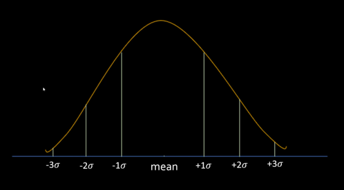

- [Z score](https://youtu.be/LZzq1zSL1bs?si=p1eO8SJDPIGNpEJ9&t=5862) - How many standard deviation away a datapoint is from mean, refer above image. Z score = (every data point - average)/standard deviation. [Modified Z score](https://youtu.be/m7KWxX23zCU?si=s0MrBjgX6XgaJyzf) - Modified Z score = 0.6745 *(every data point - median)/MAD where if modified_z_score > 3.5 may consider as outliers.
- Using percentile method with values in Inter Quartile Range along with lower and upper bound values and remaining as outliers it's possible to remove outliers. 
- [Logarithms uses](https://youtu.be/KzQQCtgzQbw?si=y5a3y-WSmHPnJNNg) , [Logarithm normal distribution](https://youtu.be/xtTX69JZ92w?si=yCe7Q2fOltWNY-Ku), [Cosine similarity,cosine distance](https://youtu.be/m_CooIRM3UI?si=JQ0wqK4GuORlasa7)
- A/B Testing - split testing, method to compare two versions of a product or service to determine which one performs better.[Refer](https://youtu.be/eiIhTbFP0ls?si=2LvxZYevNvYcccMv)
- [Hyphothesis Testing](https://youtu.be/fb8BSFr0isg?si=MyiugS-kgzgBVAHK) to get rid of randomness. Null hypothesis(H0) - Eg: Product B is not better than A that statment should be proved false , then it defines Product B is better than A. Alternative Hypothesis (𝐻1 or 𝐻𝑎):statement that contradicts the null hypothesis.It should prove Product B does better than A
- Statistics classified as - 

**Descriptive Statistics:**
<ul>
<li>Measure of central tendency - Mean,Median,Mode</li><li>Measure of dispersion - Variance(Population variance, Sample variance), standard deviation</li><li>Summarizing the data</li><li>Histogram</li><li>PDF (Probability Density Function)</li><li>CDF (Cumulative Distribution Function)</li><li>Probability</li><li>Permutation</li><li>Mean</li><li>Median</li><li>Mode</li><li>Variance</li><li>Standard deviation</li><li><a href="https://youtu.be/LZzq1zSL1bs?si=vD72ErlOKJ9kfeuL&t=5338">Gaussian distribution/Normal distribution</a></li><li>LogNormal distribution</li><li>Binomial distribution</li><li>Bernoulli distribution</li><li>Power law distribution/Paretto distribution</li><li><a href="https://youtu.be/LZzq1zSL1bs?si=kYwkqqx0qJN_Y6Zs&t=6101">Standard normal distribution</a></li><li>Transformation and <a href="https://youtu.be/LZzq1zSL1bs?si=usq-reT_ytYXj20T&t=6205">standardization</a></li><li>Q-Q Plot</li><li><a href="https://youtu.be/LZzq1zSL1bs?si=HK78YG0xsaaziaS6&t=6337">Normalization</a></li><li>Kernel Density Estimator</li><li>PDF (Probability Density Function)</li><li>Violin Plot</li><li>Data Transformation</li><li>Box-Cox Transform</li><li>Time Series Analysis</li>
</ul>

**Inferential Statistics:**

<ul>
  <li>Z Test, <a href="https://www.youtube.com/watch?v=LZzq1zSL1bs&t=13605s">One sample z test</a></li><li><a href="https://youtu.be/LZzq1zSL1bs?si=yqtmBTv_QkgsLu0g&t=13206">T Test</a>,<a href="https://www.youtube.com/watch?v=LZzq1zSL1bs&t=14351s">One sample t test</a></li><li>F Test/Anova (Analysis of Variance) test</li><li><a href="https://youtu.be/LZzq1zSL1bs?si=GSR-CR5fQS3KZszG&t=14771">CHI Square Test</a></li><li><a href="https://www.youtube.com/watch?v=LZzq1zSL1bs&t=15877s">Covariance,Pearson Correlation Coefficient</a></li><li>Hypothesis testing</li><li><a href="https://www.youtube.com/watch?v=LZzq1zSL1bs&t=10286s">P Values</a>,<a href="https://www.youtube.com/watch?v=LZzq1zSL1bs&t=17699s">Deriving P Values and significance</a></li><li>Confidence Intervals</li><li><a href="https://youtu.be/LZzq1zSL1bs?si=fssh_921L3KbTBKZ&t=7229">Z Table</a></li><li>T table</li><li>Bayes theorem</li><li>Bernoulli Distribution</li><li>Poisson Distribution</li><li>Central Limit Theorem</li><li>Chebyshev's Inequality</li>
</ul>

Sampling Techniques - Simple Random Sampling, Stratified Sampling, [Systematic sampling](https://youtu.be/LZzq1zSL1bs?si=qOiB8q12sGMrEtN4&t=1114), [Convenient Sampling](https://youtu.be/LZzq1zSL1bs?si=KVZqCJxo32fDV7yy&t=1213)
- Variables - Classified as Qualitative Variable, Quantitative Variable (Discrete, continuous). [Variable Measure Scales](https://www.youtube.com/watch?v=LZzq1zSL1bs&t=1854s) - classified as Nominal, Ordinal, Interval, Ratio.
- [Frequency distribution](https://youtu.be/LZzq1zSL1bs?si=0prfFWtIz7Fc7xiS&t=2090). [Percentiles and Quartiles](https://www.youtube.com/watch?v=LZzq1zSL1bs&t=4085s)
- [Probability](https://www.youtube.com/watch?v=LZzq1zSL1bs&t=10286s) . [Type I and Type II Error](https://www.youtube.com/watch?v=LZzq1zSL1bs&t=11542s) . [One Tailed and Two Tailed Tests](https://youtu.be/LZzq1zSL1bs?si=S9zeXmgAi9rwLsef&t=11975). [Confidence Interval](https://www.youtube.com/watch?v=LZzq1zSL1bs&t=12355s)

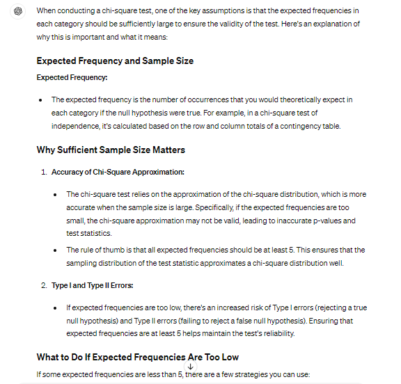
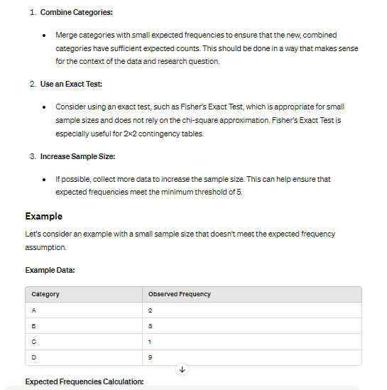
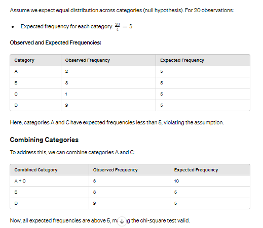

# Classification

- Types of classification - Decision Tree, Random Forest, Naive Bayes, KNN
 
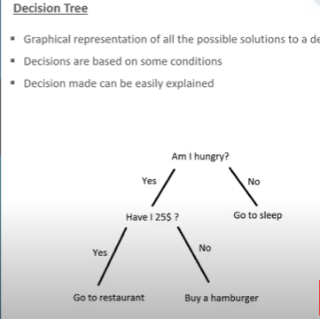
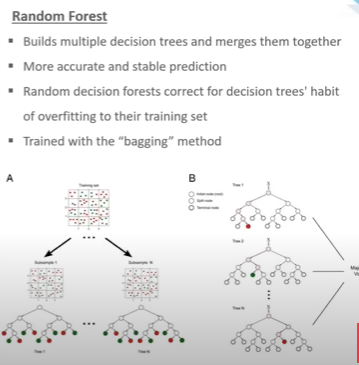
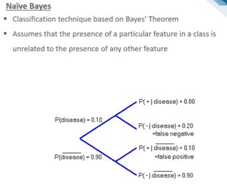
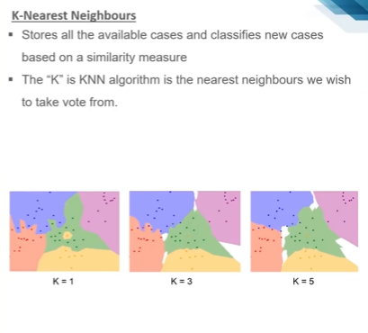

### Decision tree algorithm

- Use CART Algorithm. Refer [here](https://youtu.be/-ETQ97mXXF0?si=ev4xUznFzcHEeqp-&t=14643) for manual calculation of entropy, Information gain

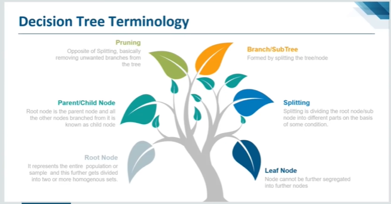
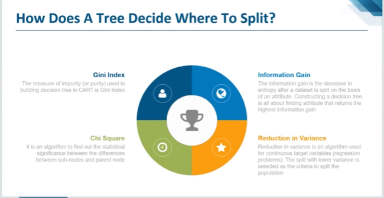

- Entropy - metric to measure the impurity, first step to do in decision tree.

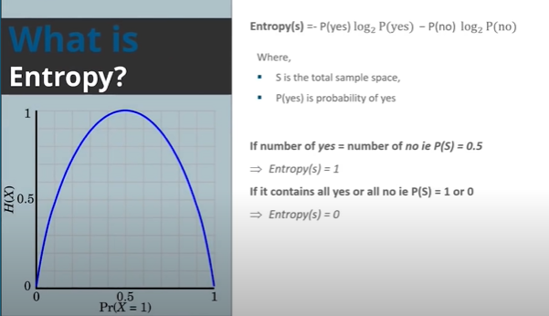

- Information gain - Measures the reduction in entropy. Pruning - Reducing the complexity i.e., remove values that has negative values

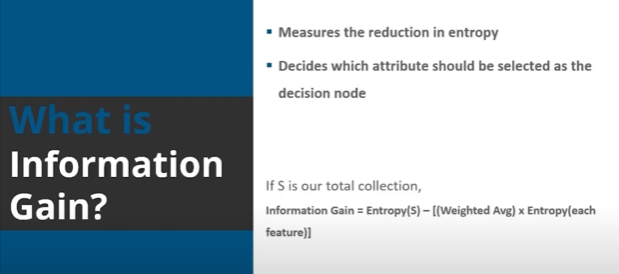

### Random Forest algorithm

- performs both regression and classification.

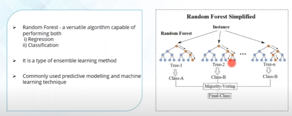

Eg: Banking - Find loan risk applicants by probability of defaulting payments , Medicine - find risk patients & disease trends,Land use - Find areas of same use,Marketing - Find customer churn

  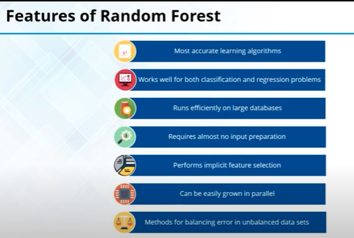

### K Nearest Neighbour

- Stores all available cases and classifies the new data or case based on least distance measure

- Concept search  - classifying documents on similar topics

- Find nearest neighbors using least distance measure. Euclidean Distance 

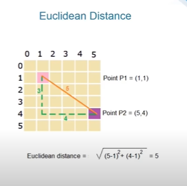

Manhattan Distance

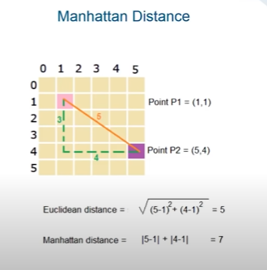

### Naive Bayes algorithm - [Refer](https://youtu.be/-ETQ97mXXF0?si=nehwOHdqkOlL9bWc&t=19733)

- Create Frequency table 

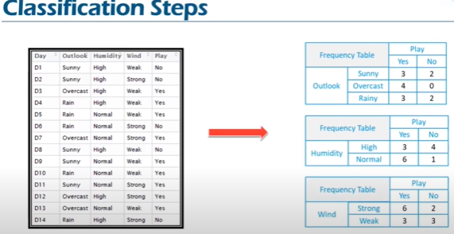

 Create Likelihood table

 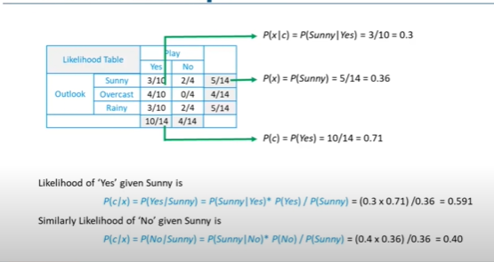

- Follows Bayes algorithm

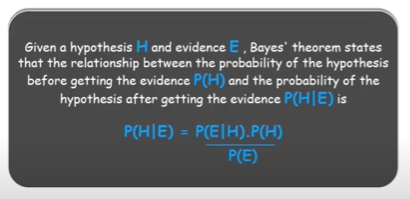
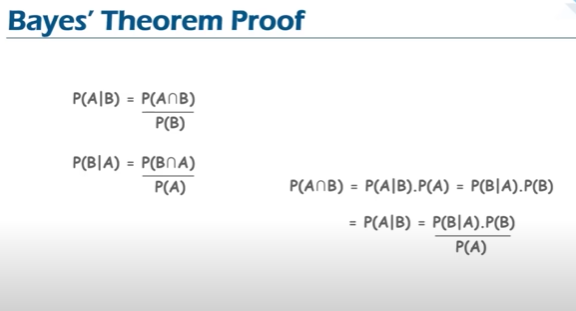

- Best suited for medical related analysis and diagnosis 
- Types - Gaussian , Multinomial, Bernoulli

### Vector Machines - [Refer](https://youtu.be/-ETQ97mXXF0?si=yfdcA8azrd4WkdVd&t=21224)

- SVM can also use for non-linear datasets.
- Draw hyperplane that separate classes -> distance between hperplane and closest points (closest points are called as support vectors)
- Optimum hyperplane will have maximum distance from each of these support vectors.Distance between two classes is called margins.
- SVM is accurate for even small datasets for Colon cancer classification than other algorithims.

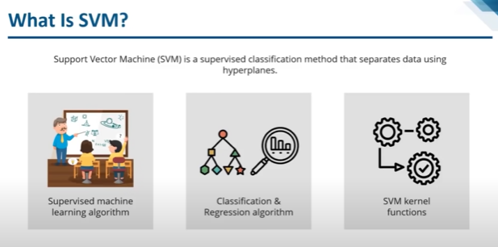
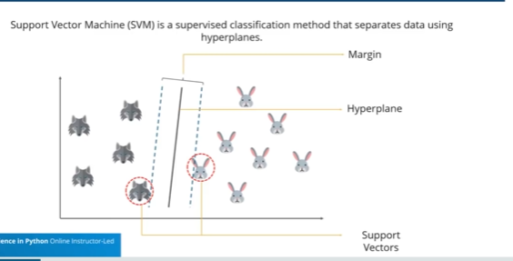

- <b>Clustering</b> - Grouping the data into particular groups based on the similar data points

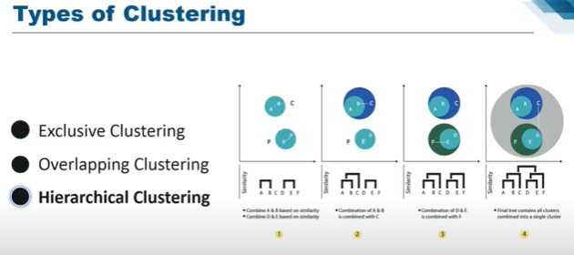

<b>K-Means Clustering</b>

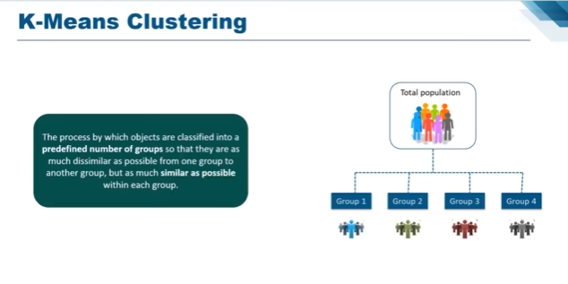
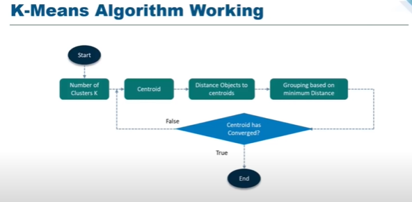

<b>Fuzzy C - Means clustering</b>

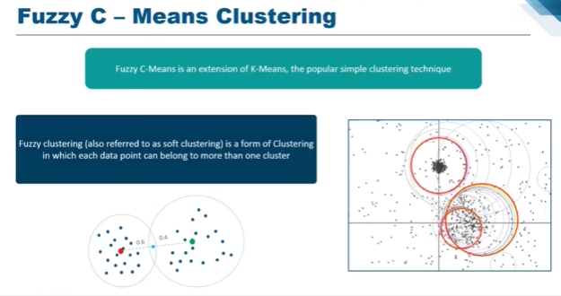
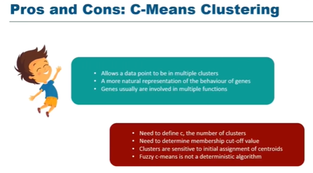

<b> Herarchical Clustering</b>

- Find and put each datapoint in its own cluster and find closest of cluster, combine to one more cluster, repeat this step until only one cluster is found.
- Will become very slow for large datasets.

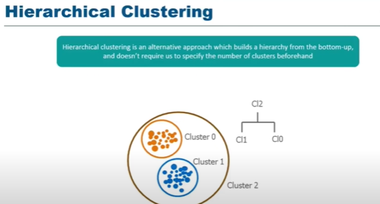

### A Priori algorithm - [Refer](https://youtu.be/-ETQ97mXXF0?si=coVeVCEEcJppf96g&t=22976)

- Associate Rule Mining - Construct rule based on number of occurences. Eg: If customer need to buy A,B or customer buys A,B also C and so on, then cardinality increase then we'll have lot of combination of rules for 10K+ data, To overcome it use Apriori algorithm.

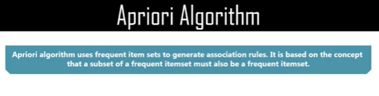

# Reinforcement Learning

- a ML where agent learns to behave in environment by performing actions and seeing the results.
- Reward maximization theory states - RL agent must be trained in such a way so it takes best action so reward is maximum.
- <b>Exploitation</b> - Using already known exploited information to heighten the rewards, <b>Exploration</b> - Exploring and capturing more information about an environment.

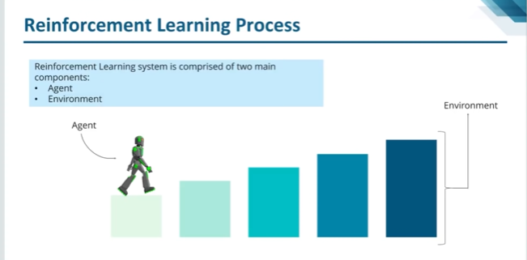
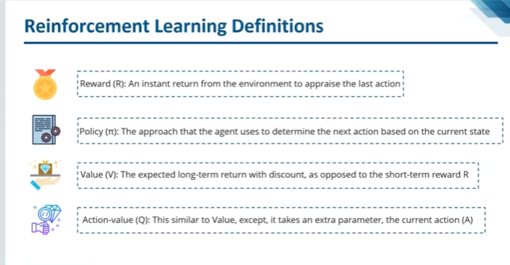

### Markov Decision Process - [Refer](https://youtu.be/-ETQ97mXXF0?si=6AcxHBfGaK-SLnNC&t=24671)

- It's a shortest path problem

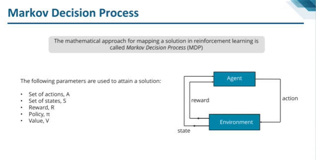
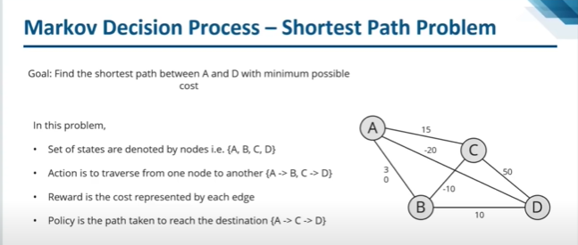

### Q-Learning Algorithm - [Refer](https://youtu.be/-ETQ97mXXF0?si=1J6UimDpt3YrI7PF&t=24896)

- The Goal is to reach end target with highest reward
- Create Reward Matrix (R) to note the connections with each node ---> Create Q Matrix for memory of agent has learned through experience ,so to remember experience later Q matrix is helpful like below example.

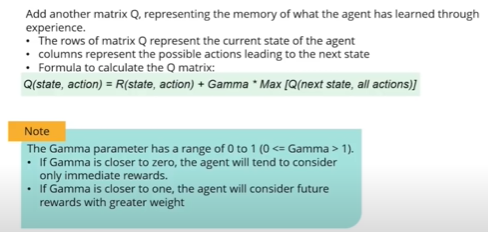
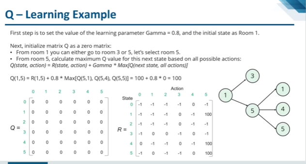

### Bellman Equation - [Refer](https://youtu.be/-ETQ97mXXF0?si=giDupPzrh1Rr0XBZ&t=26732)

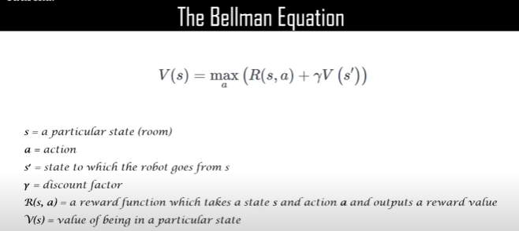

- If machinery got corrupted, but machine got hindarance, but if machine need to take right path but didn't take it, to overcome these types use Makov decision process in Bellman equation .

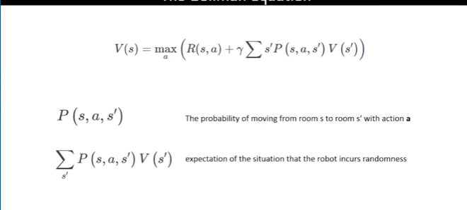
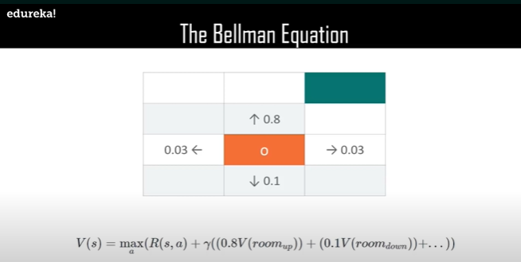

- To quantify the quality of particular action 

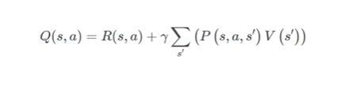
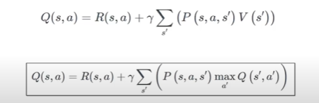

- Temporal difference - helps robot to calculate Q values with respect to changes in environment.For example: Let's say the robot is in mark state and already know the Q value needs to move upper state, the environment is stochastic and reward will be different may differ from earlier observation so to capture the difference use below formula. Here, <b>alpha</b> - learning rate that controls how quickly robot adapts to random changes imposed by environment. <b>Qt(s,a)</b> - current state Q value. <b>Qt-1(s,a)</b> - previously recorded Q value 

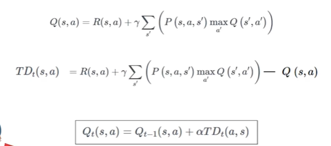
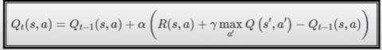

# Deep Learning - [Refer](https://youtu.be/-ETQ97mXXF0?si=wi-BPrbGRv0gqYsF&t=28047)

- Skips manual steps of extracting features , directly feed input to algorithm for classification

### Preceptron Learning Algorithm
 
- Pass the input (X) and multiply it with corresponding weights then sum together pass it to activation function to get the threshold value if above threshold then preceptron will trigger.

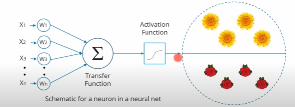 
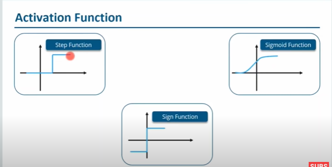

- Tensorflow - Tensors are standard way of showing data in deep learning, multidimensional arrays,extension of 2D tables to data with higher dimension

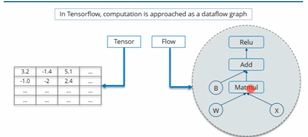

# Generative AI

- Prerequisites - Python,Statistics,NLP(RNN,IK Variants,Transformer and BERTS),Computer Vision(CNN,Object Detection). Learning Frameworks like Langchain,LamaIndex,Chainlit,HuggingFace. Fine Tuning opensource models (QLORA,LORA).
Function calling, Langchain (openai via langchain,prompt template,HuggingFace with langchain, chain,agents,memory,Document Loader)
- RNN for short term memory , LSTM supports both short and long term memory with four gates (3 I/P ,1 O/P),GRU are famous architectures. Also using these archs also implement 1 to 1,1 to many,many to 1, many to many sequences.
- Above mentioned sequence have limitation of no. of inputs always = no. of outputs, to overcome it they introduced encoders and decoders that encodes input pass it through context vector to decoders in paper "Sequence to sequence learning". 
- In classical mapping the input and output will mismatch so to overcome it use encoder-decoder arch but it too cannot handle longer sentence so they introduced Attention concept in paper "Neural Macine Translation with Attention"
- Using "Attention" concept google published paper "Attention is all you need" describes use of encoders and decoders without internal archs like RNN,LSTM or GRU
- "Universal language model fine-tuning for text classification" paper tells how to use LLM to our task.
- LANGCHAIN - Access different type of all LLM from single place, Access private date sources.Use Prompt Template for normal Questions using below syntax. 

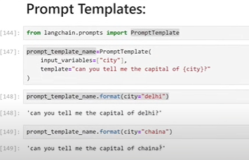

- "SerpAPI" with Langchain can get real time search data from google or any API.

# NLP 

- Step by step guide by [krish naik](https://youtu.be/fM4qTMfCoak?si=tZ4GvA6tWxfZjjXt)
- Stemming - fixed rules to come up with base word ex: loves -> love , eating -> eat .Lemmitaization - Base form of word ex: ate -> eat.
- To convert the text to numbers use methods TF-IDF Vectorizer, One Hot Encoding, Word Embedding, bag of words

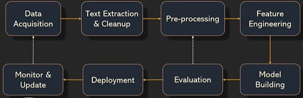

- Part of speech - Noun, pronoun, adjective, verb, adverb, Interjection, conjunction, preposition
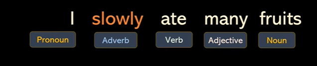

### EXTRAS TO REMEMBER

- [Sample Article for AI](https://www.linkedin.com/pulse/ai-landscape-2024-trends-top-startups-leta-capital-orqpe) , [Mad firstmark page](https://mad.firstmark.com/)
- [Concepts to learn as data scientist](https://youtu.be/4x30Fziru6M?si=ZIbAV4l1JKcpxysg)
- Refer [Data science questions](https://youtu.be/-ETQ97mXXF0?si=txf-VPBVFd2Np6fR&t=32559) , [Data Analysis questions](https://youtu.be/-ETQ97mXXF0?si=9R4Y4w6dveK52Qyy&t=33942) , [Machine Learning Questions](https://youtu.be/-ETQ97mXXF0?si=KETjk7LBuZ4Yw9Sz&t=35188)

- Logistic regression will work best when it has two labels. Collaborative filtering like User based Collaborative filtering , Item based Collaborative filtering are commonly used , SVD algorithm used in `Recommender systems`.

- If relationship b/w dependant and independant variable well approximated by linear model then use linear regression.

- If high non-linearity and complex relationship between dependent and independent variables then use tree model.

- If to build a model which is easy to explain to people then use decision tree models.

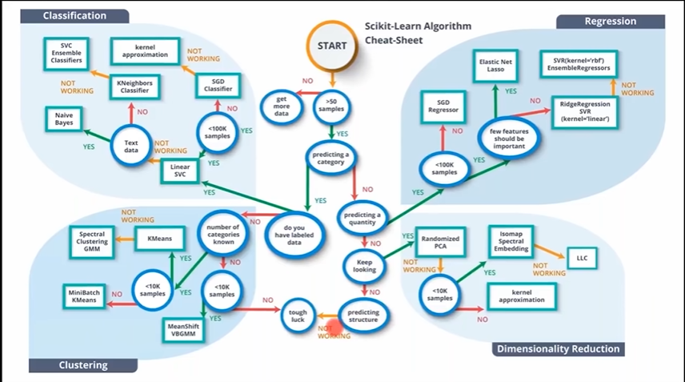

- [CK12.org](https://www.ck12.org/student/) For beginner probability and statistics, Algebra,calculus just like Khan academy.
- [Krish Naik Datascience roadmap](https://github.com/krishnaik06/Perfect-Roadmap-To-Learn-Data-Science-In-2024?tab=readme-ov-file)

### Interview questions

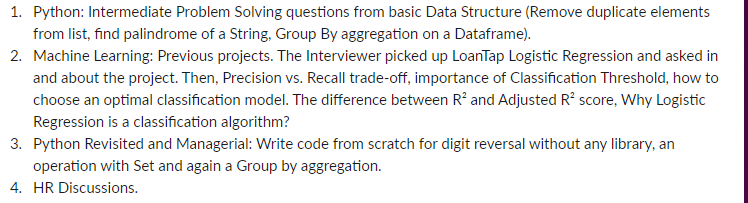
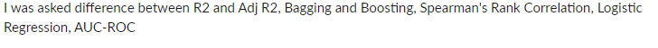

**[Data science Interview](https://www.youtube.com/watch?v=KIA9_9RPETg)**

<b>Questions Asked</b>

<ul><li>What is difference between iterators and generators in python</li>
<li>What is right skewness and how to relate with mathematical expression</li><li>What is standardization,normalization</li><li>Difference of scaler,vector with examples</li><li>What is d2yy,dx2</li><li>What is ensemble technique , how to implement in regression problem </li><li>For building Random forest what's the data selection technique that can be used, how the data will be splitted in random forest, In subsampling need to split the data col or row wise and what's the name of splitting technique?</li><li>What is K-fold cross validation, Boot strapping</li><li>What are parameters in random forest and it's uses</li><li>If there are two models one with n_estimator=10 other with n_estimator=30 which model will perform better?</li><li>What is ensemble technique and how to use it with other algorithms?</li><li>What is NN,pros,cons</li><li>What is activation functions and what's the use</li><li>What is Sigmoid,Tangent activation function, criterias to decide it</li><li>Loss functions,Optimizers,working of optimizers,Momentum and its uses</li><li>What is NLP,libraries for NLP used like NLTK,Concepts of stemming and lemitization <b>Note: Sentiment analysis can use stemming and for Q/A apps can use Lemitization</b> </li></ul>

