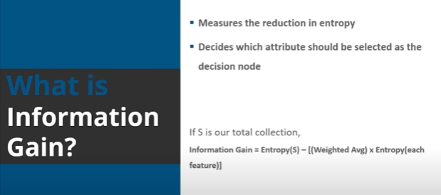
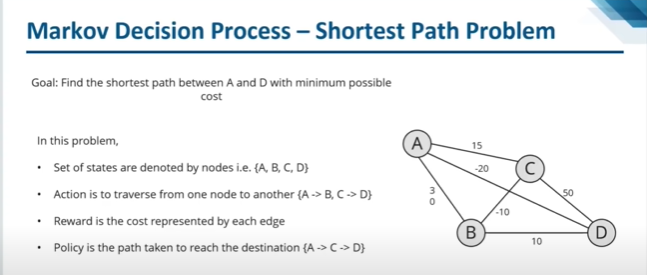
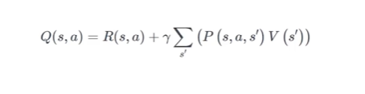
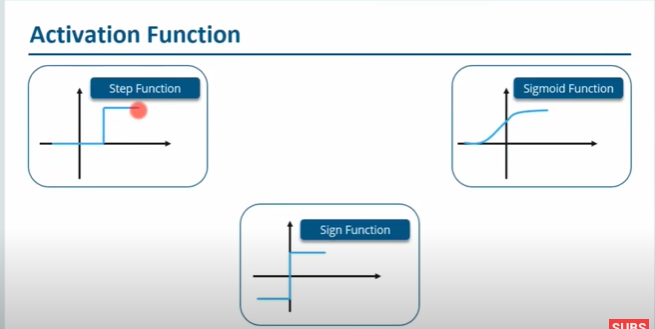

# Classification

- Types of classification - Decision Tree, Random Forest, Naive Bayes, KNN

### Decision tree algorithm

- Use CART Algorithm. Refer [here](https://youtu.be/-ETQ97mXXF0?si=ev4xUznFzcHEeqp-&t=14643) for manual calculation of entropy, Information gain

- Entropy - metric to measure the impurity, first step to do in decision tree.

- Information gain - Measures the reduction in entropy. Pruning - Reducing the complexity i.e., remove values that has negative values

### Random Forest algorithm

- performs both regression and classification.

Eg: Banking - Find loan risk applicants by probability of defaulting payments , Medicine - find risk patients & disease trends,Land use - Find areas of same use,Marketing - Find customer churn 
  

### K Nearest Neighbour

- Stores all available cases and classifies the new data or case based on least distance measure

- Concept search  - classifying documents on similar topics

- Find nearest neighbors using least distance measure. Euclidean Distance 

Manhattan Distance

### Naive Bayes algorithm - [Refer](https://youtu.be/-ETQ97mXXF0?si=nehwOHdqkOlL9bWc&t=19733)

- Create Frequency table 

 Create Likelihood table
 fr
- Follows Bayes algorithm

- Best suited for medical related analysis and diagnosis 
- Types - Gaussian , Multinomial, Bernoulli

### Vector Machines - [Refer](https://youtu.be/-ETQ97mXXF0?si=yfdcA8azrd4WkdVd&t=21224)

- SVM can also use for non-linear datasets.
- Draw hyperplane that separate classes -> distance between hperplane and closest points (closest points are called as support vectors)
- Optimum hyperplane will have maximum distance from each of these support vectors.Distance between two classes is called margins.
- SVM is accurate for even small datasets for Colon cancer classification than other algorithims.

- <b>Clustering</b> - Grouping the data into particular groups based on the similar data points

<b>K-Means Clustering</b>

<b>Fuzzy C - Means clustering</b>

<b> Herarchical Clustering</b>

- Find and put each datapoint in its own cluster and find closest of cluster, combine to one more cluster, repeat this step until only one cluster is found.
- Will become very slow for large datasets.

### A Priori algorithm - [Refer](https://youtu.be/-ETQ97mXXF0?si=coVeVCEEcJppf96g&t=22976)

- Associate Rule Mining - Construct rule based on number of occurences. Eg: If customer need to buy A,B or customer buys A,B also C and so on, then cardinality increase then we'll have lot of combination of rules for 10K+ data, To overcome it use Apriori algorithm.

# Reinforcement Learning

- a ML where agent learns to behave in environment by performing actions and seeing the results.
- Reward maximization theory states - RL agent must be trained in such a way so it takes best action so reward is maximum.
- <b>Exploitation</b> - Using already known exploited information to heighten the rewards, <b>Exploration</b> - Exploring and capturing more information about an environment.

### Markov Decision Process - [Refer](https://youtu.be/-ETQ97mXXF0?si=6AcxHBfGaK-SLnNC&t=24671)

- It's a shortest path problem

### Q-Learning Algorithm - [Refer](https://youtu.be/-ETQ97mXXF0?si=1J6UimDpt3YrI7PF&t=24896)

- The Goal is to reach end target with highest reward
- Create Reward Matrix (R) to note the connections with each node ---> Create Q Matrix for memory of agent has learned through experience ,so to remember experience later Q matrix is helpful like below example.

### Bellman Equation - [Refer](https://youtu.be/-ETQ97mXXF0?si=giDupPzrh1Rr0XBZ&t=26732)

- If machinery got corrupted, but machine got hindarance, but if machine need to take right path but didn't take it, to overcome these types use Makov decision process in Bellman equation .

- To quantify the quality of particular action 

- Temporal difference - helps robot to calculate Q values with respect to changes in environment.For example: Let's say the robot is in mark state and already know the Q value needs to move upper state, the environment is stochastic and reward will be different may differ from earlier observation so to capture the difference use below formula. Here, <b>alpha</b> - learning rate that controls how quickly robot adapts to random changes imposed by environment. <b>Qt(s,a)</b> - current state Q value. <b>Qt-1(s,a)</b> - previously recorded Q value 

# Deep Learning - [Refer](https://youtu.be/-ETQ97mXXF0?si=wi-BPrbGRv0gqYsF&t=28047)

- Skips manual steps of extracting features , directly feed input to algorithm for classification

### Preceptron Learning Algorithm

- Pass the input (X) and multiply it with corresponding weights then sum together pass it to activation function to get the threshold value if above threshold then preceptron will trigger.
 

- Tensorflow - Tensors are standard way of showing data in deep learning, multidimensional arrays,extension of 2D tables to data with higher dimension

### 

- If relationship b/w dependant and independant variable well approximated by linear model then use linear regression.

- If high non-linearity and complex relationship between dependent and independent variables then use tree model.

- If to build a model which is easy to explain to people then use decision tree models.
