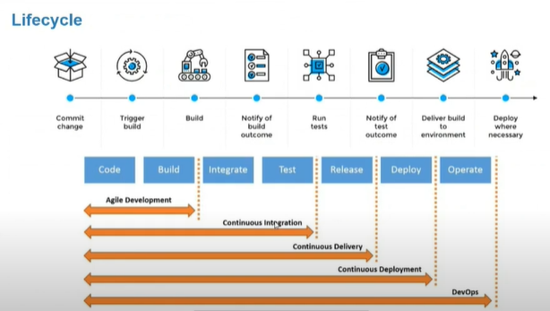
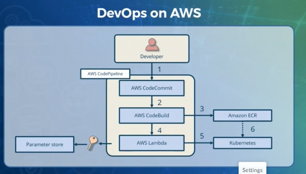
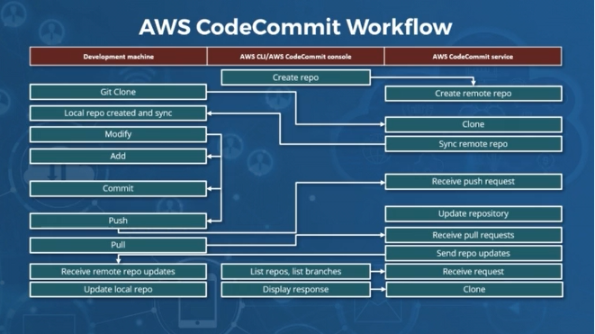
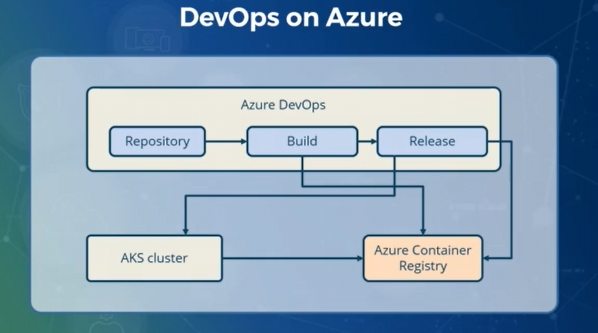
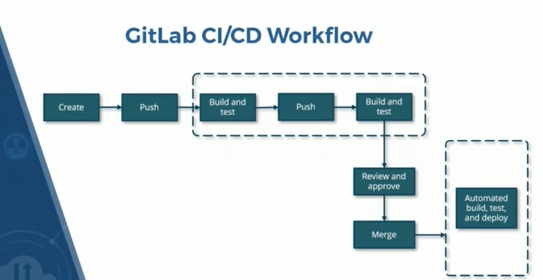
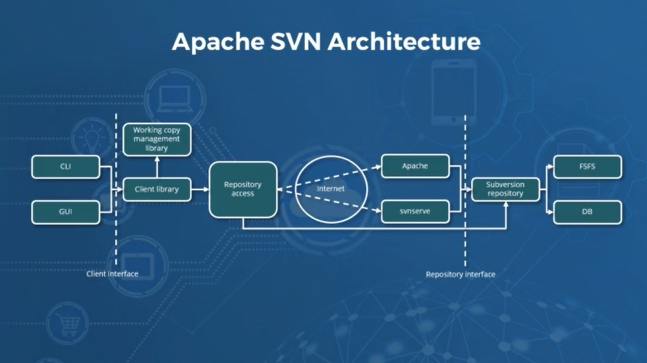
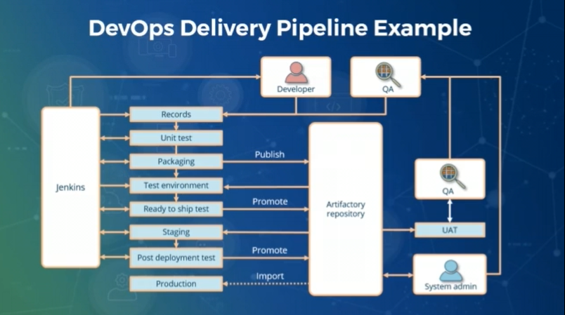

- ```SonarCube``` open source platform for continuous inspection of code quality,does static code analysis,provides report on bugs,vulnerabilities.
- ```Continous Integration``` integrates developers products into central repositories,make integration process repeat,relies on test suite and automated test executions.```Continous Delivery``` automates software delivery processes,product software in short cycles,each steps of build
- ```Version control,Build,Test,Deploy,Automate test and code coverage,Deploy to production,Validate``` are the steps of delivery pipeline.The working flow of jenkins pipeline is shown below
- ```DevSecOps``` integrates security within Devops process,remove vulnerabilities,security-as-code culture,Incorporates security into every development steps.
- ```Beanstalk``` helps write , review and deploy code quickly,Provides robust git and svn hosting,Supports issue and review management,supports multiple environments,built-in integrations.
- ```Apache subversion``` manage fully featured version control system allows attaching of arbitrary metadata to any file or directory,supports atomic commits,support HTTP based Webdav/DeltaV protocols,supports standalone server.









# Jenkins

- Deploy to test servers to perform user acceptance testing with tools like selenium and then deploy to prod servers for release. If this done automatically then called as `Continuous Deployment` else if manually then `Continous Delivery`.

- How Jenkins Works- Developer changes the source code ---> Jenkins take that code and trigger a build using maven or gradle ---> Then test source code in test server for unit testing with tools like selenium and JUnit ---> Deploy tested code to prod servers for release with tools like docker, puppet ---> continuously monitored with tools like Nagios,Splunk, LG Stack.

- Jenkins role is till the app is packaged and then to deliver our app we need Docker.



# Git and Github

- `git remote add origin <GITHUB_URL>` - To set repo url to push our files.
- `git clone <GITHUB_URL>` - To clone the repository to local machine
- `git add .` - To add all files for commit , `git add <FILE_NAME>` - To add particular file for commit to github
- `git commit -m <MESSAGE_TITLE> -m <MESSAGE_DESCRIPTION>` - To commit all the added files to github repo with title and description.
- `git push origin <BRANCH_NAME>` - Push the files to remote repository
- To verify with SSH - Create ssh keys by `ssh-keygen -t rsa -b 4096 -C <YOUR_EMAIL>` ---> `ls | grep testkey` to get the keys present ---> From two keys copy `<KEY_FILE>.pub` ---> Goto `SSH and GPG keys` in settings in Github repo and Add new key and paste it.
- `git push -u origin <BRANCH_NAME>` - To push into branch and set default branch to push the file using `-u` parameter.After, if we just use `git push` it will automatically push to default branch.
- `git checkout -b <BRANCH_NAME>` - Create new branch.
- `git diff <BRANCH_NAME>` - shows what changes been made, compares two versions of code and shows all of the lines that changed.
- `git merge <BRANCH_NAME>` - Merge the branch to main branch.
- `git branch -d <BRANCH_NAME>` - Delete branch
- `git commit -am <MESSAGE_TITLE>` - add the modified file and also commit with the message, only works for modified file not for newly created file.
- `git reset` or `git reset <FILE_NAME>` - To undo the stage once added using `git add .`
- `git reset <POINTER_TO_LAST_COMMIT>~<STEPS>` - `git reset HEAD~1` where HEAD shows last commit and 1 denotes 1 step before commit.
- `git log` - shows all logs of the commit. Use with filters by date,by keywords,by author, by file, by branch Eg: `git log --after="2021-7-9" --before="2021-7-5" --grep="anywordsToSearch" --author="authorName" -- filename.extension`. `git login <BRANCH_NAME>..<BRANCH_NAME>` - Eg: `git log feature/login..main` returns commits that are in `main` but not in `feature/login`.
- `git reset <COMMIT_HASH>` - To reset to particular commit, paste the target hash and reset it.But the modified part will still be available and show it as unstaged changes.
- `git reset --hard <COMMIT_HASH>` - Reset to particular commit and even remove the unstage changes , totally reset it.
- `git merge --abort` - to abort the merge.
- `git mergetool` - configure the merge.tool in `git config`, helps to show conflicted places and everything in the configured tool.
- `git rebase <BRANCH_NAME>` - similar to merge.While merging brings changes together with a new commit, rebasing integrates changes by moving or combining commits onto a new base commit. Don't use rebase on commits that already pushed on remote repo , Instead use it for cleaning local commit history before merging it into shared team branch.
- `git cherry-pick <COMMIT_ID>` - It takes the changes introduced by a specific commit on one branch and applies those changes to your current branch.
- `git reflog` -  log that provides a history of reference updates in  repository. It includes information about when the branches were updated, where the HEAD (current branch) was pointing, and details about each commit.
Mainly used to `restore commits`.
- `git branch <BRANCH_NAME>` - Create new branch in repo
- `git branch -d <BRANCH_NAME>` - Delete a branch named with merged changes
- `git branch -D <BRANCH_NAME>` -  To force-delete the branch without checking for merged changes.
- `git branch -vv` - To check the upstream setting for a branch.
- `git submodule add <GITHUB_LINK>` - `git submodule add https://github.com/abcd/library.git` To add the submodule from any git repo to your repo. <b>Note:</b> Contents of submodule not stored in our parent repo, parent repo stores only submodule remote-url and local-path inside main project and checkout division.
- `git submodule update --init --recursive` - At first when cloned the repo with submodule, the cloned repo only has sumodule folders with no contents as git stores only configs of submodule, so to initialize and update the submodule run the command or run `git clone --recurse-submodules https://github.com/abcd/yourRepo.git` to clone the repo along with submodules.