- ```SonarCube``` open source platform for continuous inspection of code quality,does static code analysis,provides report on bugs,vulnerabilities.
- ```Continous Integration``` integrates developers products into central repositories,make integration process repeat,relies on test suite and automated test executions.```Continous Delivery``` automates software delivery processes,product software in short cycles,each steps of build
- ```Version control,Build,Test,Deploy,Automate test and code coverage,Deploy to production,Validate``` are the steps of delivery pipeline.The working flow of jenkins pipeline is shown below
- ```DevSecOps``` integrates security within Devops process,remove vulnerabilities,security-as-code culture,Incorporates security into every development steps.
- ```Beanstalk``` helps write , review and deploy code quickly,Provides robust git and svn hosting,Supports issue and review management,supports multiple environments,built-in integrations.
- ```Apache subversion``` manage fully featured version control system allows attaching of arbitrary metadata to any file or directory,supports atomic commits,support HTTP based Webdav/DeltaV protocols,supports standalone server.

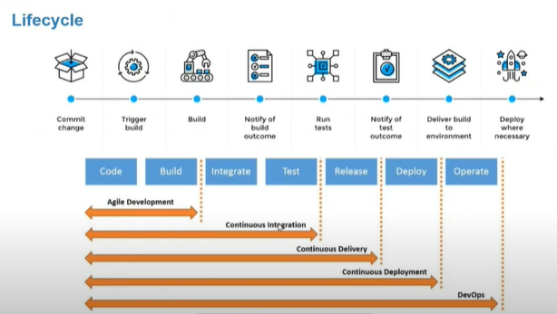
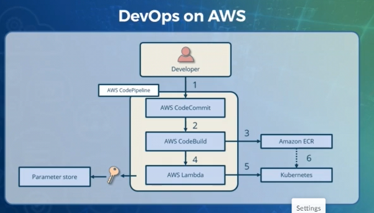
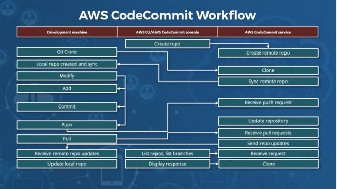
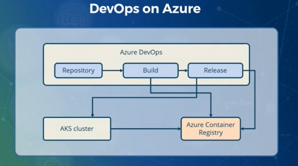
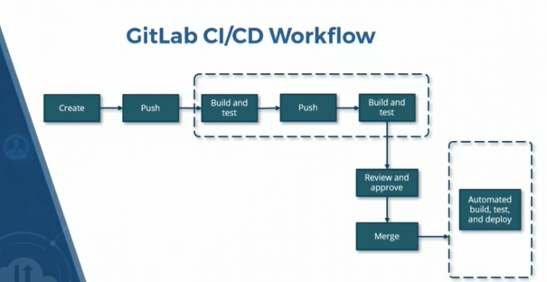
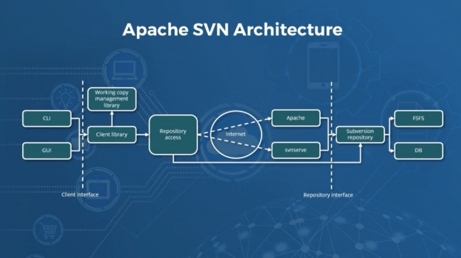


# Jenkins

- Deploy to test servers to perform user acceptance testing with tools like selenium and then deploy to prod servers for release. If this done automatically then called as `Continuous Deployment` else if manually then `Continous Delivery`.

- How Jenkins Works- Developer changes the source code ---> Jenkins take that code and trigger a build using maven or gradle ---> Then test source code in test server for unit testing with tools like selenium and JUnit ---> Deploy tested code to prod servers for release with tools like docker, puppet ---> continuously monitored with tools like Nagios,Splunk, LG Stack.

- Jenkins role is till the app is packaged and then to deliver our app we need Docker.

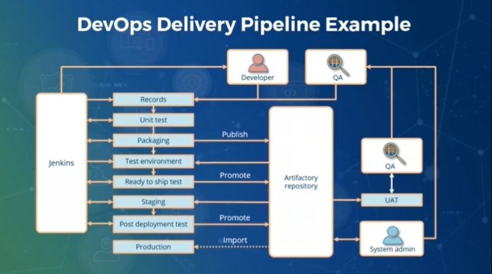

# Git and Github

- `git remote add origin <GITHUB_URL>` - To set repo url to push our files.
- `git clone <GITHUB_URL>` - To clone the repository to local machine
- `git add .` - To add all files for commit , `git add <FILE_NAME>` - To add particular file for commit to github
- `git commit -m <MESSAGE_TITLE> -m <MESSAGE_DESCRIPTION>` - To commit all the added files to github repo with title and description.
- `git push origin <BRANCH_NAME>` - Push the files to remote repository
- To verify with SSH - Create ssh keys by `ssh-keygen -t rsa -b 4096 -C <YOUR_EMAIL>` ---> `ls | grep testkey` to get the keys present ---> From two keys copy `<KEY_FILE>.pub` ---> Goto `SSH and GPG keys` in settings in Github repo and Add new key and paste it.
- `git push -u origin <BRANCH_NAME>` - To push into branch and set default branch to push the file using `-u` parameter.After, if we just use `git push` it will automatically push to default branch.
- `git checkout -b <BRANCH_NAME>` - Create new branch.
- `git diff <BRANCH_NAME>` - shows what changes been made, compares two versions of code and shows all of the lines that changed.
- `git merge <BRANCH_NAME>` - Merge the branch to main branch.
- `git branch -d <BRANCH_NAME>` - Delete branch
- `git commit -am <MESSAGE_TITLE>` - add the modified file and also commit with the message, only works for modified file not for newly created file.
- `git reset` or `git reset <FILE_NAME>` - To undo the stage once added using `git add .`
- `git reset <POINTER_TO_LAST_COMMIT>~<STEPS>` - `git reset HEAD~1` where HEAD shows last commit and 1 denotes 1 step before commit.
- `git log` - shows all logs of the commit. Use with filters by date,by keywords,by author, by file, by branch Eg: `git log --after="2021-7-9" --before="2021-7-5" --grep="anywordsToSearch" --author="authorName" -- filename.extension`. `git login <BRANCH_NAME>..<BRANCH_NAME>` - Eg: `git log feature/login..main` returns commits that are in `main` but not in `feature/login`.
- `git reset <COMMIT_HASH>` - To reset to particular commit, paste the target hash and reset it.But the modified part will still be available and show it as unstaged changes.
- `git reset --hard <COMMIT_HASH>` - Reset to particular commit and even remove the unstage changes , totally reset it.
- `git merge --abort` - to abort the merge.
- `git mergetool` - configure the merge.tool in `git config`, helps to show conflicted places and everything in the configured tool.
- `git rebase <BRANCH_NAME>` - similar to merge.While merging brings changes together with a new commit, rebasing integrates changes by moving or combining commits onto a new base commit. Don't use rebase on commits that already pushed on remote repo , Instead use it for cleaning local commit history before merging it into shared team branch.
- `git cherry-pick <COMMIT_ID>` - It takes the changes introduced by a specific commit on one branch and applies those changes to your current branch.
- `git reflog` -  log that provides a history of reference updates in  repository. It includes information about when the branches were updated, where the HEAD (current branch) was pointing, and details about each commit.
Mainly used to `restore commits`.
- `git branch <BRANCH_NAME>` - Create new branch in repo
- `git branch -d <BRANCH_NAME>` - Delete a branch named with merged changes
- `git branch -D <BRANCH_NAME>` -  To force-delete the branch without checking for merged changes.
- `git branch -vv` - To check the upstream setting for a branch.
- `git submodule add <GITHUB_LINK>` - `git submodule add https://github.com/abcd/library.git` To add the submodule from any git repo to your repo. <b>Note:</b> Contents of submodule not stored in our parent repo, parent repo stores only submodule remote-url and local-path inside main project and checkout division.
- `git submodule update --init --recursive` - At first when cloned the repo with submodule, the cloned repo only has sumodule folders with no contents as git stores only configs of submodule, so to initialize and update the submodule run the command or run `git clone --recurse-submodules https://github.com/abcd/yourRepo.git` to clone the repo along with submodules.

# AWS

- AWS Cloud Practitioner syllabus - 28% (13 Q) from Cloud Concepts, 24%(16-17 Q) from Security and Compliance, 36%(21-22 Q) from Technology, 12%(10-11 Q) from Billing and Pricing. Take test as In person or online from home where proctor monitors us.Need to take atleast 700/1000 marks for pass.Out of 65 - 50 Scored,15 Unscored(can afford to get wrong). Questions maybe MCQ with Multiple answers.Duration - 1.5 hours(~1.5 mins/Q) and Overall time including review instructions,providing feedback and other activities the seat time is 120 mins. Certificate will be valid for 3 YEARS OR 36 MONTHS.Cost is 100$. ```Recommended to take in TEST CENTER```, [Practice test 1](https://explore.skillbuilder.aws/learn/course/external/view/elearning/18115/exam-prep-official-pre-test-aws-certified-cloud-practitioner-clf-c02) and [Practice test 2](https://explore.skillbuilder.aws/learn/course/external/view/elearning/14050/aws-certified-cloud-practitioner-official-practice-question-set-clf-c02-english) and [AWS Cloud Quest](https://aws.amazon.com/training/digital/aws-cloud-quest/)

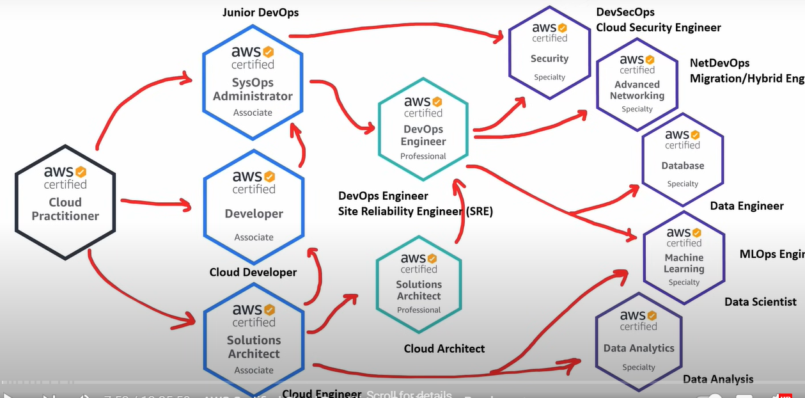
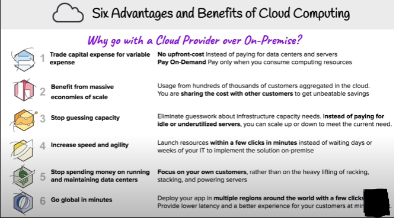
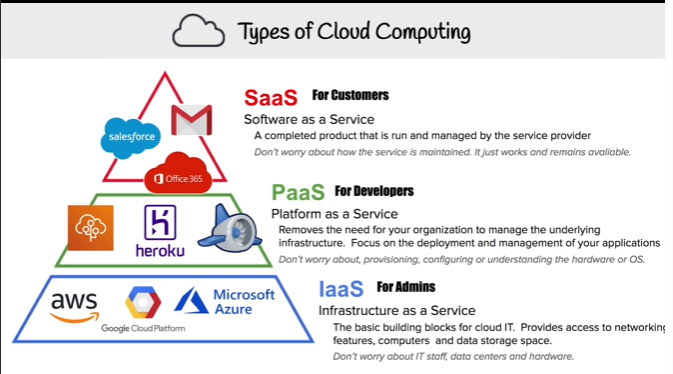

- Cloud Computing Deployment Models - Cloud,Hybrid(Both cloud,on-prem),On-prem. AWS servers are in >190 countries. `Regions` are physical location in world with multiple availability zone(Data centers),Every region is isolated and independent of others,each region has atleast 2 AZ,Largest region is US-EAST,service always become available first in US-EAST,US-EAST1 where see all billing informations. `Availability Zones` are one or more discrete data centers, represented by like "us-east-1a", <10ms latency between AZs. `Edge Location` datacenter owned by trusted partner of AWS,these locations serve requests for cloudFront, Route 53, S3 Transfer acceleration, API Gateway where request going to either of these service will route to nearest edge location automatically, Allows low latency wherever user is located.`Gov cloud` regions allow customer host sensitive controlled unclassified info , Operated by employees of U.S. Citizens on U.S. Soil, Only accessible to U.S. entities and root account holders who pass a screening test.Refer [Regional Table](https://aws.amazon.com/about-aws/global-infrastructure/regional-product-services/?p=ngi&loc=4)
- When created instance, to run with Session Manager need to Modify IAM Role in ec2 instance with permission `AmazonEc2RoleforSSM , AmazonSSMManagedInstanceCore`.
- [AMI](https://www.youtube.com/watch?v=3hLmDS179YE&t=3516s) used to create copy of server, save the instance state etc. [Auto scaling groups](https://www.youtube.com/watch?v=3hLmDS179YE&t=3632s) to manage increase or decrease of server automatically based on the traffic and after reaching Auto scaling groups then only it will enter EC2 instances..When Auto scaling create a server but user terminated it then it will detect and identify as unhealthy and create new instance.
- [Elastic Load Balancer](https://www.youtube.com/watch?v=3hLmDS179YE&t=4051s) makes the incoming traffic to flow equally to all available instances. [RDS](https://www.youtube.com/watch?v=3hLmDS179YE&t=4612s) used to create Relational Database Systems , Refer [here](https://docs.aws.amazon.com/AmazonRDS/latest/UserGuide/Welcome.html).
- [Lambda Functions](https://www.youtube.com/watch?v=3hLmDS179YE&t=4920s) used . [EC2 Pricing model](https://www.youtube.com/watch?v=3hLmDS179YE&t=5531s) shows 4 different expensive methods

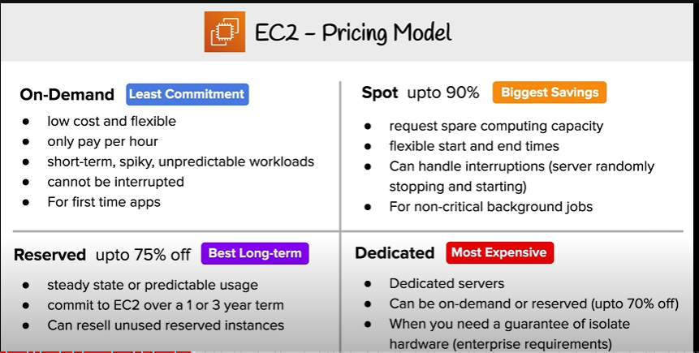
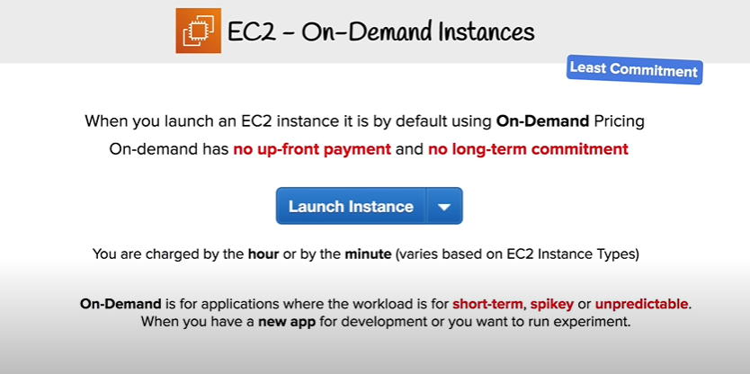
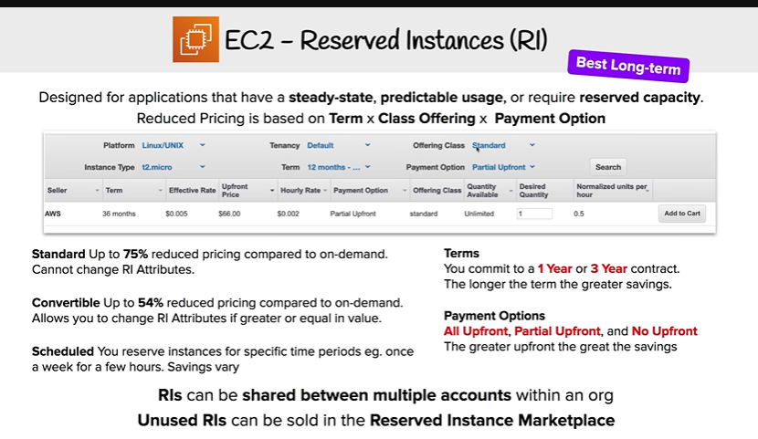
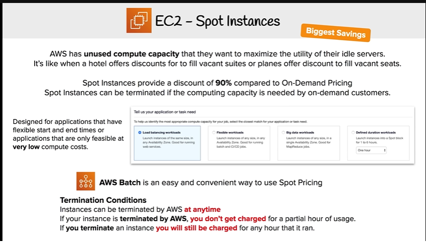
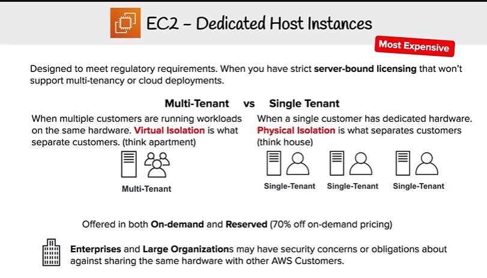

- Free Services - IAM, Amazon VPC, Organizations & Consolidated Billing, AWS Cost Explorer.Service that are free but resource to setup will cost are - Auto Scaling, CloudFormation, Elastic Beanstalk, Opsworks, Amplify, AppSync, CodeStar. Able

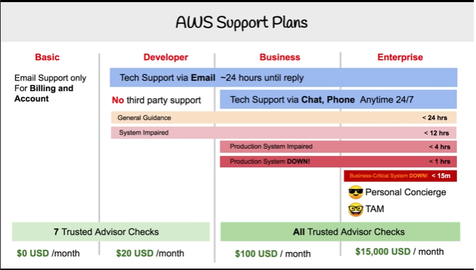

- [AWS Marketplace](https://www.youtube.com/watch?v=3hLmDS179YE&t=6245s) and [Subscription](https://www.youtube.com/watch?v=3hLmDS179YE&t=6305s). AWS Trusted advisors recommendations are

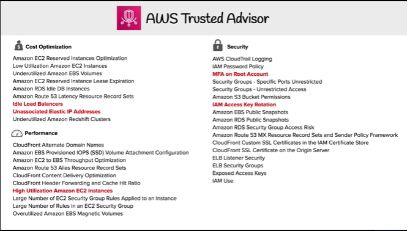
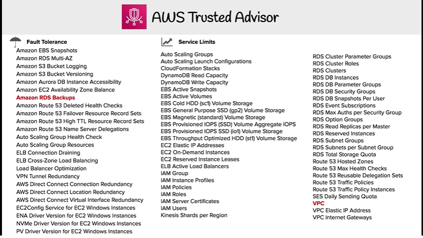

- Consolidated Billing - Pay all the members instead of paying separately. For example: In below , Odo used 4TB and Dax used 8TB if paid separately it costs 2088.96 dollars but if paid totally it costs 2007.04 dollars.

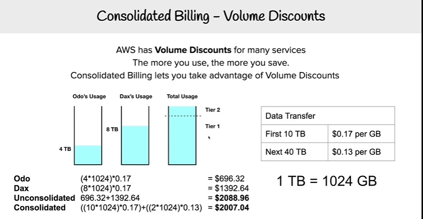

- [AWS Cost Explorer](https://www.youtube.com/watch?v=3hLmDS179YE&t=7116s) and [AWS Budgets](https://www.youtube.com/watch?v=3hLmDS179YE&t=7456s) used to create cost,usage,reservation budgets, can be tracked at monthly,quarterly, yearly levels. Alerts support Ec2,RDS,Redshift,ElastiCache reservations.Easily manage from AWS Budgets dashboard or via Budgets API.Get Notified by email or chatbot and threshold how close to current or forecased budget.

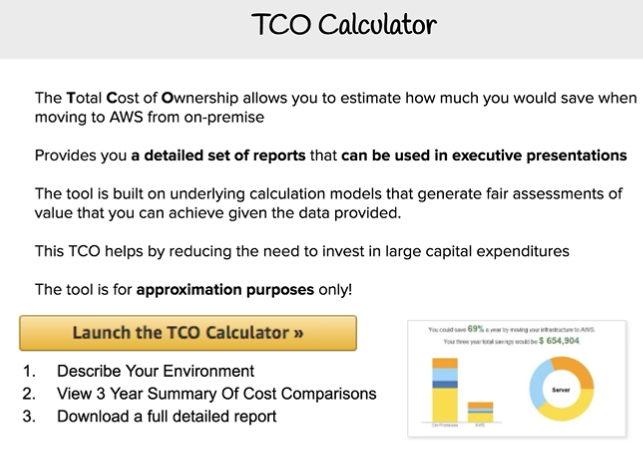

- [AWS Landing zone](https://www.youtube.com/watch?v=3hLmDS179YE&t=8084s) - Helps enterprises quickly setup secure,AWS-Multiaccount , Provides baseline environment to start with multi-account architecture, AWS AVM(Account Vending Machine) automatically provisions and confgiure new account via service catalog template , Uses SSO for managing and accessing accounts, Customizable to allow customers implement their own account baselines through Landing zone configuration and update pipeline.
- [AWS Resource Groups and Tagging](https://www.youtube.com/watch?v=3hLmDS179YE&t=8248s) where Tags are words act as metadata to organize AWS resources. Resource groups are colection of resources that share one or more tags , can dispay details based on Metrics,Alarms,Configuration settings.
- [AWS Quickstart](https://www.youtube.com/watch?v=3hLmDS179YE&t=8620s) provides sample templates to run it on our AWS, Refer [AWS Site](https://aws.amazon.com/quickstart). [AWS Cost and Usage](https://www.youtube.com/watch?v=3hLmDS179YE&t=8808s) used to view the usage and cost in AWS and view or analyse it using Redshift,Athena.
- [AWS Organizations](https://www.youtube.com/watch?v=3hLmDS179YE&t=9018s) to manage Roles,Policies to give which users can access which services.

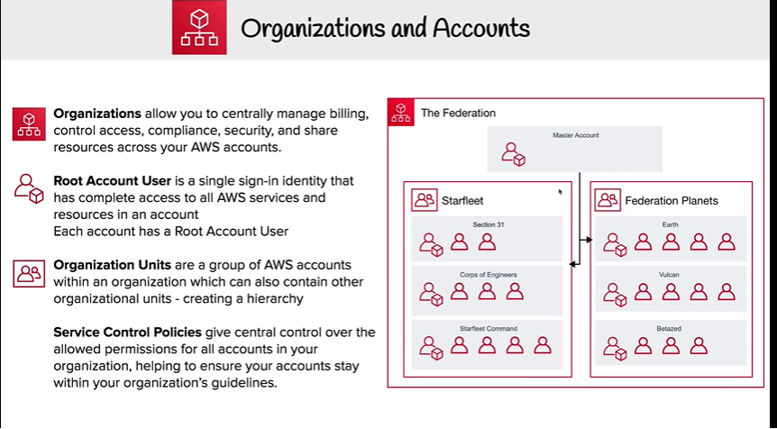

- [AWS Networking](https://www.youtube.com/watch?v=3hLmDS179YE&t=9853s) contains `VPC` a logically isolated section of AWS Cloud to launch AWS resources,`Internet Gateway` to enable access to internet,`Route Tables` to determine where network traffic from subnets are directed,`NACLs` act as firewals at subnet level,`Security Groups` act as firewall at instance level,`Subnets` logical partition of IP network into multiple,smaller network segments.

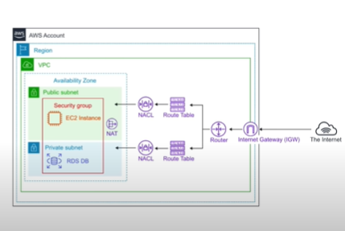

- [AWS Data services](https://www.youtube.com/watch?v=3hLmDS179YE&t=10047s) for managing SQL,NOSQL db. [AWS Provisioning](https://youtu.be/3hLmDS179YE?si=isqEjt9HUByTbcJh&t=10295) for allocation or creation of resources and services to customer. [AWS Computing](https://youtu.be/3hLmDS179YE?si=gY3dWQIV_HDbtv0s&t=10561) to run docker,Kubernetes etc.[AWS Storage services](https://youtu.be/3hLmDS179YE?si=_pFH05zNEEUBfvLy&t=10807) has S3,S3 Glacier,Storage Gateway,EBS,EFS,Snowball etc.[AWS Business Services](https://youtu.be/3hLmDS179YE?si=_LjMcTJyzpoqfm3a&t=11031) has connect,workspaces,workdocs,chime,workmail,pinpoint,SES,QuickSight etc.The few Enterprise Integrations to migrate data from ON-PREM to AWS are 

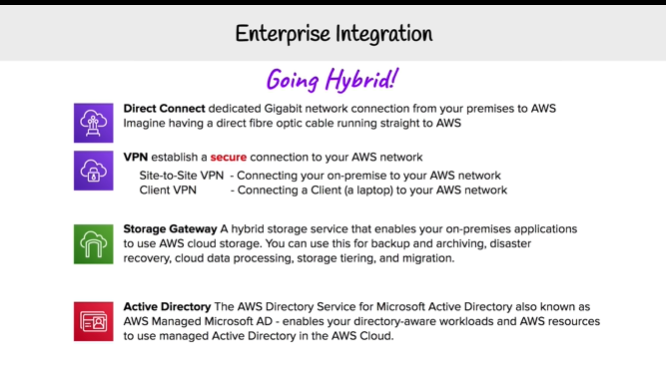

- [AWS Logging services](https://www.youtube.com/watch?v=3hLmDS179YE&t=11353s) includes CloudTrail,CloudWatch to watch logs,metrics,events,alarms etc.Some full forms in AWS are

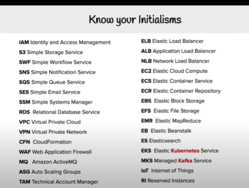

-[AWS Shared Model](https://www.youtube.com/watch?v=3hLmDS179YE&t=11629s) shows what should client handle in AWS on their end , AWS handle on their end and refer about [AWS Compliance Programs](https://aws.amazon.com/compliance/programs/) tells the compliances it has and to confirm those compliances Refer [here](https://youtu.be/3hLmDS179YE?si=Tn7eajfj-0g0hf3o&t=11946) 

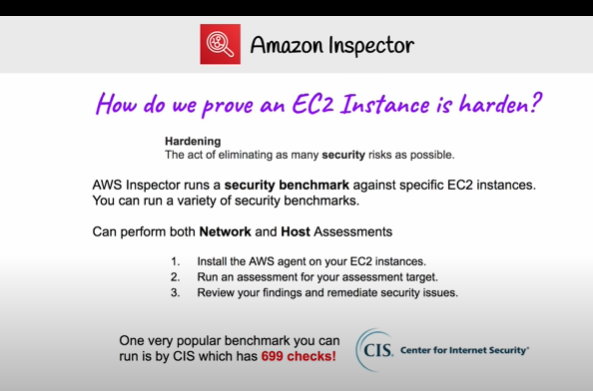
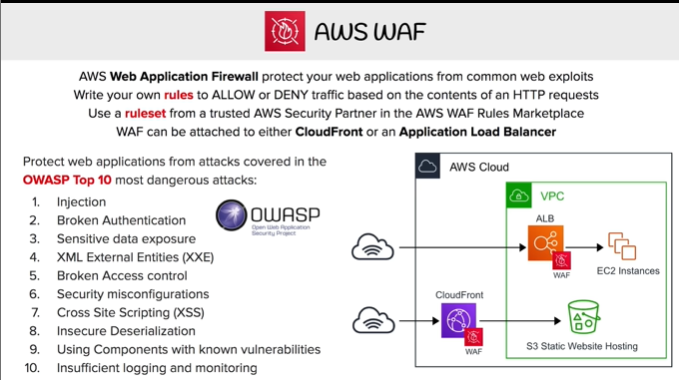
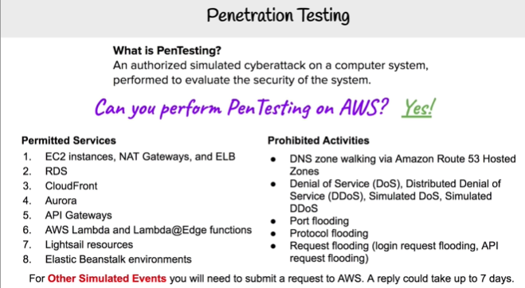
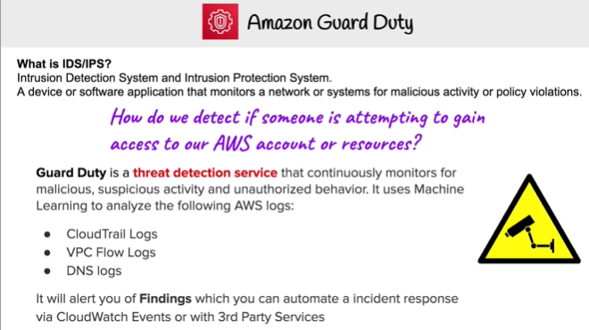

- [AWS Shield](https://www.youtube.com/watch?v=3hLmDS179YE&t=12257s) to protect from DDOS Attacks.[KMS](https://www.youtube.com/watch?v=3hLmDS179YE&t=12673s) to create and control encryption keys used to encrypt data.[Amazon Macie](https://youtu.be/3hLmDS179YE?si=YC_tYbUNMdKK-zZI&t=12773) to continuously monitor S3 data access activity for anomalies,generate alerts when risk of data access or leaks happened.Refer about difference between Security Groups vs NACLs [here](https://www.youtube.com/watch?v=3hLmDS179YE&t=12906s).

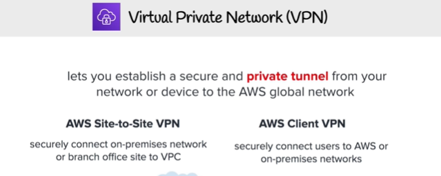

- In AWS there are few services that begin with word "Cloud", to know the difference refer [here](https://youtu.be/3hLmDS179YE?si=ZK9UVvkzisgYJLuU&t=13090).
- `Direct Connect` dedicated fiber optics connections from Datacenter to AWS, if needed extra security use VPN connect on-top of Direct connect.`Amazon Connect` call center service, get toll free number and accept inbound and outbound calls,setup automated phone systems.`Media Connect` new version of elastic transcoder,converts videos to different video types,helps to apply watermarks or insert introduction video in front of every video etc.

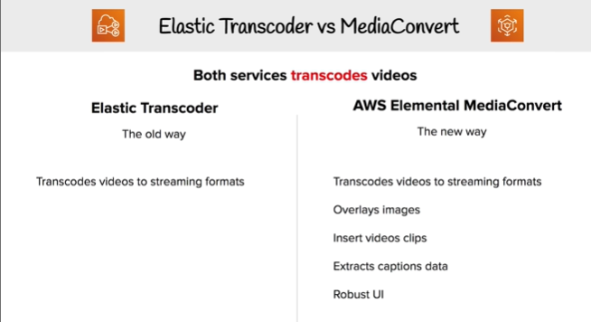
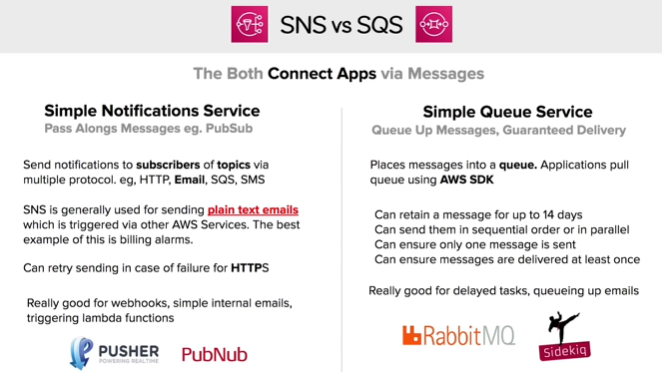
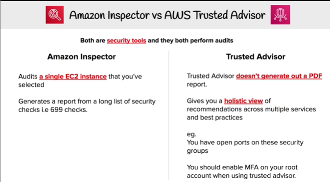

- [ALB vs NLB vs CLB](https://www.youtube.com/watch?v=3hLmDS179YE&t=13601s) shows difference between types of load balancers. [Artifact vs Inspector](https://www.youtube.com/watch?v=3hLmDS179YE&t=13858s) shows difference between security.

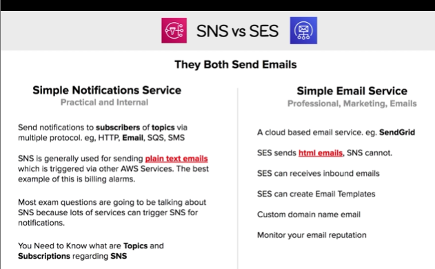

- [Book AWS Exam](https://www.youtube.com/watch?v=3hLmDS179YE&t=13930s)

## cloudthat Training by Nitin Kamble

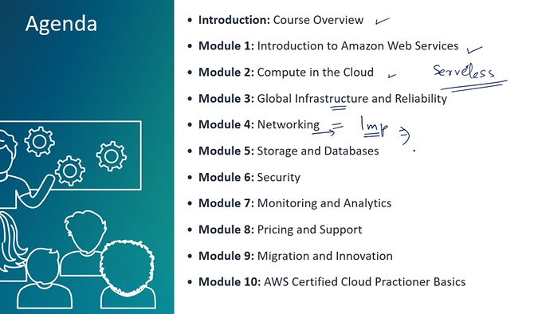

- In free trier never forget to run the resources continously. [AWS Advantages](https://docs.aws.amazon.com/whitepapers/latest/aws-overview/six-advantages-of-cloud-computing.html) , [AWS Core Services](https://docs.aws.amazon.com/whitepapers/latest/public-sector-cloud-transformation/core-services-and-additional-services.html)
- Deployment models - Cloud,on-premises,Hybrid. Enable MFA is the best practice for securing the root account.
- Both horizontal scaling , vertical scaling is possible for saving the cost.
- Elastic Load Balancer used to manage the request between the EC2 (Elastic Compute Cloud) instace to dynamically scale up and scale down. Security Groups - a virtual firewall for traffic
- General purpose EC2 instance used for web server for web applications , Batch processing or high computing performance needs compute optimized EC2, Databases and high I/O operations per second needs Memory optimizd EC2, video rendering or video streaming with high quality like 4K videos needs and ML Algos for training needs Accelerated Computing , Data Warehouse needs Storage optimized EC2. [Amazon EC2](https://docs.aws.amazon.com/AWSEC2/latest/UserGuide/concepts.html)

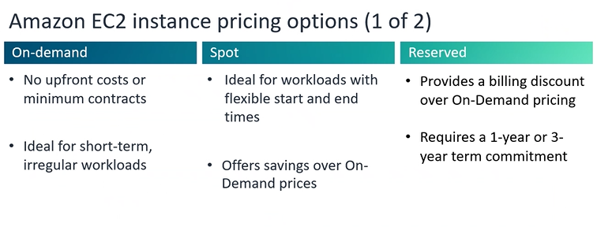
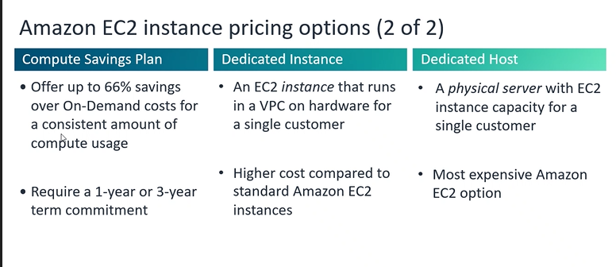

- [AWS Collaboration with Avatar2](https://aws.amazon.com/blogs/media/avatar-the-way-of-water-and-the-future-of-filmmaking/).  On demand instance cost appro 10$/hr and for spot instance cost 90% of discount where 1$/hr. On dedicated instance to launch resource the hardware that's reserved for us will be used and it costlier called as dedicated instance. Once Dedicated host we can create many more instance and manage by ourself
and it's the most expensive option. On compute savings plan where Ec2 and [fargate](https://docs.aws.amazon.com/AmazonECS/latest/developerguide/AWS_Fargate.html) and lambda comes under this and it has 66% of discount.

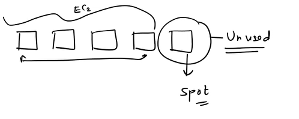

- Manual Scaling is not possible for high demand customers. So AWS auto scaling is possible. Cloudwatch monitoring will monitor the metric of EC2 metric called as CPU Utilization and if it's >80% auto-scaling will trigger and create new server instance S2 and if S2>80% usage it will create S3 server when decreases <80% remaining instance will delete.By default Cloudwatch monitor 5 min once and do the scaling and it can be increased. This is called as Horizontal scaling.
- For auto-scaling the minimum no of instance is required and now AWS has ML Algo to predict the max no of instance require when high usage. Auto-scaling supports for reserved instance , spotted instance for everything. Based on the amount of usage how much time for ex: 5 min or 1 hour the cost will incur but earlier it was 1 hour basis.Launch template we can configure min and max no of instance to start for auto scaling. [Auto scaling](https://docs.aws.amazon.com/autoscaling/) 

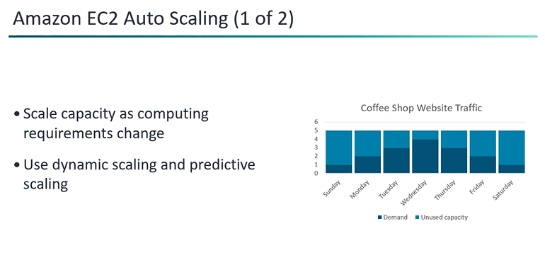

- ELB will do health check for all instance. In below image there are two servers s1,s2 is running and if s1 got errored health check informs ELB then we need to manually remove S1 so to avoid it implement Auto-scaling for the errored instance then once errored it will scale up and delete err instance. For ELB provides a single point of contact for Auto scaling group where the request will come from ELB then to Auto scaling groups and then to EC2 instance.[Elastic Load Balancing](https://docs.aws.amazon.com/elasticloadbalancing/)

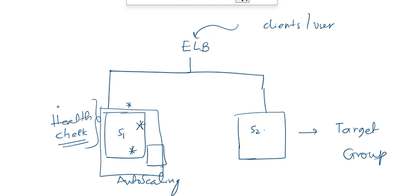
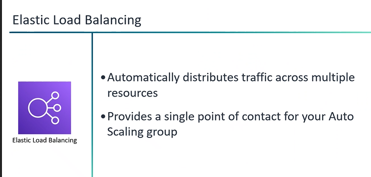

- [Lambda](https://docs.aws.amazon.com/lambda/) is serverless for taking code and execute directly. To send notification use [SNS](https://docs.aws.amazon.com/sns/) . [SQS (Simple Queue Service)](https://docs.aws.amazon.com/AWSSimpleQueueService/latest/SQSDeveloperGuide/welcome.html) to send message to many persons in single take through Queue method.
- [ECS (Container Service)](https://docs.aws.amazon.com/ecs/) for customers using docker container in on-prem and [EKS (Kubernetes Service)](https://docs.aws.amazon.com/eks/latest/userguide/getting-started.html) for customers using kubernetes  `Fleet, Autoscaling, LoadBalancing, All Hardwares are managed by AWS and as User we only manage Applications`.
- In Each region(totally 33 regions, region also called as Origin) there contains multiple Availability Zone (minimum 3 AZ) and in AZ there are multiple Data Centres. If the region is unsupported select the supported one.
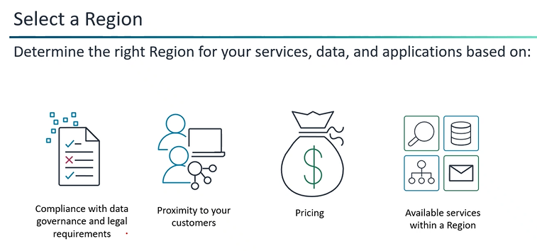
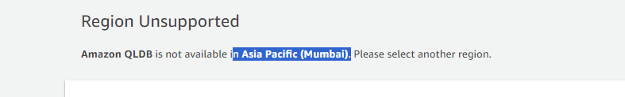

- CDN (Content Delivery Network) - multiple channels to deliver the content and cache in Edge location so easily available faster, [CloudFront](https://docs.aws.amazon.com/AmazonCloudFront/latest/DeveloperGuide/Introduction.html) act as CDN.  Wavelength where AWS collaborated with cell providers and started providing services who are not able to reach out to near center through Wavelength [AWS Wavelength](https://aws.amazon.com/wavelength/)
- [AWS Outposts](https://docs.aws.amazon.com/outposts/) to create own data center that's local to us but can't able to create all services and it will be managed by us where AWS will be helping us for setup. Networking, EC2, Database and Storage are 4 services will be available.
- To connect to AWS are SSH, [AWS CLI](https://docs.aws.amazon.com/cli/latest/userguide/getting-started-install.html ) and SDK.
- [VPC (Virtual Private Cloud)](https://docs.aws.amazon.com/vpc/latest/userguide/what-is-amazon-vpc.html) is own space where easily create own resources . NAT address is used for VPC that is 10.10.0.0/16 . The second image shows the calculation of number of ips will be used for creation of resources. In VPC multiple subnets are created and to allow internet to subnets we need to have [Internet GatewaY (IGW)](https://docs.aws.amazon.com/vpc/latest/userguide/VPC_Internet_Gateway.html) and IGW pass to Route table then to subnet and subnet to route table to IGR to public internet which makes it as public subnet shown in the image 3 below.
- If there is EC2 in Subnet1 and DB in Subnet2 but subnet 2 is connected to internet then we need to use NAT(Network Address Translation) Gateway and pass it to another Route table for communicating with Subnet2.Also refer [Network Access Control Lists](https://docs.aws.amazon.com/vpc/latest/userguide/vpc-network-acls.html)


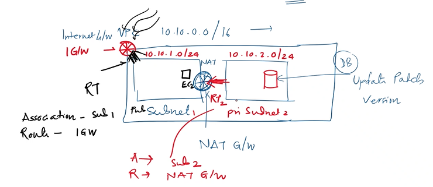

- There will be default VPC along with its own default subnets,route table.In one region t's possible to create `5 VPC` and we can raise support ticket to increase this limit. [VPN (Virtual Private Network)](https://docs.aws.amazon.com/vpn/) to connect through secure network and at once only one tunnel will be active with 1.25 GB/S with IPSec ncryption it's the default behaviour as shown in image 2 and in advanced settings we can set 2 tunnels for redundancy.
- [AWS Direct Connect](https://docs.aws.amazon.com/directconnect/latest/UserGuide/Welcome.html) will provide from 1 to 400 GB/S which lays physical connectivity between On-prem and AWS . It will take 15 days to establish this where AWS will take assessment between our nearest data center and for us.
- For Outbound all traffic is allowed and for Inbound which traffic to be allowed should be set by us shown in image 3

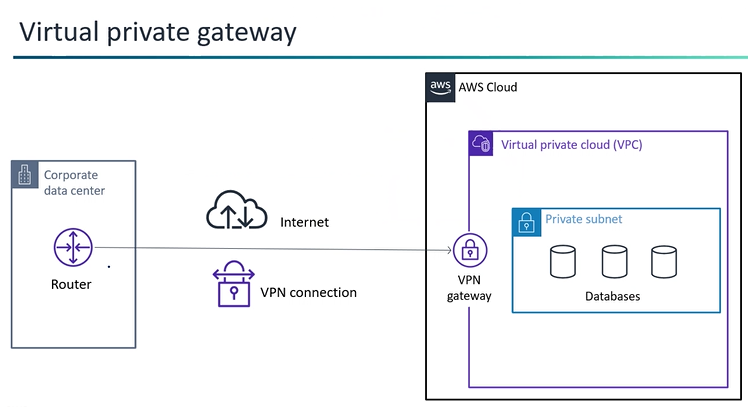

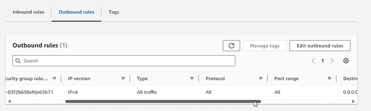

- [Security groups](https://docs.aws.amazon.com/AWSEC2/latest/UserGuide/security-group-rules.html) perform stateful packt filtering. Remember previous decisions that were made for incoming packets shown in image1. The security groups are stateful and deny all inbound traffic by default.
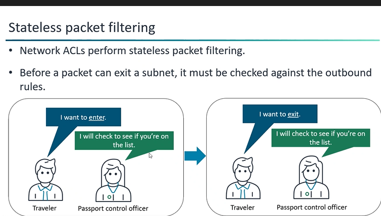
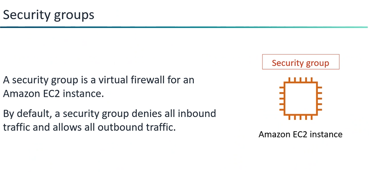

- DNS (Domain Name System) for domains. [Amazon Route 53](https://docs.aws.amazon.com/Route53/latest/DeveloperGuide/Welcome.html), a DNS service based on resource and based on geo location we can route traffic and also act as Registrar for domain names.
When request is made first goes to cloudront and also Route 53 migrate traffic to Cloudfront then to load balancer then to ec2 as shown in image 3.Route 53 optimizes how traffic is routed to CloudFront, ensuring users get the fastest response times.Failover routing and health checks enhance the availability of your services.Geolocation and latency-based routing ensure content is delivered efficiently to users worldwide.DNSSEC (Domain Name System Security Extensions) and integration with AWS security services help protect your content and domain.
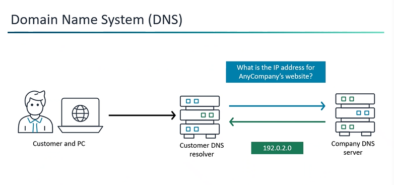
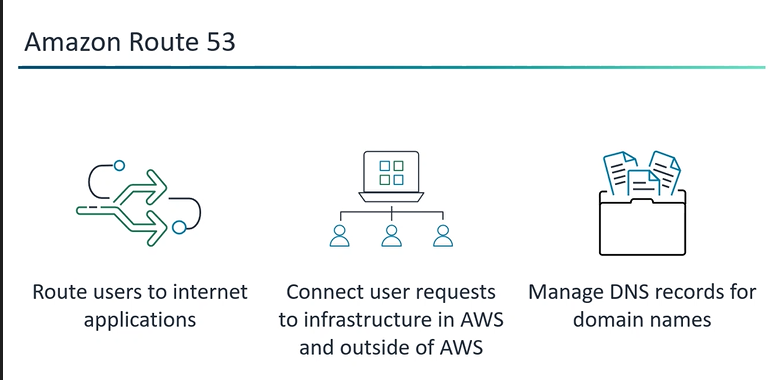
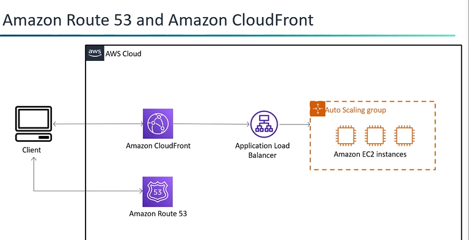

- HDD, a local drive and block storage is [Elastic Block Storage (EBS)](https://docs.aws.amazon.com/AWSEC2/latest/UserGuide/AmazonEBS.html). The EC2 instance has EBS and for two EC2 the common data sharing is not possible. The [Elastic File System(EFS)](https://docs.aws.amazon.com/efs/latest/ug/whatisefs.html) is one solution to overcome the limitation of EBS which is it act as common center for file system. EBS or EFS will be only visible if attach to EC2 instance.
- Block storage files are separated into equal size pieces of data and use for applications that run on Amazon EC2 instances. Once stopped the instance the data will be gone so to keep the data the EBS volumes are required. In [instance store](https://docs.aws.amazon.com/AWSEC2/latest/UserGuide/InstanceStorage.html) we can't able to create snapshots . So during disaster recovery use [Amazon EBS snapshots](https://docs.aws.amazon.com/AWSEC2/latest/UserGuide/EBSSnapshots.html) for backup.


- [Object storage S3](https://docs.aws.amazon.com/AmazonS3/latest/userguide/Welcome.html) when created the bucket by default it won't allow public access. In S3 the data will be stored as copy in different AZ like in about 3 AZones.Store objects in buckets, Set permissions to control access to objects and choose from a range of storage classes for different use cases. The S3 Intelligent tiering uses the ML Algo for access patterns. The `Glacier` is mainly used for Archival data where before it took 3 to 5 hr to retrieve data but now it's in milliseconds. Based on below image 2 and 3 the cost is decreased from left to right making S3 standard the costlier and Glacier Deep archive the low costlier


- File storage store data in scalabe file system, provide data to thousand of EC2 instance concurrently and store data in and across multiple available zones by default. EBS volumes store data within Single availability zone and EFS File storage store file in multiple availability zones by default.


- Database types - Relational Database , NonSQL DB. Hadoop is a non sql database which uses HBase and it's developed by Apache. SQL Follows strict schema and Non Sql follows flexible schema. AWS provide SQL as [RDS (Relational Database Service)](https://docs.aws.amazon.com/AmazonRDS/latest/UserGuide/Welcome.html) . [Aurora(mysql compatible)](https://docs.aws.amazon.com/AmazonRDS/latest/AuroraUserGuide/CHAP_AuroraOverview.html) is 5 times faster than normal SQL Db and Aurora (postgresql compatible) is faster than 3 times of normal Postgresql


- [Amazon Dynamodb](https://docs.aws.amazon.com/amazondynamodb/latest/developerguide/Introduction.html) is serverless, key value pair based , single digit millisecond latency and it's a NoSQL database.It will be useful during 10 trillion requests per day. Database Migration Service migrate relational database , non relational db and other type of datastores. In Image 2 it shows the migration from MYSQL datasource then to Schema Conversion Table (AWS DMS) and then to Aurora. In Dynamodb the feature the inline cache called as [Dynamodb Accelerator (DAX)](https://docs.aws.amazon.com/amazondynamodb/latest/developerguide/DAX.html) will make performance increase and will get data in micro seconds latency.Migration from Relational DB to Dynamodb also possible.  Amazon Redshit is the large petabyte scale SQL datawarehouse solution by AWS


- [AWS Identity and Access Management(IAM)](https://docs.aws.amazon.com/IAM/latest/UserGuide/introduction.html
) allows to manage acess to AWS services and resources. The features are IAM User, IAM Policy , IAM Group , IAM role and MFA. AWS recommends instead of attaching creating policy and attaching policy to each user create the group and include the users there then attach the policy to group.The role is temporary where key will be assigned.


- IAM User an identity that represents person or application that interacts with AWS services and resouces. Te best practice is to create individual IAM users for each person who needs to access AWS.IAM Policy document that grants or denies permissions to AWS services and resources. Best practice is to follow security principle of least privilege. Refer [AWS policy generator](https://awspolicygen.s3.amazonaws.com/policygen.html) to generate policy.IAM Role an identity that an assume to gain temporary access to access resource. [MFA](https://docs.aws.amazon.com/IAM/latest/UserGuide/id_credentials_mfa.html) is extra layer of protection for AWS Account.


- [AWS Organizations](https://docs.aws.amazon.com/organizations/latest/userguide/orgs_introduction.html) help customer to create different accounts for each team and assign each account with respective permission like to be allowed only for S3 or EC2.If I have full permission on IAM user but not in resource level like for EC2 then i can't able to use EC2 it will show Access denied error.


- AWS Artifcats provide security and compliance reports and select online agreements.View any reports and also third party reports.[Customer compliance cneter](https://aws.amazon.com/compliance/customer-center/) contains resources to help about AWS compliance.


- [AWS WAF](https://docs.aws.amazon.com/waf/latest/developerguide/waf-chapter.html) is web application firewall and it protects from Cross-site scripting attack,SQL Injection attack.[Amazon Shield](https://docs.aws.amazon.com/waf/latest/developerguide/shield-chapter.html) protects from DDOS attack. [Amazon Inspector](https://docs.aws.amazon.com/inspector/latest/user/what-is-inspector.html) allows to perform automated security assessments on applications. 


- [AWS KMS (Key management services)](https://docs.aws.amazon.com/kms/latest/developerguide/overview.html)  manages the key for every services and we can create custom key. [AWS Amazon GuardDuty](https://docs.aws.amazon.com/guardduty/latest/ug/what-is-guardduty.html) provides intelligent threat detection for AWS products and services 


- [Amazon cloudwatch](https://docs.aws.amazon.com/cloudwatch/) to monitor the Metrics, Thresholds and Actions. We can define particular value in cloudwatch console and if greater than that metric we can configure AWS notification,EC2 Auto scaling, Lambda etc.Cloudwatch also monitor the server which are hosted on outside AWS.
- [AWS CloudTrail](https://docs.aws.amazon.com/cloudtrail/) log for API. In root access we can delete the logs. After 30 days the logs will delete automatically. 


- [AWS Trusted Advisor](https://docs.aws.amazon.com/awssupport/latest/user/trusted-advisor.html) to receive real time guidance for improving AWS environment and compare your infra to AWS best practices in five categories , Evaluate and implement guidance at all stages of deployment.


- [AWS Pricing](https://docs.aws.amazon.com/awsaccountbilling/latest/aboutv2/price-changes.html) can be calculated by using [AWS Pricing Calculator](https://calculator.aws/#/estimate). If pricing asked for 15 min then it's for lambda. For AWS S3 storage , Requests and data retrievals, Data transfer and Manage and replication are all involved for pricings.


- [AWS Consolidate billings](https://docs.aws.amazon.com/awsaccountbilling/latest/aboutv2/consolidated-billing.html) defines below three images. AWS Budgets can be created in Billing and Cost Management. AWS Cost explorer a tool to visualize , understand and manage our AWS costs and usage over time.


- [AWS Support](https://aws.amazon.com/premiumsupport/plans) have different [support plans](https://docs.aws.amazon.com/awssupport/latest/user/aws-support-plans.html) based on developer,Business,Enterprise On-Ramp and Enterprise. Technical account Manager (TAM) our primary point of contact to AWS and TAM are included only with enterprise , enterprise on-ramp support plans and also they provide technical guidance, support expertise and practices.


- `The lowest cost and cheapest support plan is Business`. In [AWS Marketplace](https://docs.aws.amazon.com/marketplace/) below categories are available to buy and use.


- [AWS Cloud Adoption frameworks](https://docs.aws.amazon.com/pdfs/whitepapers/latest/overview-aws-cloud-adoption-framework/overview-aws-cloud-adoption-framework.pdf) provides advice to company to enable a quick and smooth migration to AWS. Organizes guidance to 6 areas of focus called prespectives.The Business Prespective is ------ . The Rehost in the image 2 is lift and shift, Replatform is lift+tinker , Repurchase means when migrated we need to purchase again in the migrated cloud like salesforce , Oracle SQL etc. Retain means keep data with ourself. Retire means the apps that are not required hereafter.


- AWS Snow family for migration and it has AWS Snowcone, AWS Snowball. The snowball they will send storage box we can upload data to that box and AWS will move data to data center through lorry containers.The innovations are increasing including serverless applications, AI,ML


- [AWS Codewhisperer](https://docs.aws.amazon.com/codewhisperer/) is the AI Code companion with any of IDEs.It will check the vulnerabilities.Benefits of using whisperer are in image 2. 


- Well Architected framework helps to design and operate reliable ,secure, efficient, and cost efffective systems in AWS.It is based on six pillars: Operational excellence, Security, Reliability, Performance efficiency, Cost optimization, Sustainability.


- Tips: Answer MCQ correct if 1 was correct and another 1 wrong then that total question itself wrong. 


- [AWS DMS](https://docs.aws.amazon.com/dms/latest/userguide/Welcome.html) , [AWS Redshift](https://docs.aws.amazon.com/redshift/) , [AWS Documentdb](https://docs.aws.amazon.com/documentdb/latest/developerguide/what-is.html) , [AWS Neptune](https://docs.aws.amazon.com/neptune/) , [AWS QLDB](https://docs.aws.amazon.com/qldb/) , [AWS Blockchain](https://docs.aws.amazon.com/managed-blockchain/) , [ElastiCache](https://docs.aws.amazon.com/elasticache/)
- [Shared Responsibility Model](https://docs.aws.amazon.com/whitepapers/latest/aws-risk-and-compliance/shared-responsibility-model.html) , [AWS Artifact](https://docs.aws.amazon.com/artifact/latest/ug/what-is-aws-artifact.html) , [AWS Billing](https://docs.aws.amazon.com/account-billing/) , [AWS Cloud Migration Strategy](https://docs.aws.amazon.com/prescriptive-guidance/latest/large-migration-guide/migration-strategies.html) , [AWS Data Migration Solutions](https://docs.aws.amazon.com/dms/) , [AWS Well Architected Framework](https://docs.aws.amazon.com/wellarchitected/latest/framework/welcome.html)


- AWS Twitch sessions for ML Associate Exam Prep

[AWS ML Associate Twitch Session 1](https://www.twitch.tv/videos/2225794100)

[AWS ML Associate Twitch Session 2](https://www.twitch.tv/videos/2231851192)

[AWS ML Associate Twitch Session 3](https://www.twitch.tv/videos/2237940676)


## NOTES FOR CLOUD PRACTIONER TEST

- Aws offers compute, storage , network scurity, blockchain,ML,AI, robot development,video production, orbital satellites.Follows client-server model.
- AWS Key concept "You pay only for what you use". Cloud computing is On-demand delivery of IT Resources over the internet with pay-as-you-go pricing."Undifferentiated heavy lifting of IT" can be done by AWS
- Three cloud computing deployment models: cloud based deployment, on-premises deployment, hybrid deployment

Cloud based
- Run all parts of app in cloud, Migrate existing application to cloud,
Design and build new app in cloud
- Building app in low evel infra that require IT to manage it but build them
using higher-level services that reduce management,architecting and scaling requirements of core infra.
- Ex: app with virtual servers,db and network components fully on cloud

On- premises deployment
- deploy using virtualization and resource management tools. Increase resource utilization by app management and virtualization technologies.
- Also known as private cloud deployment. It's like legacy IT infra and incorporation of app management and virtualization tecnologies help to increase resource utilization

Hybrid deployment
- Connect cloud based resource to on-prem, Integrate cloud based resource to legacy IT applications
- Ex: legacy app that are better maintained on-prem, Government regulations to keep records on-prem
- Use it when legacy app are suitable on-prem and won't migrate to cloud so legacy app will be in on-prem and data , analytics services will run in cloud.
- Benefits:
1) Trade upfront expense for variable expense. Instead of pay full at once , pay for what you use. The aggregated cloud usage from large number of customers results in lower pay-as-you-go prices.
2) Stop spending money to run and maintain data centers
3) Stop guessing capacity. Access capacity what we need and scale in,scale otu our server
4) Benefit from massive economies of scale
5) Increase speed and agility
6) Go global in minutes

- EC2 - If trying to host traditional applications and want full access to the underlying operating system like Linux or Windows,use EC2.pay for running instances not stopped or terminated instance. Run on top of physical host machine managed by AWS uisng virtual tech.When start, the entire host not available for ourself it share host with multiple other instance called virtual machines
- Hypervisor running in host machine helps sharing and underlying physical resource between virtual machines.this sharing concept called Multitenancy.Hypervisor isolate VM from each other as they share resources from host so one EC2 is not aware of other EC2 on that host.
- EC2 is resizable we can do vertical scaling , configure network and type requests make to server , public or private accessible. It works like "Launch"->"Connect"->"Use"
- EC2 Instance Types 5 types

General computing
-   good balance of compute, memory and networing resources, use for diverse workloads like web service or code repos, applicaiton servers, gaming servers, backend servers for enterprise apps, small and medium databases.

Compute optimized instance
- For computer intensive tasks  with high performance processors like gaming server, High perfomance compute or HPC, scientific modelling,web, application, batch processing workloads that require processing many transaction in single group.

Memory Optimized
- Already preloaded in temp storage area before computer program or app able to run for CPU to complete actions
- For memory intensive like process large datasets in memory,High performance db, Real time processing of large unstructured data

Accelerated compute
- Use hardware accelerators or coprocessors. Use for floating point no calculations,graphics processing, data pattern matching as they use hardware accelerators, data processing, graphics application,game streaming,application streaming

Storage optimized
- For high performance locally stored data that requires high,sequetial read and write to large data. Use for distributed file system, data warehouse, high-frequency OLTP. IOPS measures performance of input/output operations a device perform in one second.
- Designed to deliver tens of thousands of low-latency , random IOPS to apps.


**EC2 Pricing**

On-Demand:
- No long-term commitments or upfront payments. Pay only for you use for per our or per sec. Use for server test and play around.
- Dont need prior contracts or communication with AWS.Ex: apps like unpredictable usage paaterns.
- Not recommended for workloads that last a year or longer so use Reserved in this case.

Savings Plan
- offer lower price for commitments to consistent amount of usage measure in dollars/hr for 1 or 3 year term that is hourly spend commitment. Save upto 72%.Also applies to AWS Fargate, lambda which are serverless compute
- During commitment charged at discount plan but after that charged at on-demand rate.Good option if need flexibility like run ec2 within ec2 instace family in chose region regardless of AZ.
- Savings plan similar to savings by Reserved instance but dont need to specify any specification,dont need 1 or 3 year term,dont include ec2 capacity reservation


Reserved Instance
- for steady-state workload or for predictable usage.Offer upto 75% discount versus on-demand pricing. You quality when commit to 1 or 3 year term and pay for them with: all upfront(full pay when commit) or partial upfront(partial pay) and no upfront(no pay at beginning)
- Two types: Standard reserved - good fit when know instance type,size,aws region. Required: Instance type and size like m5.large,Platform description like Linux,Tenancy like default or dedicated tenancy, Specify Availability Zone to get ec2 capacity reservation. 
- Convertible Reserved - when ec2 be in diff AZ or diff instance type . Deeper discount when require flexibility to run ec2 instance. After end term Continue using but you will be charged for on-demand rates until you do terminate instance or purchase new reserve instance  (instance family and size, Region, platform, and tenancy).

Spot instance
- Request to spare ec2 for 90% off of on-demand price.AWS can reclaim instance at anytime giving 2 min warning. Use for workload tolerate being interrupted like batch workloads.
- Raise request to AWS if available they give else request unsuccessful.If not available instance will interrupt but background processing job wont have issue

Dedicated hosts
- physical hosts dedicated for use EC2. Usually for meeting certain compliance and no one share tenancy of that host.
- Use existing per-socket,per-core,per-VM license to maintain compliance. Can purchase on-demand host, dedicated hosts. Most expensive.

- AWS Auto Scaling - Two types

Dynamic scaling - respond to changing demand.

Predictive scaling - automatically schedules right no of ec2 instance based on predicted demand.

- Size of auto scaling group set min capacity of ec2 instance to 1 that start immediately , desired capacity to 2 (if not defined , desired capacity default to minimum capacity), max capacity to 4 where it scales upto 4. Pay only for instance when you use.
- ELB - runs at region level, automatically scalable, If new ec2 comes in ELB Knows and directs the traffic if goes out it will wait until old request drains out then auto-scaling terminate instance.
- Messaging and Queuing - Tightly coupled(monolithic) where one app fails other failed too but loosely coupled(microservices) has SQS between two apps where one app fail message will simply queue wont break other app
- SNS - uses pub/sub model, subscribers can also be endpoints such as SQS queues, AWS Lambda functions, and HTTPS or HTTP web hooks.fan out notifications to end users using mobile push, SMS, and email
- SQS - send, store, and receive messages between software components, without losing messages. Send messages to queue,retrieves a message from the queue, processes it, and then deletes it from the queue.
- AWS Lamda - allows create lambda function, automatically scalable, highly available and all of the maintenance in the environment itself is done by AWS.If one or 1,000 incoming triggers, Lambda will scale your function to meet demand. Run code under 15 minutes so this isn't for long running processes like deep learning. suited for quick processing like a web backend, handling requests or a backend expense report processing service where each invocation takes less than 15 minutes to complete.Host short running functions, service-oriented or event driven applications and you don't want to manage the underlying environment at all, look into the serverless AWS Lambda
- ECS - For Docker, acces to underlying env, together of them is called cluster, start restart stop and monitoring  tasks called as orchestration. supports the use of open-source Docker Community Edition and subscription-based Docker Enterprise Edition.Launch/Stop docker app through ECS API
- EKS - Run kubernetes.
- AWS Fargate - serverless compute engine for containers. It works with both Amazon ECS and Amazon EKS. If don't want to use EC2s to host containers because we don't need access to the underlying OS or don't want to manage those EC2 instances, use a compute platform called AWS Fargate. Fargate is a serverless compute platform for ECS or EKS.
- Region - Inside it have multiple data centers. Each region connected to other region through fiber network."Amazon Braket" is AWS Quantum computing platform.Region services already highly available at no extra cost.Business factors to choose region
1) Compliance
2) Proximity
3) Feature availability
4) Pricing
- AZ - present inside region , run app on AZ that are far from each other, Best practice is to run app in atleast 2 AZ . ELB run across all AZ.
- Edge Locations - Caching copies of data closer to customer all around world uses CDN. Cloudfront serve low latency , high transfer speeds.Other than CDN edge locations also run DNS,Route53
- AWS Origin refers to the source server from which AWS CloudFront retrieves content. This could be an AWS service like an S3 bucket, an Elastic Load Balancer, or an EC2 instance, or it could be an external server
- AWS Outposts - Install fully operational mini region inside own datacenter.Owned and operated by AWS using AWS function isolated within our building.
- AWS Management console manage AWS visually. AWS CLI to make API calls using terminal. AWS SDK to interact with AWS resources through programming language.
- AWS Elastic Beanstalk - provision EC2 by writing code and desired configurations to Beanstalk service then takes info and build env for us. Easy to save env configs so can easily deployed again.  Performs adjust capacity, Load balancing, Automatic scaling,Health monitoring
- AWS Cloudformation - Define AWS resources using JSON or YAML text documents called cloudformation template. Supports EC2,Storage,db,analytics,ML etc. Also rolls back changes automatically if detect errors.
- VPC - Own private network in AWS. Subnets, a chunk of IP Address in VPS allows ot group resource together. To allow traffic from public internet flow into and out of VPC attach internet gateway. Instead of public if want to allow from approved network use Private gateway. If want to establish encrypted VPN connection to private nternal AWS use Virtual private gateway.
1) Public subnets - accessible by public.Private subnet - access through private network like db
- AWS Direct connect - establish complete private dedicated fiber connection from our data center to AWS. Work with direct connect partner to do this.Reduce network costs and increase the amount of bandwidth that can travel through your network
- Subnets and Network ACL
1) AWS Covers network hardening, app security, User identity, Authentication and authorization, DDOS prevention, data integrity,encryption.
2) Network ACL - Packet when enters checked by ACL if it has permission during but once entered it wont allow to go out.By default allows all inbound and outbound traffic.For custom network ACL all inbound and outbound is denied until add rule to allow.It also scans while traffic enters and also when traffic goes out.It's stateless(memoryless)
3) Security groups - checks whether packets reached to ec2 instance or not. By default not allow any traffic into instance where all ports are blocked and all IP address also locked. If configured it scan entered packets but allow all traffic to goout. It is stateful (memory)  
- Route53 - AWS DNS.Register domain and buy use own domain names.Transfer DNS records for existing domain names manage by other domain registrars. Include routing policies are
1) Latency-Based routing
2) Geolocation DNS
3) Geoproximity routing
4) Weighted round robin
- EBS - Block level storage , Virtual harddrives. All block level storage are harddrive. When EC2 launched it stores to Instance store volumes that is temp when stopped it also deleted. So attach  EBS volumes for permanent storage.Allows incremental backup called SNAPSHOTS. Full backup means include data that not changed since most recent backup.Best for data that requires retention and it separates drives from host computer of an EC2 instance.
- S3 - Store data as objects, store in buckets, Upload max size of 5TB.Best for static website hosting.Tiers include:

S3 Standard 
- Remain intact after 1 year . Designed for frequently accessed data. Stores data in miimum of 3 AZ.Best for websites,content distribution, data analytics.Higher cost than other classes. Has high availability.

S3 Standard IA
- Files that accessed less frequently but require rapid access.Lower storage price but higher retrieval price.Also store in min of 3 AZ.Has high availability.For backups, disaster recovery files or any object that requires long term storage.

S3 One zone IA
- store data in single AZ. Has lower price than Standard IA.Conditions to use:If want to save cost on storage. Easily reproduce data when AZ fail.

S3 Intelligent Tiering
- For data with unknown or changing access patterns. Require small monthly monitoring and automation fee per object.Monitors objcts access patterns.If haven't access object for 30 days S3 automatically moves it to Standard-IA.If access object in IA tier again automatically move to S3 standard.

S3 Glacier Instant Retrieval
- For arcived data that requires immediate access. Retrieve obj in few milliseconds with same performance as S3 standard.

S3 Glacier Flexible retrieval
- Low cost storage designed for data archiving,Retrieve obj in minutes to hrs.Low cost tier for data archiving.Retrieve data in 1 min to 12 hrs. If wanted certain period of time use S3 GLACIER VAULT LOCK POLICY to lock our vault. Also can use WORM(Write once ready many) in vault lock policy.Once locked poicy cant change.
- Upload directly or using s3 lifecycle policies (policy we create to move data automatically between tiers)

S3 Glacier Deep archive
- Lowest cost class.Retrieve obj in 12 hrs to 48hrs.Supports long term retention and digital preservation for data that access once or twice in year. All obj are replicated and stored across atleast 3 AZ.

S3 Outposts
- Create bucket in s3 outposts. Easy to retrieve store and access data on AWS outpost.Store data across multiple device , servers in our outpost.


| Feature                           | EBS                                           | S3                                        |
|-----------------------------------|-----------------------------------------------|-------------------------------------------|
| Size                              | Up to 16 TiB                                  | Unlimited storage                         |
| Data Persistence                  | Survives termination of EC2 instance          | Persistent storage                        |
| Storage Type                      | Solid-state by default, HDD options available | Object storage                            |
| Micro Edits                       | Can do micro edits and store the blocks       | Entire object must be updated             |
| Object Size Limit                 | N/A                                           | Individual objects up to 5 TB             |
| Durability                        | High (but not specified)                      | 99.999999999% (11 nines) durable          |
| Compliance                        | N/A                                           | Supports WORM (Write Once Read Many)      |


- EFS - Multiple instance access data at same time.

| Feature                           | EBS                                             | EFS                                             |
|-----------------------------------|-------------------------------------------------|-------------------------------------------------|
| Attachment                        | Volume attaches to a single EC2 instance        | Multiple instances can read and write simultaneously |
| Scope                             | Availability Zone-level resource that is store data in single AZ | Regional resource (any EC2 in the region can write to EFS) |
| Attachment Requirement            | Must be in the same AZ as the EC2 instance      | Accessible by any EC2 instance within the region |
| Scalability                       | Does not automatically scale                    | Automatically scales with usage                 |
| File System Type                  | Block storage                                   | Linux file system                               |
| Access                            | On-prem server can't access                     | On-prem servers can access EFS using AWS Direct connect|

- AWS supports Mysql,postgresql,oracle,microsoft sql server etc. "Lift and shift" migrate data from on-prem to AWS EC2
- RDS - Run relational db in AWS.Do hardware provisioning,db setup,automated patching, Backups,redundancy, failover,disaster recovery. Offers encryption at rest and for transit. Have Aurora,Postgresql,Mysql,Mariadb,oracledb, microsoft sql server.
- Aurora - Compatible with Mysql and Postgresql, Data replication. 5X faster than MYSQL and 3X faster than PostgreSQL db.Replicate 6 copies of data across 3 AZ.Reduce DB cost by reducing unnecessary I/O operations.1/10th cost of commercial db, Upto 15 read replicas, continuous backupt to S3
- DynamoDB - serverless db. millisecond response time. Non relational db.Fully managed and highly scalable.It uses key-value pairs. Automatically scalable.

| Feature                           | RDS                                               | DynamoDB                                      |
|-----------------------------------|--------------------------------------------------|-----------------------------------------------|
| High Availability and Recovery    | Automatic high availability and recovery provided | High availability built-in                    |
| Control                           | We control data, schema, network, and everything  | Managed service with granular API access      |
| Data Model                        | Relational database (tables, rows, columns)       | Key-value pair and document store             |
| Throughput                        | Scales with instance size and configuration       | Massive throughput capabilities               |
| Scalability                       | Scales vertically (by instance size)             | Petabyte size potential, scales horizontally  |

- Redshift - For data warehouses for big data analytics.
- DMS - migrate from source to target db from on-prem to cloud. Source db remains fully operational during migration.Downtime is minimized for app that rely on db.Source(Homogeneous) and target db can be same or diff type(Hetrogeneous) but here first we need to convert using schema conversion.Also use DMS to test app against production data without affecting production users, Combine several db into single db, sending ongoing copies of data to other target sources instead of doing on-time migration.
- DocumentDB - Document db supports mongodb workloads.
- Neptune - graph db service to build and run app that work with highly connected datasets like recommendation engines,fraud detection and knowledge graphs.
- QLDB - Quantum ledger db is ledger db service to review complete history of all changes that been made in app data.
- Managed blockchain - create and manage blockchain networks with open-source frameworks.Distributed ledger system that let multiple parties run transactions ahd share data without central authority.
- ElastiCache - add caching layers on top of db to improve read times . support two types of data store: Redis and Memcached
- DAX - Dynamodb acclerator in-memory cache for Dynamodb. Helps to improve response times from single digit milliseconds to microseconds.
- Shared responsibility model - Where AWS is responsible for security of the cloud(like they maintain region,AZ,Edge location,Hardware,db,storage,compute,networking,software) and we are responsible for security in the cloud(customer data, OS,IAM,Platform,apps,server and client side encryption,networking traffic protection)
- IAM - root account is admin can do anything, MFA is extra authentication.Always follow principle of least privilege: A user is granted access only to what they need. IAM Policy - to setup permissions with JSON. IAM Groups - attach policy to it and add user. IAM Roles - Temporary access, has Associated permssions, Allow or deny access, Assume temp access for temp amount of time,No username or password, temp access to any resources users external identities or apps etc. By default IAM user has no permission associated with it.
- AWS Organizations - Central location to manage multiple AWS accounts.Manage billing,resource,access,security,compliance across all AWS accounts. Centralized management,Consolidated billing,Hierarchical groupings of accounts,AWS service and API action access control also be handled. Service Control permission (SCP) to specify max permission for member account in organization and also restrict which member access which resources.When create organization automatically create root,a parent container, for all accounts in our org. Organizational Units - makes easier to manage accounts or restrict access. We can apply SCP to Individual member account and OU.
- AWS Artifacts - Gain access to compliance reports done by third parties. Has two sections:
1) AWS Artifact Agreements - to sign agreement with AWS for use of certain types of information through AWS service.
2) AWS Artifact Reports - compliance report from third party auditors. 
- AWS Compliance Center - Get compliance information all in one place.Have documentation about AWS risk and security whitepaper to understand compliance. For consumer data in EU - General Data Protection Regulation (GDPR) is applicable.Healthcare app in US - HIPAA. AWS Customer compliance center to read customer compliance stories to know how companies solve various compliance,governance and audit challenges.
- AWS Shield with AWS WAF - Protect apps against DDOS. Provides two levels of protection.
1) Shield Standard - automatically protects at no cost.
2) Shield advanced - Paid services with detailed attack diagnostics. Integrate with other service like Cloudfront,Route53,ELB. Also allows to use AWS Shield with WAF to solve DDOS.
DDOS Attack - solution:AWS Shield, UDP Flood - solution:Security groups , HTTP Level Attacks, SLOWLORIS Attack - solution:ELB. 
- AWS KMS - Secure message or data that only authorized parties can access. Do both encryption at transit and encryption as idle. Can temporarily disable keys also.
- Amazon Inspector - Automatic security inspection. Checks deviation of security best practice like vulnerability. Do network configuration reachability piece, Amazon agent and security assessment.Includes detail description of each security issue and recommendation.
- AWS Guardduty - Intelligent threat detection,analyse metadata from our account,network activity that found on Cloudtrail events,VPC Flow logs,DNS Logs. Integrated threat detection with anomaly detection, malicious IP Address, ML thread detection.
- AWS WAF - firewall, works together with cloudfront and ALB. Block or allow traffic using Web Access Control List (ACL)
- AWS Cloudwatch - monitor AWS in realtime. Create a cloudwatch alarm and set metrics when threshold reached it triggers alarm. Integrate with SNS, and other resources also. Cloudwatch dashboard feature shows metrics graphs how performance changed over time. Access all metrics from central location whether cloud or on-prem, Gain visibility into apps infra and services, Reduce Mean Time To Resolution MTTR and Total Customer Ownership TCO,Drive insights tooptimize apps and resources.
- AWS Cloudtrail - API Auditing tool, records changes that got changed.Every single requests logged. Saves those logs indefinitely in S3 bucket.Vault lock to critical security audit logs.Events updated within 15 mins of API call.
Cloudtrail Insights - Make cloudtrail  to automatically detect unusual API activity.
- AWS Trusted Advisor - Automated advisor. Evaluate resourcs again 5 pillars: Cost optimization,performance,fault tolerance,service limits ,security.Inspects AWS env and give real-time recommendation based on AWS Best practices.
- Automate the deployment of workloads into an AWS environment - This action can be performed with AWS Quick Starts.
- AWS Free Tier - 3 types:Always free (do not expire, Lambda allows 1M free requests and 3.2M seconds of compute time/month.Dynamodb allow 25gb free storage/month),12 months free and Trials (AWS Inspector gives 90 day free trial ), 5 gb free storage for S3. AWS Lightsail - service to run virtual private servers,deploy readymade application stacks like Wordpress where 1 month trail of 750 hrs is free 
- Pricing
1) Pay for what you use - not require long term contracts/license.
2) Pay less when you reserve - For ex: Reserve instance give 72% offer than on-demand.
3) Pay less with volume-ased discounts when use more - For tiered pricing, so per-unit cost is incremental low with increased usage. For ex: more S3 storage use less pay for it per GB.
- AWS Pricing calculator - Calculate price for different resource. "AWS Lambda" - free for 1M free requests,3.2M seconds of compute time per month, Save cost by signing up for compute savings plan commit to usage of over 1 year or 3 year term. An ex of paying less when reserve."AWS EC2" - reduce cost by using spot instance and 90% saving. "AWS S3" - charged for object size storage class and how long stored, requests made to retrieve those obj, NO COST for data b/w diff S3 buckets or from s3 to other service in same region, data transfer into S3 from internet or out to Cloudfront,data transferred out to EC2 in same AWS region as S3 bucket. PAY for into and out of S3,inventory,analytics,object tagging.
- AWS Consolidate billing - Free and share savings across accounts.Receive single bill for all AWS accounts in our org.Max no of accounts allowed for org is 4 but reach support to increase. For ex: S3 for >10TB offer lower-perFB price for next 40 TB so combine all accounts usage 1TB+5TB+7TB > 10 TB instead of separate usage where each TB is <10TB so wont applicable ot that offer.Compare current month balance to prev month and get forecast of next month current usage. Month to date spend by service. Free tier usage by service. Access cost explorer and create budgets. Purchase and manage savings plans. Publish aws cost and usage reports.
- AWS Budget - set for cost and usage.Receive alert when cost exceed budgeted amount.
- AWS Cost explorer - check how you spend money with AWS.gives 12 month of history data.Also group by TAG. Includes default report of cost , usage for top five cost-accruing service.
- AWS Support Plans - Developer plan is LOWEST, Business and Enterprise On-Ramp is MIDDLE, Enterprise is HIGHEST.5 support plans
1) Basic plan - free for all.Access to whitepapers,documentation,support communities. Contact AWS for billing questions,service limit increases.Limited access to AWS Trusted Advisor checks. Use AWS Personal Health dashboard that provides alerts and remediation.
2) Developer plan - Access to best practice guidance, client side diagnostic tools, Building block architect support that has AWS offerings,features and services.Email customer support directly with 24 hr response time for questions and 12 hr for systems are impaired.
3) Business Support - Access to all offer, features,services,all trusted advisor checks,Limited support for third party softwares like OS etc. 4 hr response time if system is impaired and 1 hr response time when system is down.
4) Enterprise on-ramp support - introduced in 2021. Supports all features in above plan. Accesss to TAM for guidance and AWS experts, cost optimization workshop(one per year), support team , account assistance,tools to monitor costs performance through trusted advisor,Consultative review and architecture guidance (1 per year),infra event management support (one per year), support automation workflows,30 mins or less response time for business problems.
5) Enterprise support - access to  TAM,support team for billing and account,operations reviews and tools to monitor health,Training and game days, Monitor costs and performance through trusted advisor/Health API/Dashboard.Consultative review and architecture guidance (1 per year),infra event management support (one per year), support automation workflows,Cost optimization workshop and tools,15 mins or less response time.
- AWS Marketplace - find, test and buy software that runs on AWS. Offers products in categories: Infra software,devops,data products,rofessional services,Business apps,ML,IOT,Industries and there are subcategories for categories.
- AWS Cloud adaption framework - Provide advice to org to enable quick and smooth migration.Helps in 6 perspectives: 
1) Business - to move from a model that separates business and IT strategies into a business model that integrates IT strategy.Common roles are Business Managers, Finance Managers,Budget owners,Strategy stakeholders
2) People - people team prioritize org structure , gap,roles across org wide for skills adoption.Common roles - HR,Staffing,People managers.
3) governance - To update staff skills and ensure business governance in cloud.Common roles - CIO,Program managers,Enterprise architects,Business analyst,Portfolio managers
Technical => 
4) Platform - Implement new solutions to cloud, migrate from on-prem to cloud, Use architect models.common roles:CTO,IT Managers,Solutions architects,Security,Operations 
5) Security - For security controls. common roles:CISO,IT Security Managers,IT Security Analyst
6) Operations - operating and recovering IT workloads to meet the requirements of your business stakeholders.Common roles: IT Operations managers,IT Support managers.
- 6 R - 
1) Rehosting - Lift and shift,save upto 30%,move app without changes.
2) Replatforming - lift,tinker and shift,won't change core architecture of app. Ex:Migration of existing Mysql db to RDS Mysql.
3) Retire - Retire the unwanted apps.
4) Retain - keep apps that are critical for business in source env.
5) Repurchase - move from traditional license to SAAS.Ex: Move from CRM to salesforce.
6) Refactoring - app is architected and developed using cloud native features.
- SNOW Family - To overcome migration of large data like one Petabyte take 100 days to migrate.
1) AWS Snowcone - holds 8TB,contains edge computing options Amazon ec2,iot greengrass.Have 2CPU,4GB memory,14TB storage
2) Snowball edge  - two options: Snowball edge compute optimized (storage=>80TB HDD for S3 or EBS,28TB of NVMe SSD.compute=>104vCPU,416GiB,NVIDIA Tesla v100GPU,run EC2 sbe-c and sbe-g equivalent to c5,M5a,G3,P3), Snowball Edge Storage optimized(storage=>Have 80TB HDD storage,1TB SATA SSD.Compute =>40 vCPU,80GiB memory to support Ec2 sbe 1 instance(equivalent to C5)).Can run Lambda,Ec2 compatible AMI,IOT Greengrass.
3) Snowmobile - 45 foot container.Have 100 petabyte. 
- `AWS VMWare` - on-prem to AWS Cloud through VMWare cloud.`AWS Sagemarker` - build,train and deploy AI. `Amazon A2I` - provide ML Platform.`Amazon lex` - voice,chabot framework like Alexa. `AWS Textract` - extract text and data from documents. `AWS Deepracer` - For devs to experiment with reinforcement learning. `AWS Ground station` - For satellite and only pay for what we use.`AWS Transcribe` - Convert speech to text. `AWS Comprehend` - Discover patterns in text. `AWS Fraud detector` - Find fraud online activities.`AWS Q Developer` - copilot for devs and trigger code using Alt-C.
- After you have selected a Region for your applications, as a best practice, run applications in at least 2 Availability Zones. Each AZ has 1 or more data centers.Using Security groups Block incoming and outgoing IP address.To track resource inventory and configuration history for security and regulatory compliance, the appropriate solution is AWS Config.
- AWS Architected framework 
1) Operational Excellence - run and monitor systems, run workloads effectively, gain insights into their operations, and continuously improve supporting processes to deliver business value.
2) Security - protect system using encryption
3) Reliability - recovery planning,dynamically acquire compute resource,mitigate misconfigurations/network issue.focuses on the ability of a workload to consistently and correctly perform its intended functions.
4) Performance Efficiency - performance and compute resource efficiently
5) Cost optimization - optimize full cost
6) Sustainability -Introduced in 2021,minimize environmental impacts of running cloud workloads.
- Advantages of cloud computing
1) Trade upfront expense for variable expense. - instead of invest before using ,pay only when use resource.Ex:Pay for compute time usage instead of upfront cost in data centers
2) Benefit from massive economies of scale. - Economices of scale translate nto lower pay-as-you-go prices because hundreds of customers aggregates in cloud.
3) Stop guessing capacity. Ex: Scale infra capacity in and out to meet demand.
4) Increase speed and agility.
5) Stop spending money running and maintaining data centers.
6) Go global in minutes. Ex: deploy app in multiple regions in world

