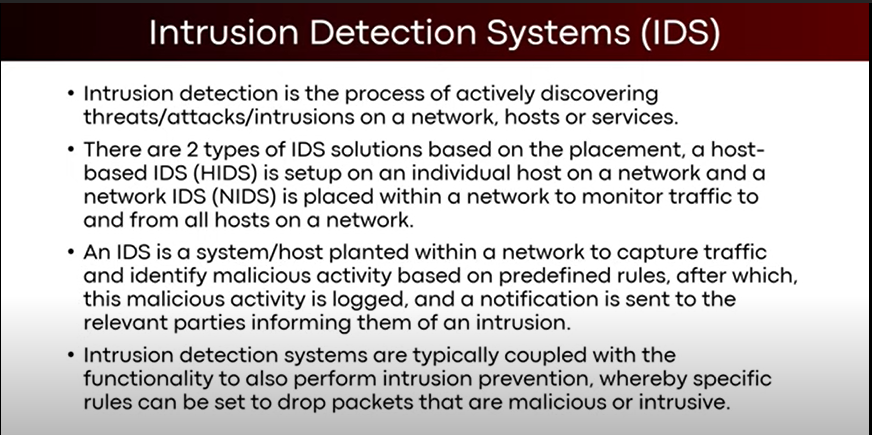
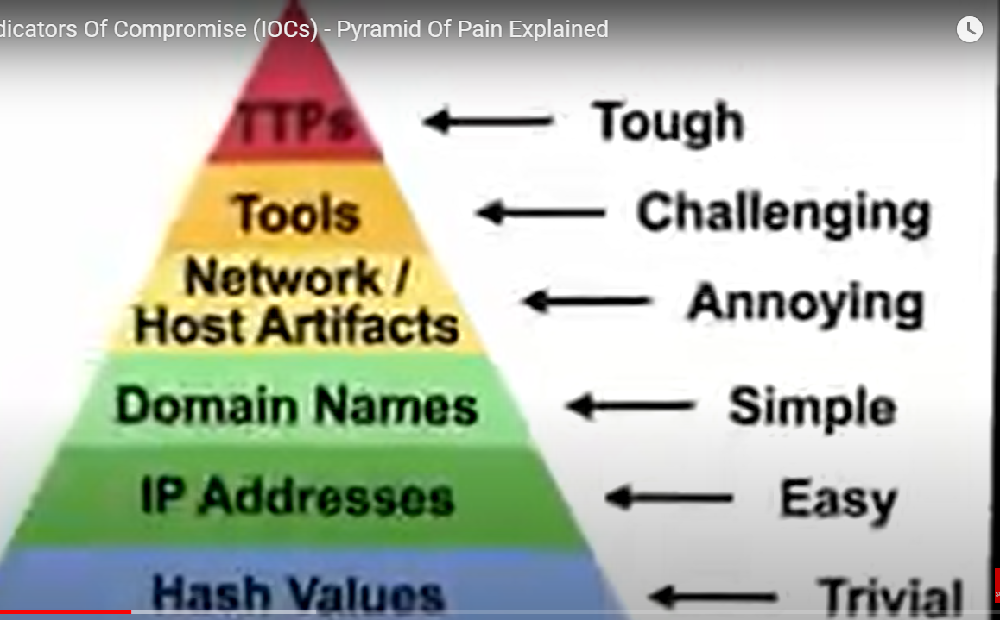
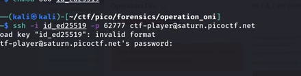
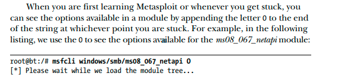
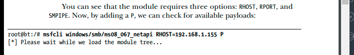
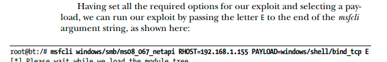

# Common Information

-Follow LulzSec,Anonymous for more information
-Node Zero linux for testing just like kali linux
-Getting passwords from trash or dustbins called as "dumpster jumping"

# Essential Hacking tools and skills

``Tools``
-SQLI Helper use to hack powerless sites with sql infusion.
-Dark Port Scanner examines for open ports on a network.
-Sonic Bat the batch file virus creator
-Local Info inspects neighborhood host and shows data about processor,memory
-Name Scanner gives all hostnames inside of scope of IP locations
-Port Scanner examines networks for dynamic TCP based administrations
-Ping Scanner pings a remote has over the system.
-Cain and Abel helps sniffing,breaking password hashes, rainbow tables are created with the winrtgen.exe,cryptanalysis assaults,recording VOIP discussions
-Superscan(port scanner) like TCP/IP port scanner
-Passive assault gathering(only for social event some essential data)tools are NAP,Nesses,Eraser,LCP(windows password cracker)
-Nekton CGI scanner incorporates 3200 perilous documents/CGIs
-Pouf identify working framework on SYN Mode,SYN+ACK mode,RST+mode,machine interchanges you can watch
-Samurai Web testing framework for pentesting the webpages
-Kopi STD gathering of hundreds and open source security instruments.
-Canine(Computer aided investigative environment) for giving a cordial GUI
-UACMe to bypass windows UAC by abusing built-in windows autoelevate backdoor.[here](https://github.com/hfiref0x/UACME)
- Snort to detect intrusions,for packet sniffing,packet logging,network intrusion detection

- Mimikatz allows to pull out memory from windows systems and parse out password from memory.
- linPEAS, an enumeration tool, Linux Privilege Escalation script to find every information about the linux machine like network,directories,files etc
- Autopsy an Forensic browser list every useful informations regarding .img files. BinWalk also walks through .img files and gives us useful datas.
- RedLine Stealer,a malware for sae that harvest info from browsers saved credentials,autocomplete data,credit card information,also steal cryptocurrency,execute comands,send back info about infected computer  
- Yeti,Whois is used for passive information gathering.
- Netcraft a web-based tool that use to find IP address of a server hosting a particular website.
- Havoc, a demon that bypasses windows 11 defender successfully Refer [here](https://youtu.be/ErPKP4Ms28s).
- NeXpose,identify devices running on network,find security weakness in OS.<p style="color:red">FYI: In Metasploit The Penetration Testers Guide by David Kennedy, Jim OGorman, Devon Kearns, Mati Aharoni Page 60 we can find installation,notable points for NeXpose</p>.
- Bettercap, MITMf for performing Man in the Middle Attacks. Refer [Mitmf github](https://github.com/byt3bl33d3r/MITMf) and [ARP Spoofing](https://linuxhint.com/arp_spoofing_using_man_in_the_middle_attack/) using linux. 
- Pwnagotchi to crack wifi with AI,we can use it in raspberry,linux
- Flipper Zero,a hardware device surely need to buy and try it for hacking

``Skills``
-Understandings of DHCP,NAT,subletting,IPV4,IPV6,Public vs Private IP,DNS,Routers and Switches,VLANs,OSI model,MAC,ARP,PKI (open key infrstructure),SSL(secure attachments layer),IDS(Interrupiton discovery framework),firewalls,How to redirect traffic to fake website,TCP/IP,Cryptography,
Hunting for Microsoft's SQL server,Cracking SQL server passwords and owning the server,Hacking Myself Online databases with slap , separating data from online databases using slap, Intrusion detections using snort like tools

# Malwares,Trojans,Viruses,Worms,Spyware,Bots,Ransomware,Root kit,Adware

-Short for Noxious programming,Viruses multiplies itself to crash the system whereas worms duplicates itself with end goals to spread to other pc.
-Boot is robot for harming wiki.Client of sort "bot" has client right "bot", client rights are regularly called banners, bots with client right "bot" are called "hailed" bots
-Ransomwares encodes records(crypto locker), some use TOR to conceal C&C interchanges(called CTB Locker).
-Boot sector virus infects boot record or floppy works on booting the pc some are Michelangelo and stoned
-Basic record infections ex: Sunday,Cascade. ``sh Multipartie Viruses`` infects both boot part and projects,records.Eg:Skeleton by Fridrik in 1989,Invader,Flip
-Stealth Viruses uses different strategies to conceal itself from AntiVirus
-Polymorphic viruses change code everytime they spread or contaminate
-Macro Viruses affects microsoft word like concept virus and melissa worm

# Bluetooth hacking

- ```Bluez``` has multiple tools for bluetooth hacking.[Github link](https://github.com/bluez).We can use ```Panda Bluetooth 4.0 USB Nano Adapter```,[Buy here](https://amzn.to/3NlSlbQ).Use ```hcitool``` to scan bluetooth devices.[See more](https://youtu.be/3yiT_WMlosg).```MultiBlue Dongle USB Blueooth V3.0 HiD``` flashed with different class to act as keyboard.```sudo apt install spooftooph``` allows us to mac address of bluetooth. ```Programming Logic Controllers``` have scehmatic diagrams,learn PLC Programming (modbus,DNP3 and ladder logic simulations),For ex: search ```inurl:/Portal/Portal.mwsl``` to find PLC,schematics of some stations.

# WPA,WPA2 Hacking

-WPA and WPA2 security executed without utilizing the WI-FI protected setup(WPS) highlight are unaffected by the security defenselessness.```airodump-ng``` will use for capturing handshakes and wifi cracking

# Sniffing

-To sniff system,have system card running in uncommon mode (wanton mode)

# Previlege Escalation

- MITRE Attack to bypass UAC Mechanisms ,Windows UAC(User Account Control) allows to elevate priveleges.When UAC level is set to default or low use UACMe to bypass.

# Website hacking

- [reverse connection using jenkins](https://youtu.be/UrbRpoLqF18)

# Vulnerabilities

- ```CVE-2021-44228``` Log4J vulnerability,Log4J v2.0 to v2.14.1 is vulernable to this. Refer [marshalsec](https://github.com/mbechler/marshalsec) and [LunaSec blog](https://www.lunasec.io/docs/blog/log4j-zero-day/)
[Log4J details](image/Readme/1655538161229.png)
- ```CVE-2021-42287```Active Directory domain services elevation of privilege vulnerability,```CVE-2021-42278``` sAMAccountName spoofing .[See more](https://4sysops.com/archives/exploiting-the-cve-2021-42278-samaccountname-spoofing-and-cve-2021-42287-deceiving-the-kdc-active-directory-vulnerabilities/).Ridter/nopac github page for more info
- ```CVE-2022-30190 Follina```,Microsoft's 0 day MSDT vulnerability.[See more](https://www.youtube.com/watch?v=3ytqP1QvhUc)
- ```IODR``` Vulnerability in instagram to change thumbnail image of reel ,see more [here](https://youtu.be/3NYD_SbAaGU). 
- ```MS08-067``` could allow remote code execution if an affected system received a specially crafted RPC request. On Microsoft Windows 2000, Windows XP, and Windows Server 2003 systems, an attacker could exploit this vulnerability without authentication to run arbitrary code.
- ```RealVNC(4.1.0,4.1.1)``` have [Bypass vulnerability](https://www.rapid7.com/db/modules/auxiliary/admin/vnc/realvnc_41_bypass/),refer [here](https://www.exploit-db.com/exploits/36932). ```CVE-2008-4770```
- Vulnerability in ```LibreNMS (v1.46,v1.50)``` can be [exploited](https://github.com/rapid7/metasploit-framework/blob/master/documentation/modules/exploit/linux/http/librenms_collectd_cmd_inject.md)


# Android and iPhone exploitation

## iPhone

- ```Checkm8 BootROM``` takes advantage of unfixable BootRom vulnerability of Apple devices (i.e iPhone 4S to iPhone X).

## Android

- Vulnerability in ```Android 5``` stagefright ,find [here](https://thehackernews.com/2015/09/stagefright-android-exploit-code.html) and [here](https://github.com/eudemonics/scaredycat/blob/master/scaredycat.py).

# Others

- What is a C2 server? A command-and-control server,computer that is controlled by a cybercriminal,used by attackers to maintain communications and send commands to systems inside a target network compromised by malware.
- rc? see [here](https://stackoverflow.com/questions/11030552/what-does-rc-mean-in-dot-files)
- TrustWave Security Site to learn about the security attacks happening in the organization.Install kali linux in windows 11 and windows 10 using wsgl and wsl [video](https://youtu.be/27Wn921q_BQ)
- ```pwntools``` is a CTF framework and exploit development library in python. Use ```import pwn``` for using it. Use ```Hack the box,portswigger.net,Bandit war games,Tryhackme.com,DamnVulnerableNugget``` for learning hacking.
-```strace``` intercepts system calls make by the glibc and other libraries directly into the Linux Kernel,use ptrace to inspect the system calls of a process. ```ltrace``` intercepts library calls and system calls made by your application to C libraries such as the glibc.```Upx``` ultimate packer for executables works by renaming the header names (UPX0/UPX1),reduce file size, this helps mask the malware as a . jpg or to spread through emails
- Police groups like NSA can monitor us using program called ```XKeyScore```. 
- ```Pyramid of pain``` includes hash values because of hash collision,Ip Addresses because of VPN change ip addresses.

- For ssh if you get error like in the given image, add empty blank  new line at last of your ssh file key


# NMAP 
- ```-sS``` to run stealth TCP scan to find specific TCP based port is open.```-Pn``` tells Nmap to not use ping to find whether a system is running,instead it considers all hosts alive.If using Internet based penetration tests ,use this flag because most networks don't allow ```Internet Control Message Protocol (ICMP)``` which is protocol that ping uses.
- ```-A``` flag gives more information about target system.To generate the XML file to import nmap into Metasploit use ```nmap -Pn -sS -A -oX Subnet1 192.168.1.0/24 > db_connect postgres:toor@127.0.0.1/msf3 > db_import Subnet1.xml > db_hosts -c address``` to run successfully. 
-Use ```nmap -PN -sI <idle_system> <RHOST>``` to discover a number of open ports on our target system without sending a single packet to the system.Use Nmap in Metasploit using ```db_nmap -sS -A <RHOST>```, ```db_serices``` to check the results from scan that stored in db.

# Metasploit

- Developed by HD Moore in Oct 2003 with 11 exploits,Metasploit 2.0 in 2004 along with Spoonm with 19 exploits,27 payloads,Metasploit 3.0 in 2007.Migration from perl to ruby took 18 months,150000 of new code lines.2009 Metasploit acquired by Rapid 7 and launched Metasploit Express,Metasploit pro.
-```Pre-engagement interactions, Intelligence gathering,Threat modeling,Vulnerability analysis,Exploitation, Post exploitation,Reporting``` are the phases of attacking.```Overt or whitehat and Covert or blackhat``` are the types of pentest.
- ```Armitage``` created by Raphael Mudge.```msfencode``` to avoid bad characters and evade antivirus and IDS by encoding original payload and the best one is ```x86/shikata_ga_nai```.
-```Passive Information Gathering```,```OSINT``` gather information about target without touching their systems.```TCP Idle scan``` allows to scan target stealthily by spoofing IP of another host on the network,For this to work locate idle host on network that use incremental IP IDs and while scanning if it break in predictability of IP ID sequence then it means that it discovered an open port,use ```auxiliary/scanner/ip/ipidseq``` to check this.
- To connect MSF with db: ```MSF supports postgresql,Mysql > /etc/init.d/postgresql-8.3 start > DB has started so give username(default:postgres),password(default:toor) > db_connect postgres:toor@127.0.0.1/<db_name> > db_status```.
- ```Pivoting``` allows to use internally connected systems to route traffic to network that would otherwise be inaccessible,allows to access NAT based firewall devices and use compromised internal system to pass traffic to internally hosted private IP-based systems to penetrate network farther behind the firewall.use ```scanner/potscan/syn``` to find tcp port open.
- Use ```scanner/mssql/mssql_ping``` to find which port the MS SQL is running.Use ```scanner/ssh/ssh_version``` to find the ssh version in the target.Use ```scanner/ftp/ftp_version``` to find the ftp version.Use ```auxiliary/scanner/ftp/anonymous``` to find whether ftp server allows anonymous login or not.Use ```scanner/snmp/snmp_enum``` that is designed specifically for SNMP sweeps.Keep in mind that the read-only (RO) and read/write (RW) community strings will play an important role in the type of information you will be able to extract from a given device. On Windows-based devices configured with SNMP, you can often use the RO or RW community strings to extract patch levels, running services, usernames, uptime, routes, and other information that can make things easier.
(Community strings are essentially passwords used to query a device for information or to write configuration information to the device.)
- To import the fully scanned report from NeExpose to MSF ```create new db by db_connect postgres:toor@127.0.0.1/msf5 > load nexpose > help > db_import /tmp/report.xml > db_hosts -c address,svcs,vulns > db_vulns > nexpose_connect -h > nexpose_scan RHOST > db_hosts > db_vulns```.
- To import Nessus report to MSF ```db_destroy postgres:toor@127.0.0.1/msf5 > db_connect postgres:toor@127.0.0.1/msf5 > nessus_connect user:password@<local_ip>:<nessus_port> > nessus_policy_list > nessus_scan_new > nessus_scan_status > nessus_report_list > nessus_report_get <ID from that before command> or db_import report.nessus > db_hosts -c address,svcs,vulns > db_vulns```. We can use Nessus Bridge plugin to use Nessus in MSF.
- Use ```auxiliary/scanner/smb/smb_login``` to login smb, but it's loud i.e. each login attempt will show up in the event logs of every Windows box it encounters.Older versions of VNC(4.1.1) allow blank passwords so check whether VNC has password or not using use ```auxiliary/scanner/vnc/vnc_none_auth```.Connect VNC with ```vncviewer <ip_address>```.
- ```msfbinscan,msfconsole,msfd,msfdb,msfelfscan,msfmachscan,msfpescan,msfrop, msfrpc,msfrpcd,msfupdate,msfvenom``` are preinstalled in MSF.
- The Simple Network Management Protocol (SNMP) is typically used in network devices to report information such as bandwidth utilization, collision rates, and other information


