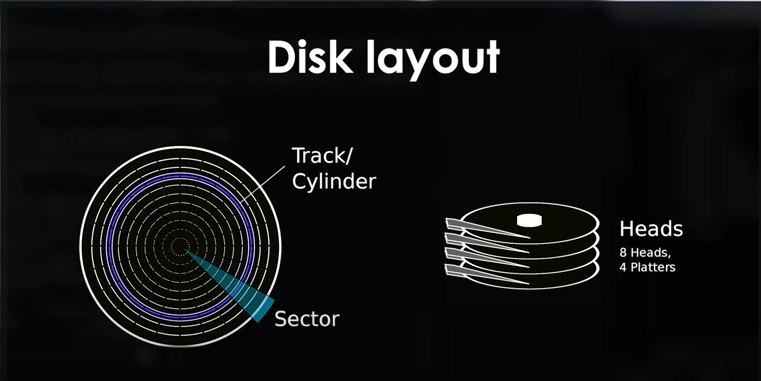
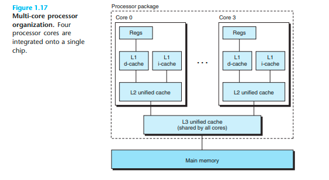

# Basics

- file.c--->(PreProcessor)--->file.i--->(compiler cc1)--->file.s--->(Assembler)--->file.o--->(Linker,printf.o is passed here)--->file.exe
- 4bits or nibble is one hexadecimal digit(0-9 or A-F).Two nibbles or eight bits make up a byte(00-FF in hexadecimal is equal to 0=255),[InstructionMnemonics](https://en.wikipedia.org/wiki/X86_instruction_listings).Initializing 32 bit variable,declare globally in .data EXAMPLE:: var db 32 or (dynamically)var db ?
- any time to perform operations define in .text, it is readOnly and this is loaded into memory only once reduces usage,launch time ,used to declare const values do not change such as file names,buffer sizes.Declare variables in .bss and print a byte to stdout mov eax, 4 ; the system interprets 4 as "write" mov ebx, 1 ; standard output (print to terminal) mov ecx, variable ; pointer to the value being passed mov edx, 1 ; length of output (in bytes).


- <h3>Disk layout</h3>
<ul style="list-style-type: square; list-style-position: inside;">
<li>Floppy,CD,DVD,HDD are in cylinder shape</li>
<li>In below each ring says track/cylinder,pizza slice like that is sector</li>
<li>Floppy disk and HDD store data on both side of platter</li>
<li> Each side of platter called as head. HDD may have multiple platter so each side of each platter is head</li>
<li>Read/write tell to disk controller by giving cylinder number,head number,sector number. This scheme called as Cyliner Head Sector Scheme which <span style="color:orange">BIOS only supports</span></li>
<li>This scheme is useful to determine to physically locate data else not use. To locate data is in begin,middle or end in disk use Logical Block Addressing(LBA) Scheme.</li>
<li>CHS Scheme - Cylinder and Head starts from index 0, Sector start from index 1.





-   Maximum length support

 <ul style="list-style-type: square; list-style-position: inside;">
<li>DB - DefineByte(1 byte) - <b>Integer</b> from -128 to 127 (signed) or 0 to 255 (unsigned)</li>
<li>DW-DefineWord(2bytes) - <b> Integer</b> from -32,768 to 32,767 (signed) or 0 to 65,535 (unsigned).</li>
<li>DD - DefineDoubleWord(4bytes) - <b> Integer</b>  -2.1 billion to 2.1 billion (signed) or 0 to 4.3 billion (unsigned). and <b>Floating Point </b>Single Precision numbers</li>
<li>DQ- DefineQuadword (8bytes) - <b> Integer</b>  -9.2 quintillion to 9.2 quintillion (signed) or 0 to 18.4 quintillion (unsigned). and <b>Floating point</b> double precision numbers.</li>
<li>RESB -ReserveBytes(1byte)</li>
<li>RESW - ReserveWord(2bytes)</li>
<li>RESD - ReserveDouble(4 bytes)</li>
<li>RESQ - array of ten reals(8bytes)</li>
<li>RESY - one YMM Register</li>
<li> RESZ - 32 ZMM registers these all designed to use in .bss. int 0x80 to call interrupt.How push instruction words??? By first decrementing esp by four followed by placing its operand into the contents of the 32-bit location at address esp (the stack pointer). Since the esp instruction is decremented every time the push instruction is performed, the stack grows from high addresses to lower addresses.
</li>

# LINKER

-Whatever we declared like .text,.data,.bss must be defined here.  The ".=" tells location counter that always initialized to 0x0 .The "*" within curly braces indicate a wildcard,tells compiler to locate exe code(.text) from all input files,merge it all into .text section.But .bss tells compiler to look for all global variables(.bss) to compile into .bss section  


# BIOS

-Basic Input/Output System,non-volatile firmware.[MoreInfo](https://www.apriorit.com/dev-blog/66-develop-boot-loader)
-Used to perform hardware initialization during the booting process,provide runTime services.`int 16h` wait for key to press,`int 19h` for reboot
-First software run when powered on
-BIOS Magic Numbers 0x55 and 0xAA or 85 and 170 located exactly in bytes 511 and 512 in our bootable device.These Magic Numbers are markers for BIOS to identify bootable devices from other devices.When the BIOS finds such a boot sector, it loads it into memory at a specific address — 0x0000:0x7C00.
-dw 0xAA55 writes our magic numbers and times 510 — ($ — $$) db 0 makes sure they will be written exactly atj   511 and 512 bytes
-The first piece loaded into memory is MasterBootRecord(MBR)  512 bytes=446 for primary bootloader+64 bytes for partition table that describes primary,extended partitions.
-times 510-($-$$) db 0 or times 510-CURRENT_ADDRESS-START_ADDRESS .For example, assume we have 100 bytes of our code, 2 bytes of magic numbers. Based on the formula, we need to write 410 bytes of zeros after our code, so magic numbers will be written at 511 and 512 bytes.
-```jmp $```, we do nothing here, just an infinite loop. That’s why it stops on Booting from Floppy...```CLI- Clear interrupt flag``` interrupts disabled when interrupt flag cleared.If protected-mode virtual interrupts are not enabled, CLI clears the IF flag in the EFLAGS register.
On an x86 system, the CPU is pre-configured to look for the last sixteen bytes of the 32-
bit address space (0xFFFFFFF0) for a “jump” instruction to the address in memory where
the BIOS has copied itself. When found, the system will kick off the BIOS which will
initiate the POST test
-Press Power button… LED on your computer blinks(we can find BIOS load success or failed through blink)… BIOS prepares to call POST procedure…--->CPU pre-configured to look last sixteen bytes of 32 bit(0xFFFFFFF0) for "jump" instruction to address in memory that BIOS has copied itself ----> system kickoff BIOS to initiate POST test--->BIOS-->located MBR(contains BOOTABLE CODE)--->load it to memory starting from physical address "0x7c0"--->code gets loaded,executed is Bootloader(bootstrap loader)--->Bootloader load kernel into physical address 0x10000000 that load rest of OS

# KERNEL

-Types: ```sh Monolithic``` has majority of OS includes drivers to low level hardware, typically loaded into protected area of memory.This protected-privileged-is called ```Kernel space```.This space separates from space where applications run known as ```User space```.Runs entire OS withhin kernel space so called as monolithic and modules attached increase size of kernel
-```sh Microkernel``` for memory management , cpu managementOther functions moved outside of kernel allows them to live and die(crash) without bringing down entire system,runs the critical activities in kernel space and others in user space,

# POST

-Power-On-Self-Test,checks if everything works correctly
-sequence of POST procedures culminates in locating a bootable device-floppy disk,cd-rom, hard disk or usb stick

# Bootloader and Bare-Metal

- Boot a bin file by referring [here](https://stackoverflow.com/questions/34268518/creating-a-bootable-iso-image-with-custom-bootloader)
- Use of BPB and EBPB 
- loads basic components into memory, puts system in expected state and collection information about system.
- Need to have bootloader in first sector or boot sector at 512 byte, remaining OS start at sector 2. 1 secotr =512 bytes, Refer [here](https://superuser.com/questions/1110355/what-is-the-difference-between-a-disk-block-and-a-sector#:~:text=A%20sector%20has%20traditional%20been,8192%2C%2016384%2C%20or%2032678.),[here](https://www.quora.com/How-many-sectors-does-a-hard-disk-have)
- In MS-DOS, invoking interrupt 21h while ```AH = 4Ch``` causes the current process to terminate and uses the value of register AL as the exit code of the process.
- Boot loader runs in 16bit real mode(Boot loader only run) then switch to protected mode(everything runs).Real mode all apps run in same memory at same time,so any apps access memory space of all of other runing apps which creates security nightmare.so after bootloader finished its work,system switches to protected mode where apps isolated from each other
- Contains boot sector. Bootsector allocates using 07C0h are equivalent segment location where BIOS loads our code.Details[here](https://stackoverflow.com/questions/50260277/is-there-a-difference-between-org-0x7c00-and-mov-ax-07c0h/50260629) & [here](https://stackoverflow.com/questions/12427571/assembler-understanding-of-some-lines)
- Loaded into operating memory from persistent memory, such as a hard drive etc.Bare Metal programming writing firmware directly runs on hardware without OS.
- The no-operands form provides "short forms" of the byte, word, and doubleword versions of the LODS instructions.DS:(E)SI is assumed to be the source operand and  AL, AX, or EAX register is assumed to be the destination operand. The size of the source and destination operands is selected with the mnemonic: LODSB (byte loaded into register AL), LODSW (word loaded into AX), or LODSD (doubleword loaded into EAX)
- SI increment or decrement by DF(Direction Flag (DF) - this flag is used by some instructions to process data chains, when this flag is set to 0 - the processing is done forward, when this flag is set to 1 the processing is done backward) flag. If DF is 0 SI incremened,if 1 ESI regiser decrementd ESI decrement or increment by 1 for byte, 2 for word,4 for doubleword
- Find more [here](https://stackoverflow.com/questions/34183799/how-does-this-assembly-bootloader-code-work). GRUB will load kernel if it compiles with multiboot spec.Kernel must contain a header(known as multiboot header) within its first 8kb,also must contain 3 fields that are 4 byte aligned namely: magic field(contain magic number 0x1BADB002 to identify header),flags field(set to zero),checksum field(the checksum field when added to the fields ‘magic’ and ‘flags’ must give zero)

# Registers

- 64bit RSI, 32 bit ESI, 16 bit SI, 8 bit SIL
- `0x0E` Indicate Bios we gonna print chars,`0x10` Call Interrupt for printing chars
- ``` General Purpose Registers```  used to store temporary data , 16 bit wide or 2 bytes long. AX,BX,CX,DX
- ``` Segment Registers``` represent memory address to microprocessor.Segment is beginning of block of memory and offset index of memory block. Example: There is a byte whose value is 'X' that is present on a block of memory whose start address is 0x7c00 and the byte is located at the 10th position from the beginning so segment as 0x7c00 and the offset as 10. The absolute address is 0x7c00 + 10.
- ```CS```-Code Segment eg:.text,```SS```-Stack Segment,```DS```-Data Segment eg:.data,.bss,```ES```-Extended Segment,(each have 16 bits),store base address that is starting address of corresponding segment.How 20 bit address obtained if there are only 16 bit registers? eg:DS=2222h BIU add 0H to LSB so base address will be 22220h(20 bit),EFFECTIVE ADDRESS=BASE ADDRESS+OFFSET. If using NASM stick with an explicit org 0x7c00 and then at the very least set DS to 0x0000. If you use org 0x0000 (same as nothing at all) you should be setting DS to 0x07C0. If you are reading disk sectors into memory you really should also set SS:SP to some place you know you won't be clobbering (Set SS to 0x0000 and SP to 0x7c00) places the stack below the bootloader which is a reasonable temporary place for many bootloaders. Any place you know won't interfere with your code will do
- ``` Segment Registers``` But there is always a limitation with these registers. You cannot directly assign an address to these registers. What we can do is, copy the address to a general purpose registers and then copy the address from that register to the segment registers. Use of `POPA` instruction is given below.


## Example

```
 movw $0x07c0, %ax
movw %ax    , %ds
movw (0x0A) , %ax 
```

- ```Stack Registers``` has Base pointer and Stack pointer
- ```Index Registers``` has SI(source index),DI(Destination Index),AX(Arithmetic operations),BX(hold address of variable),CX(counter),DX(hold 16 bits of product in multiply),CS(base locations for executable instructions),SS(holds base location of stack),DS(default base location for variables),ES(additional base location for memory variables),BP(has assumed offset from SS register),SP(has offset of top of stack),SI(use in string movement),
DI(act as destination for string movement instructions).

# Microprocessors

- 16 bit,32 bit,64 bit are available.Normally the more the number of bits the more memory space the programs are accessed to and the more performance they gain in terms of temporary storage.2 types Intel and AMD .
- `Real Mode` starts when x86 cpus booting from device. Supports only 16 bits instructions, so code written compiled only 16 bit compatible code.Virtual memory not enabled, if CR0 reg is 0 then program runs in real mode.
- `Protected Mode` supports 32 bit instructions,modern OS runs  in protected mode,`CONS` <1MB of RAM availale for use,no GDT(hardware based memory protection) or Virtual Memory,no built in security mechansims to protect against malicious apps, default cpu operand length is 16bits, memory addressing modes are more restricted , accessing more than 64k requires use of segment register that are difficult to work with.`PROS` BIOS installs device drivers to control devices and handle interrupt also provide OS with advance collection of low level API functions and memory access is faster due to low descriptor tables, virtual mode enabled and accessible.
- `Virtual 8086 mode` allow os to run in protected mode to emulate real mode for individual applications,allows Protected mode OS to have access like BIOS functions
- ``` Instruction Set``` collection of entities like Instructions,registers,addressing modes,memory architecture,interrupt,exception handling,external I/O.8086,80286,80386,80486,Pentium,Pentium I,II,III are all x86 family.

# Interrupts

- When mouse moves mourse hardware interrups control current program to handle mouse movement.Interrupts--->Interrupt handler(routine that process interrupt). Each interrupt assign as integer.At beginning of physical memory,a table of interrupt vectors resides contain segmented addresses of interrupt handlers.No of index is index to this table.Bios interrupt 0x10.
-```sh Sti``` start interrupts use to allocate more memory, switching between real and protected mode

# Buses

- designed to transfer fixed-size chunks(words)

# I/O Devices

- Each I/O device is connected to I/O bus by controller or adapter.Controllers are chip set(AKA motherboard).Adapter is plugs into a slot on motherboard.
- Files are abstractions of I/O devices

# Main Memory

-Consists of a collection dynamic random access memory(DRAM).

# Processor

- executes instructions stored in main memory and performs Load(copy byte or word from main memory into register),Store(copy byte from register to main memory),Operate(Copy contents of two registers to ALU and performs Arithmetic operations),Jump(Extract word from instruction and copy to PC)
- Processor can read data from register 100 times faster than from memory.Processes provides abstractions for processor,mainMemory,I/O Devices.When the operating system decides to transfer control from the current process to some new process, it performs a context switch by saving the context of the current process, restoring the context of the new process and passing control to new process
- Processors executes faster than 1 I/C called superscalar processors.



## Threading, Parallelism, Concurrency
-Threads are important programming model because of requirement for concurrency in network servers,it is easier to share data between multiple threads than between multiple processes,because threads are typically more efficient than processes. Multi-threading is also one way to make
programs run faster when multiple processors are available
- `Pipelining` execute instructions partitioned into different steps where processor performs one of these steps.```SIMD(Single-Instruction Multiple-Data)``` allows single instruction to perform in parallel,compilers like GCC supported to extract SIMD parallelism from C programs this is called `Web Aside`.

# Cache

- L1 cache in processor holds tens of thousands of bytes,L2 cache holds thousands to millions of bytes connected to processor by a special bus,take 5 times longer for processor to access L2 than L1,5 to 10 times faster than to access MainMemory.L1,L2 are designed with hardware tech SRAM.In MemoryHierarchy storage at one level serves as cache for next lower level. Eg:Reg act as cache for L1,L1 act for L2,L3.
- L3 is cache for mainMemory


# Virtual Memory

- First introduced by IBM in 1960.Virtual memory provides abstraction for main memory, I/O devices.Topmost region reserved for kernel. Top most of VirtualMemory contains stack(grows when program executes,decreases when function returns),heap 
- Machine with w-bit word size, virtual address space range from 0 to 2^w-1 giving program access to 2^w bytes.Eg: 32 bit word has virtual address space to 4GB(4x10^9 bytes),64 bit has 16 exabytes(1.84x10^19 bytes)


# Others

-.code16 generates 16 bit code Why?? OS to utilize an assembler and a compiler to write boot loader code and works in 32 bit protected mode. So when you utilize assembler on a protected mode operating system, it’s configured by default to produce 32-bit code rather than 16-bit code, which does not semrve the purpose, as we need 16-bit code. To avoid assembler and compilers generating 32-bit code, we use this directive.
-.globl _start: .global <symbol> makes the symbol visible to linker._start is default entry point of linker.```User space or Userland``` programs refers to code that runs outside the OS kernel, includes programs and libraries that OS interact with kernel eg:File system objects, input/output etc.
-```Triple faults``` indicates problem with os kernel or device drivers , mainly caused by buffer overflow or underflow which writes over the interrupt descriptor table (IDT).
-```Real Mode``` default 16bits and 32 bit registers can also accessible by adding <Operand Size Override Prefix> 0x66 to beginning of any instruction.
-```lea-Load effective address```  loads the address of the location reference by the source operand to the destination operand. For instance, you could use it to: lea ebx, `ebx+eax*8`. The ```%rip``` register on x86-64 is a special-purpose register that always holds the current memory address of the current instruction to execute in the program's code segment.%rip also shows up when an assembly program refers to a global variable,address reference is provided as a (signed) 32-bit displacement from the current instruction pointer.```ret or pop rip``` removes address to next line of code in stack
- `0xb8000` is the vga color text is starting and locating at physical memory address in protected mode for color monitors and this buffer capable of holding 25 lines with each line of 80 ascii characters,characters in our video buffer are represented by two bytes aligned as a 16-bit word. lower byte is the actual character itself while the upper byte contains the format of the character such as its color, blinking, character set.`0xb0000` for monochrome monitors. `int 10h, int 13h,int 14h or int 16h`  to print strings reading sectors from floppy disk.mov ax,bx moves values from bx to ax and mov ax,```bx``` moves not only the contents but memory address to which bx points.For `>` use ja for unsigned and jg for  signed,For `<` jb for unsigned and jl for signed.For Unsigned JB/JNAE,JAE/JNB,JBE/JNA,JA/JNBE, For signed JL/JNGE,JGE/JNL,JLE/JNG,JG/JNLE
- linker(ld) convert .o to .exe search for _start: , gcc as same as ld search for main: and `ld -m elf_i386 -o file file.o`  use elf_i386 because to allocate for comparing eax(64bit),rax(32bit).If we put data in %EAX , %AL change the lower 8 bit values.%ECX for increment/decrement operands.%EAX for arithmetic.%ESI and %EDI for copying data.%ESP stack pointers increase/decrease and performs like stack-pop,push and has upper index base index,%EBP base pointers points to base index of %ESP
- `movzx eax,3` put last 2 bit 11(binary of 3) & remaining 0s in 32 bit reg.`movzx eax,byte ptr[ebx]` get one byte from address ebx and store to eax put 0s to remaining unused bits,```[ebx]```  use [] to store data inside that particular regs.`movsx eax,signedValues/unsignedValues` store signed values or unsigned values.
- to multiply `mov ax,15  mul bx (dx:ax=ax*bx (16 bits),rdx:rax=rax*rbx(64bits))` multiplying 2 16bit values gives >16bits so we use dx to store upper 16bits, ax to store lower 16bits.to divide R(Remainer)dx=dx:ax/bx
- ```sh Align 4``` is a directive  allows  to enforce alignment of the instruction or data immediately after the directive. Whatever number follows the align directive must be a power of 2 (i.e. 2, 4, 8, 16, 32, …) and must not be > the default alignment of the segment which we defined by saying that this should compile for a 32-bit system (i.e. “bits 32”). Since the system is expected to be 32 bits (i.e. 4 bytes), we must use alignment values that are less than or equal to 4
- flags ```CF-carry flag, OF-overflow flag, ZF-zero flag,SF- sign flag, PF- parity flag``` and jump => jmp-jump,je/jne-jump equal to 0,jc/jnc-jump cary,jo-jump overflow,jg/jng-jump greater,js/jns-jump sign flag,jge/jnge-jump greater than equal,jl/jnl-jump less,jle/jnle-jump less equal,ja/jna-jump above,jae/jnae-jump above equal,jb/jnb or jbe-jump below/equal (here n is not equal)
- shifting =>shr-shift right(divide),shf-shift left(multiply) works for 8 bit if >8 store in CF,sar-signed arithmetic right (eg:01000111 op:0<--(signed)0100011),sal-signed arithmetic left and shifting left by n bits on signed/unsigned has effect of multiplyin it by 2^n
- the <> used in header file that include wrapped with double-quotes, it means the compiler should look in the local directory first. If it cannot locate the file in the local directory, it should then look for it in the library location instead.
- Different processors use different architecture, we can't make system calls if different
- replacing int main(void *) {with void main(void*),this approach is best practice.Using void main(void *) { instead of int main(void*) { doesn’t work with some compilers. ```sh gcc -c kernel.c -o kernel -ffreestanding -m32``` for compiling to object code, here c=tells compiler kernel.c will be compiling, -ffreestanding= tells compiler that standard c library may not exist and entry point may not necessarily by located at main,-m32=tells compiler that it should compile code for 32 architecture.
- How inline function in c is more efficient [here](https://stackoverflow.com/questions/144993/how-much-overhead-is-there-in-calling-a-function-in-c)

- Most Intel-compatible machines operate exclusively in little-endian . On the other hand, most machines from IBM and Oracle(arising from acquistion of Sun Microsystems in 2010) uses Big-endian.Android(from Google) and IOS (from Apple)—operate in ARM processors works in little-endian mode

- Unicode consortium is maintaining 100000 chars.Unicode that use 32 bit have 4 bytes/char,others have 1 or 2 bytes
- ASCII code for decimal digit a is ```0x3a```,terminating byte has the hex representation of 0x00.[Bootloader is Not loading the kernel](https://stackoverflow.com/questions/59427901/bootloader-is-not-loading-the-kernel)
